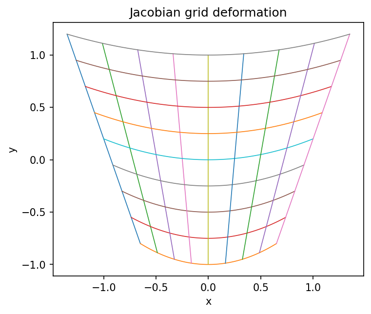

# 変数変換とJacobian determinant

Course 01｜微積分

---

## 何を解決するか

座標変換で積分するとき、なぜJacobian determinantの絶対値を掛けるのか。

Jacobian matrixは局所的な線形変換。小さな長方形は平行四辺形へ移り、その面積倍率が determinant の絶対値になる。

---

## 図の意味

左側の $(u,v)$ 平面にある小さな正方形格子が、写像 $T$ により右側の $(x,y)$ 平面で平行四辺形状に変形している。1セルの2本の辺ベクトルはJacobian $J_T$ の2列で近似され、その平行四辺形の面積が $|\det J_T|\,du\,dv$。GIFは恒等写像から変形を連続的に進め、局所面積倍率が生まれる様子を示す。

---

## 記号

| 記号 | 意味 |
|---|---|
| $T(u,v)=(x,y)$ | 座標変換 |
| $J_T$ | TのJacobian matrix |
| $det J_T$ | 局所面積の符号付き倍率 |

- $T(u,v)=(x(u,v),y(u,v))$：座標変換。
- $J_T$：TのJacobian matrix。
- $|\det J_T|$：局所面積倍率。

---

## 中心式

$$
dx\,dy=|\det J_T(u,v)|\,du\,dv
$$

---

## 導出

1. 微小変位は $d\mathbf{x}\approx J_T d\mathbf{u}$。
2. 2本の微小基底ベクトルが作る平行四辺形の面積倍率は |det J_T|。
3. Riemann和の各セル面積を変換し、極限を取る。

---

## 省略しない一段

微小変位 $d\mathbf u=(du,dv)^T$ に対し $T(\mathbf u+d\mathbf u)-T(\mathbf u)\approx J_T(\mathbf u)d\mathbf u$。したがって、u方向とv方向の微小辺はそれぞれJacobianの第1列、第2列へ写る。

2次元で2本のベクトルが張る平行四辺形の符号付き面積は行列式。積分で必要なのは面積の大きさなので絶対値を取る。1対1で滑らかな変換ならRiemann和の各セルについてこの局所倍率を掛け、極限で変数変換公式を得る。

---

## 手計算

**問題**：変換 $x=2u+v$, $y=u-v$ のJacobian determinantを求め、uv平面の面積1の小領域がxy平面で何倍の面積になるか答えよ。

**解答**：$J=\begin{bmatrix}2&1\\1&-1\end{bmatrix}$、$\det J=-3$。面積倍率は絶対値3なので、面積1は面積3へ写る。負号は向き反転を表す。

---

## 条件を変える

極座標 $x=r\cos\theta$, $y=r\sin\theta$ では $J=\begin{bmatrix}\cos\theta&-r\sin\theta\\\sin\theta&r\cos\theta\end{bmatrix}$。行列式は $r(\cos^2\theta+\sin^2\theta)=r$ なので $dA=r\,dr\,d\theta$。

---

## どこで壊れるか

$|\det J|=0$ の点では局所的に面積が潰れ、通常の1対1な座標変換として扱えない。また絶対値を外すと向きを反転する変換で面積が負になってしまう。

---

## 次へ

確率変数変換の密度公式にも同じJacobianが現れる。normalizing flowでは、この局所体積変化をlog-determinantとして尤度へ加える。

---

[教科書](../../textbook/calc-change-of-variables-jacobian)　|　[10問の演習](../../exercises/calc-change-of-variables-jacobian)

---

## 今回の問い

「変数変換とJacobian determinant」は何を表し、どの条件で使え、結果をどう検算するのか？

---

## 到達目標

- 座標変換で積分するとき、なぜJacobian determinantの絶対値を掛けるのか。
- 中心式の記号と成立条件を説明できる
- 小さい例と反例で検算できる

---

## 理解確認

1. 座標変換で積分するとき、なぜJacobian determinantの絶対値を掛けるのか。
2. 中心式の記号と成立条件を説明できる
3. 小さい例と反例で検算できる
