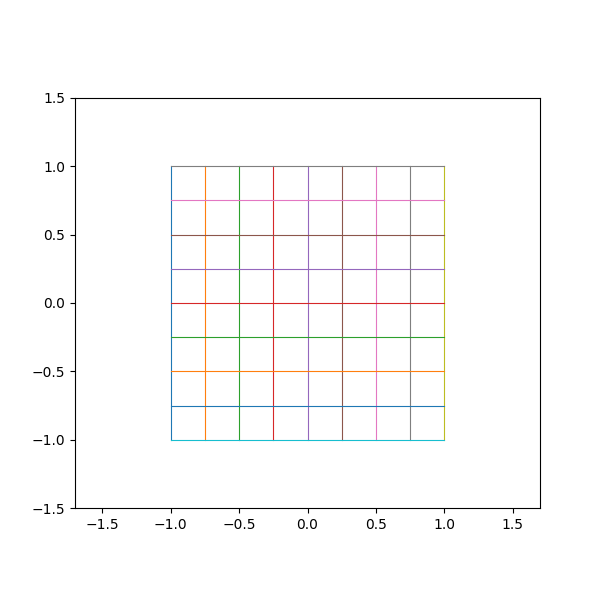

# 変数変換とJacobian determinant

Course 01｜微積分

---

## 今回の問い

座標変換で積分するとき、なぜJacobian determinantの絶対値を掛けるのか。

---

## 直感

Jacobian matrixは局所的な線形変換。小さな長方形は平行四辺形へ移り、その面積倍率が determinant の絶対値になる。

---

## 図解

---

## 動きで確認

---

## 中心式

$$
dx\,dy=|\det J_T(u,v)|\,du\,dv
$$

---

## 導出

1. 微小変位は $d\mathbf{x}\approx J_T d\mathbf{u}$。
2. 2本の微小基底ベクトルが作る平行四辺形の面積倍率は |det J_T|。
3. Riemann和の各セル面積を変換し、極限を取る。

---

## 小さい例

極座標 x=r cosθ, y=r sinθ では det J=r。よって dA=r dr dθ。rを忘れると面積が過小評価される。

---

## 条件を外すと

- detではなく|det|を面積倍率に使う。
- Jacobian matrixそのものとdeterminantを混同しない。

---

## 理解確認

- 式の各記号を定義できるか。
- 導出を1段ずつ再現できるか。
- 反例を1つ作れるか。

---

## 教科書と演習

[教科書](../../textbook/calc-change-of-variables-jacobian)

[10問の演習](../../exercises/calc-change-of-variables-jacobian)
