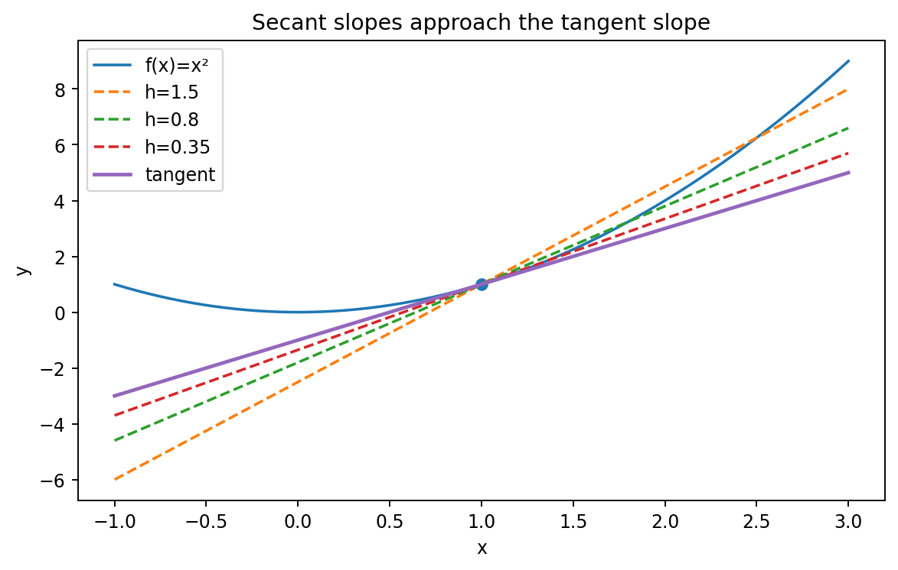

# 微分と変化率

Course 01｜微積分｜Topic 02/13

---
layout: center
---

## 今回の問い

## 到達目標

- 定義と代表式を、自分の言葉と記号で説明できる。
- 成立条件を確認し、手計算と結果を検算できる。

## 理解確認

- 定義・条件・計算結果を自分の言葉で説明できるか確認する。

平均変化率から瞬間変化率をどう作り、その値が接線の傾きになるのはなぜか。

---

## なぜ今これを学ぶのか

前Topicで「近づける」操作を極限として定義した。二点間の傾きは計算できるが、一点だけでは幅が0になり通常の割り算ができない。そこで二点の幅を0へ近づける極限を取る。

---

## 直感

微分は有限区間の平均変化率を、区間幅を0へ縮める極限で瞬間の変化率へ変える。

速度計が示す瞬間速度も、非常に短い時間間隔での移動距離/時間を極限まで短くしたものと考えられる。グラフでは割線が点へ寄るにつれて接線へ近づく。

---

## 図解

図では固定点 $(x,f(x))$ と移動点 $(x+h,f(x+h))$ を結ぶ割線を描く。$h$ が小さくなるほど二点が近づき、割線の傾きが一つの値へ収束すると、その極限が接線の傾き $f^{\prime}(x)$ になる。

---

## 記号と代表式

- $x$：微分を評価する入力
- $h$：入力の小さな増分。極限では0へ近づける
- $f(x+h)-f(x)$：入力を $h$ だけ動かしたときの出力変化
- $f^{\prime}(x)$：$x$ における導関数、瞬間変化率

$$
f^{\prime}(x)=\lim_{h\to0}\frac{f(x+h)-f(x)}{h}
$$

---

## 導出 1

二点 $(x,f(x))$ と $(x+h,f(x+h))$ の傾きは $m_h=(f(x+h)-f(x))/((x+h)-x)=[f(x+h)-f(x)]/h$ である。ここでは $h\ne0$。

---

## 導出 2

瞬間の傾きを求めようとして $h=0$ を代入すると分母が0になる。そこで値を代入するのではなく、$h$ を0へ近づけたときの差分商の極限を見る。極限が存在すれば $m_h\to f^{\prime}(x)$ と定義できる。

---

## 例題

$f(x)=x^2$。差分商は $[(x+h)^2-x^2]/h=(2xh+h^2)/h=2x+h$。$h\to0$ で $f^{\prime}(x)=2x$。例えば $x=3$ なら接線の傾きは6。

---

## 条件を変えるとどうなるか

$|x|$ は0で連続だが微分不可能である。これは「連続なら必ず滑らかな接線を持つ」という誤解への反例。

---

## よくある誤解

導関数を微分公式の一覧として覚えると、微分可能性の判定や非滑らかな点を扱えない。定義は差分商の極限であり、公式はその極限を効率よく計算した結果である。

---

## 実装・計算上の注意

有限差分で導関数を近似すると、$h$ が大きすぎれば打切り誤差、小さすぎれば丸め誤差が増える。解析的微分・自動微分・有限差分は同じ「導関数」を異なる方法で計算していることを区別する。

---

## 一段先へ

導関数の定義から和・積・商・合成の微分法則を導ける。次Topicでは、毎回極限を展開せずに計算する規則がなぜ正しいかを定義から導く。

---

## 自分で説明できるか

- $x^3$ の導関数を定義から導けるか
- $|x|$ が0で微分不可能な理由を左右差分商で説明できるか
- 「微分可能なら連続」を差分 $f(x+h)-f(x)$ を使って説明できるか

---
layout: center
---

## 教科書と演習

- [教科書](../../textbook/calc-derivatives-rates)
- [10問の演習](../../exercises/calc-derivatives-rates)
