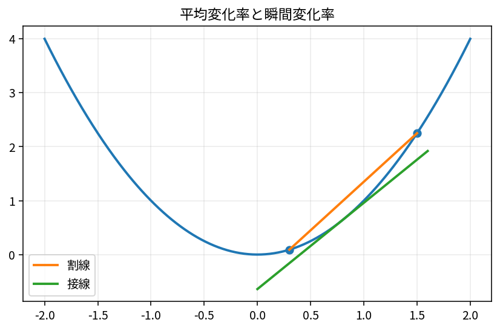

# 微分と変化率

Course 01｜微積分｜Topic 02/13

---
layout: center
---

## 今回の問い

平均の変化率から、ある瞬間の変化率をどう取り出すのか。

---

## 到達目標

- 差商から導関数の定義を書ける
- 導関数を接線の傾き・瞬間変化率として説明できる
- 基本関数の微分を計算できる
- 微分可能性と連続性の関係を説明できる

---

## 試験での基本姿勢

1. 何を求める問題か確認
2. 定義・成立条件を確認
3. 計算
4. 判定
5. 検算して結論

---

## 記号

| 記号 | 意味 |
|---|---|
| $x$ | 入力 |
| $h$ | 入力をずらす小さな量 |
| $f^{\prime}(x)$ | 点 $x$ における $f$ の導関数 |
| $\Delta x$ | 入力の有限な変化量 |
| $\Delta f$ | 出力の有限な変化量 $f(x+\Delta x)-f(x)$ |

---

## 中心概念 1

1. 平均変化率から瞬間変化率へ
区間 $[x,x+h]$ における平均変化率は
$$\frac{f(x+h)-f(x)}{h}$$
である。これはグラフ上の2点を結ぶ**割線**の傾き。$h$ を0へ近づけると2点が重なり、極限が存在すれば接線の傾きになる。

---

## 中心概念 2

### 2. 導関数の定義
$$f^{\prime}(x)=\lim_{h\to0}\frac{f(x+h)-f(x)}{h}.$$
ここで $h=0$ を代入してはいけない。分母が0になるからである。$h\ne0$ の差商をまず簡単にし、その後で極限をとる。

---

## 図で確認

---

## 標準手順

- 差商を書く
- 必要なら $f(x+h)$ を展開する
- 分子から $f(x)$ を引き、$h$ を因数として取り出す
- $h\ne0$ で約分する
- 最後に $h\to0$ の極限をとる
- 答えの符号・単位・グラフの傾きが直感と合うか確認する

---

## 典型例

**例1：$f(x)=x^2$ を定義から微分。**
$$\frac{(x+h)^2-x^2}{h}=\frac{2xh+h^2}{h}=2x+h.$$
したがって $h\to0$ で $f^{\prime}(x)=2x$。

---

## よくある誤り

- $h=0$ を差商へ直接代入する
- 平均変化率と瞬間変化率を同じものとして扱う
- 微分可能性と連続性を逆向きにも成り立つと思う
- 導関数の単位を無視する

---

## 満点答案のポイント

- 定義からの微分は展開→約分→極限の順番を書く
- グラフ問題では導関数の正負と増減を対応させる
- 「連続だが微分不可能」の例として $|x|$ を説明できるようにする

---

## 機械学習との接続

勾配法で使う勾配も「入力を少し動かしたとき損失がどれだけ変化するか」を集めたもの。1変数の微分がその原型である。

---

## 30秒確認 1

中心式または中心定義を、記号の意味まで含めて口頭で説明できるか。

---

## 30秒確認 2

「この条件がないと結論できない」という成立条件を1つ挙げられるか。

---

## 30秒確認 3

典型的な誤答を1つ挙げ、どこが誤りか説明できるか。

---

## 演習へ

- [教科書](../../textbook/calc-derivatives-rates)
- [10問の演習](../../exercises/calc-derivatives-rates)
## 理解確認

- 到達目標の各項目を、定義・計算手順・成立条件とともに説明できるか確認する。
- 教科書と演習の対応箇所を参照し、式の意味を自分の言葉で説明する。
