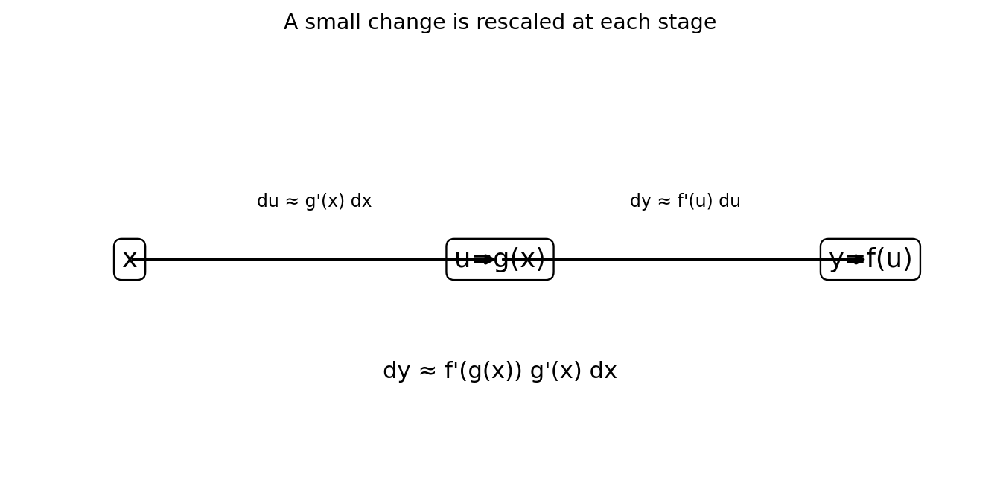

# 微分法則と一変数の連鎖律

Course 01｜微積分｜Topic 03/13

---
layout: center
---

## 今回の問い

## 到達目標

- 定義と代表式を、自分の言葉と記号で説明できる。
- 成立条件を確認し、手計算と結果を検算できる。

## 理解確認

- 定義・条件・計算結果を自分の言葉で説明できるか確認する。

複雑な式を構成要素へ分け、積・商・合成の微分法則を定義からどう導くか。

---

## なぜ今これを学ぶのか

導関数は差分商の極限として定義できたが、複雑な関数を毎回展開するのは非効率である。和・積・合成という関数の組み立て方に対し、微分がどう振る舞うかを定理として整理する。

---

## 直感

合成関数の変化は、内側の変化量と、その変化を外側が何倍にするかの積として伝播する。

連鎖律では、入力 $x$ の小さな変化がまず $g$ により $g^{\prime}(x)$ 倍され、その変化を外側の $f$ が $f^{\prime}(g(x))$ 倍する。倍率を順に掛けるため積になる。

---

## 図解

図では $x\to u=g(x)\to y=f(u)$ という二段階の変換を描く。$x$ の微小変化 $dx$ が $du\approx g^{\prime}(x)dx$ となり、さらに $dy\approx f^{\prime}(u)du$ となるため、全体では $dy\approx f^{\prime}(g(x))g^{\prime}(x)dx$ となる。

---

## 記号と代表式

- $f,g$：微分可能な一変数関数
- $u=g(x)$：合成の中間変数
- $f\circ g$：$x\mapsto f(g(x))$ という合成関数
- $f^{\prime},g^{\prime}$：各関数の導関数

$$
(f\circ g)^{\prime}(x)=f^{\prime}(g(x))g^{\prime}(x)
$$

---

## 導出 1

$h(x)=f(x)g(x)$ とする。$[f(x+h)g(x+h)-f(x)g(x)]/h$ に $f(x+h)g(x)$ を足して引くと、$g(x+h)[f(x+h)-f(x)]/h+f(x)[g(x+h)-g(x)]/h$。$h\to0$ で連続性を使い $h^{\prime}=f^{\prime}g+fg^{\prime}$ を得る。

---

## 導出 2

$u=g(x)$ とし $\Delta u=g(x+h)-g(x)$。差分商を $[f(u+\Delta u)-f(u)]/h = ([f(u+\Delta u)-f(u)]/\Delta u)(\Delta u/h)$ と分ける。$h\to0$ で $\Delta u\to0$ なら第一因子は $f^{\prime}(u)$、第二因子は $g^{\prime}(x)$ へ近づく。

---

## 例題

$y=(3x^2+1)^5$。外側 $f(u)=u^5$、内側 $g(x)=3x^2+1$ と分ける。$f^{\prime}(u)=5u^4$, $g^{\prime}(x)=6x$ なので $y^{\prime}=30x(3x^2+1)^4$。

---

## 条件を変えるとどうなるか

$(fg)^{\prime}=f^{\prime}g^{\prime}$ は一般に誤り。$f(x)=g(x)=x$ なら左辺は $(x^2)^{\prime}=2x$、右辺は1。

---

## よくある誤解

「外微分×内微分」という言葉だけでは、多重合成や積と合成が混在した式で迷う。計算木の最上位演算を特定し、その演算に対応する法則を一段ずつ適用する方が安全。

---

## 実装・計算上の注意

自動微分は連鎖律を計算graph上で機械的に適用する。数式処理と違い、関数値の計算手順を記録し、局所導関数を合成する。後のbackpropagationの基礎になる。

---

## 一段先へ

多変数では「局所倍率」がスカラーではなくJacobianになる。Course 01後半の多変数連鎖律では、局所線形写像の合成として行列積が現れる。

---

## 自分で説明できるか

- 積の微分を定義から導く際に、なぜ項を足して引くのか説明できるか
- $(\sin(x^2))^3$ を計算木として分解できるか
- 連鎖律の積が「二段階の倍率の積」であることを微小変化で説明できるか

---
layout: center
---

## 教科書と演習

- [教科書](../../textbook/calc-differentiation-rules-chain-rule)
- [10問の演習](../../exercises/calc-differentiation-rules-chain-rule)
