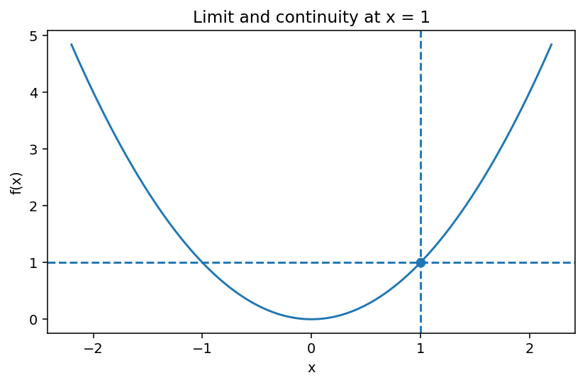

# 関数・極限・連続

Course 01｜微積分｜Topic 01/13

---
layout: center
---

## 今回の問い

「点そのものの値」と「その点へ近づいたときの値」を、どう区別して考えるのか。

---

## 到達目標

- 関数の定義域・値域を明示できる
- 左右極限を使って極限の存在を判定できる
- 連続性の3条件を使って不連続を分類できる
- 代入・因数分解・有理化などを使って基本的な極限を計算できる

---

## 試験での基本姿勢

1. 何を求める問題か確認
2. 定義・成立条件を確認
3. 計算
4. 判定
5. 検算して結論

---

## 記号

| 記号 | 意味 |
|---|---|
| $x$ | 関数への入力を表す実数 |
| $f(x)$ | 入力 $x$ に対する関数 $f$ の出力 |
| $a$ | 入力 $x$ が近づく目標の点 |
| $L$ | $x\to a$ のとき $f(x)$ が近づく値 |
| $\lim_{x\to a}f(x)=L$ | $x$ を $a$ に十分近づけると、$f(x)$ を $L$ にいくらでも近づけられること |
| $\varepsilon$ | 出力側で許す正の誤差幅 |
| $\delta$ | 入力側で許す正の距離 |

---

## 中心概念 1

1. 関数は「入力から出力への規則」
関数 $f$ は、定義域の各入力 $x$ に対して出力 $f(x)$ を1つだけ対応させる規則である。計算問題では式だけでなく、**どの $x$ を入れてよいか**を確認する。たとえば $f(x)=1/(x-2)$ では $x=2$ は定義域に含まれない。

---

## 中心概念 2

### 2. 極限は「点での値」ではなく「近づく途中」を見る
$$\lim_{x\to a}f(x)=L$$
は、$x=a$ を代入した値を述べているのではない。$x$ が $a$ に近づくときの $f(x)$ の振る舞いを述べている。したがって $f(a)$ が未定義でも極限は存在しうる。

厳密には、任意の $\varepsilon>0$ に対して、ある $\delta>0$ が存在し、
$$0<|x-a|<\delta \quad\Rightarrow\quad |f(x)-L|<\varepsilon$$
となるとき、極限は $L$ である。ここで $0<|x-a|$ としているのは、$x=a$ そのものを調べる必要がないからである。

---

## 図で確認

---

## 標準手順

- 最初に定義域を確認する
- 直接代入して不定形かどうかを見る
- $0/0$ なら因数分解・有理化・共通因子の約分を考える
- 区分関数では左極限と右極限を別々に計算する
- 連続性を問われたら「値・極限の存在・一致」の3条件を順に書く

---

## 典型例

**例1：穴があっても極限は存在する。**
$$f(x)=\frac{x^2-1}{x-1}\quad (x\ne1)$$
を考える。$x^2-1=(x-1)(x+1)$ だから、$x\ne1$ では $f(x)=x+1$。したがって
$$\lim_{x\to1}f(x)=2.$$
一方、元の式では $f(1)$ は未定義である。よって「極限は存在するが、$x=1$ では連続ではない」。

---

## よくある誤り

- $0/0$ を極限値0と誤解する
- $f(a)$ が存在するだけで連続と判断する
- 左右極限を確認せず区分関数の極限を答える
- 約分後の式と元の関数が $x=a$ でも完全に同一だと思う

---

## 満点答案のポイント

- 「極限値」「関数値」「連続か」を別々に書く
- 不連続の理由を3条件のどこが破れるかで説明する
- 計算だけでなく、変形が $x
e a$ で有効であることを一言添えると答案が強い

---

## 機械学習との接続

損失関数の連続性は最適化アルゴリズムの挙動を考える出発点になる。また有限差分では $h\to0$ の極限という考え方が、そのまま数値微分につながる。

---

## 30秒確認 1

中心式または中心定義を、記号の意味まで含めて口頭で説明できるか。

---

## 30秒確認 2

「この条件がないと結論できない」という成立条件を1つ挙げられるか。

---

## 30秒確認 3

典型的な誤答を1つ挙げ、どこが誤りか説明できるか。

---

## 演習へ

- [教科書](../../textbook/calc-functions-limits-continuity)
- [10問の演習](../../exercises/calc-functions-limits-continuity)
## 理解確認

- 到達目標の各項目を、定義・計算手順・成立条件とともに説明できるか確認する。
- 教科書と演習の対応箇所を参照し、式の意味を自分の言葉で説明する。
