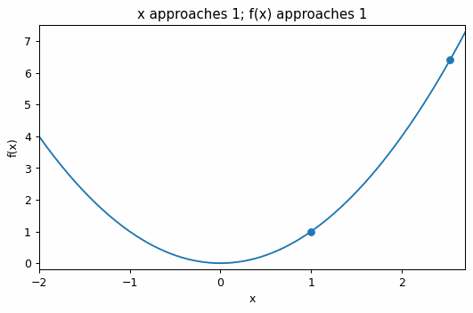

# 関数・極限・連続

Course 01｜微積分

---
layout: center
---

## 今回の問い

「関数・極限・連続」は何を表し、どの条件で使え、結果をどう検算するのか？

---

## 到達目標

- 関数、極限、連続の定義と成立条件を説明できる
- 関数・極限・連続を小規模に計算・実装し検算できる

---

## まず全体像をつかむ

関数・極限・連続の定義、計算手順、成立条件を整理し、微積分の後続Topicへ接続する

---

## このTopicで考える問い

入力が点 $a$ に近づくとき、出力はどこへ近づくのか。

---

## 学習目標

- 極限の定義と左右極限の違いを説明する
- 連続性を $\lim_{x\to a}f(x)=f(a)$ で判定する
- 不連続の典型例を区別する

---

## まず直感

- 関数は入力に対して出力を返す規則である。
- 極限は点そのものより、近づいたときの振る舞いを見る概念である。
- 連続性は「近づく先」と「実際の値」が一致していること。

数学の定義に入る前に、**どの量を固定し、どの量を動かしているか** を言葉で確認すると理解しやすくなる。

---

## 図解

---

## 図を見るポイント

- 図の横軸・縦軸が何を表しているかを確認する。
- 変化している量と固定している量を区別する。
- 式の各記号が図のどこに対応するかを探す。

---

## アニメーションで極限を見る

---

## アニメーションを見るポイント

- 動く点の横座標が $a$ に近づく様子を見る。
- 同時に $f(x)$ が $L$ に近づくことを確認する。
- 「$x=a$ での値」ではなく「近づく途中の振る舞い」が極限の本体。

---

## 数学的な定義・中心式

$\lim_{x\to a} f(x)=L$, 連続性は $\lim_{x\to a}f(x)=f(a)$

この式は単なる計算規則ではなく、**何をどう近似しているか** を表している。

---

## 小さな例

$f(x)=\sin x$ はどの点でも連続。一方、$g(x)=\begin{cases}-1&(x<0)\\1&(x\ge0)\end{cases}$ は $x=0$ で不連続。

例を読むときは、1. 入力は何か 2. 出力は何か 3. どの量の変化を見ているか、を順に確認する。

---

## よくある誤解

- $x=a$ を代入できることと、極限が存在することは同じではない。
- 左右極限が一致しなければ極限は存在しない。

---

## 機械学習・数値計算との接続

機械学習では、損失関数や活性化関数の連続性が最適化の安定性に関わる。

Course 01の内容は、後の線形代数・最適化・機械学習で何度も再登場する。

---

## 最後に確認したいこと

- 中心式を日本語で説明できるか。
- 図のどの部分が式の各項に対応するか。
- どの場面でこの概念が必要になるか。

---

## 次へ

- [スライド](/slides/calc-functions-limits-continuity/)
- [演習](/exercises/calc-functions-limits-continuity)

---

## 前提との接続

このTopicは次の内容を土台にする。式や用語が曖昧なら、先に対応するTopicへ戻る。

- `prep-sets-functions-mappings`
- `prep-exponents-logarithms`

---

## 理解確認

1. 関数、極限、連続の定義と成立条件を説明できる
2. 関数・極限・連続を小規模に計算・実装し検算できる
3. 代表式・計算手順・成立条件を小さな例で検算できるか。

---

## 演習へ

[教科書](../../textbook/calc-functions-limits-continuity)

[10問の演習](../../exercises/calc-functions-limits-continuity)

