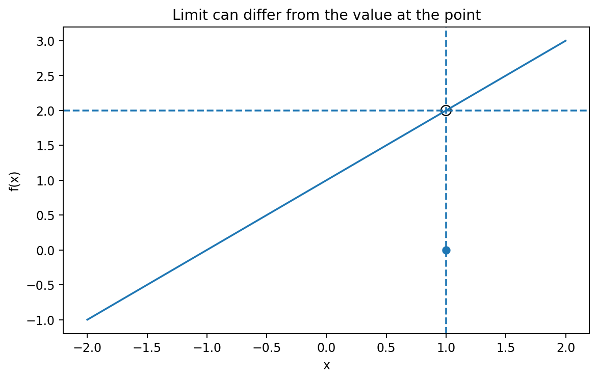

# 関数・極限・連続

Course 01｜微積分｜Topic 01/13

---
layout: center
---

## 今回の問い

## 到達目標

- 定義と代表式を、自分の言葉と記号で説明できる。
- 成立条件を確認し、手計算と結果を検算できる。

## 理解確認

- 定義・条件・計算結果を自分の言葉で説明できるか確認する。

点での値と、その点へ近づいたときの値は何が違い、連続性は両者をどう結ぶのか。

---

## なぜ今これを学ぶのか

Course 00では関数を入力から出力への写像として定義した。しかし、関数値がある点で未定義でも、その近くの振る舞いは規則的なことがある。微分を定義するには「点へ近づける」操作が必要なので、まず極限を独立した概念として作る。

---

## 直感

極限は点そのものの値ではなく、その点へ近づく過程で関数値がどこへ近づくかを記述する。連続性は、その近づき方と点での値が一致する性質である。

たとえば道路の標高を地点ごとの関数と考えると、ある地点の標識が欠けていても、その直前・直後の標高が同じ値へ近づくことはあり得る。極限は「標識そのもの」ではなく「近づいたときに観測される傾向」を記述する。

---

## 図解

図では横軸が入力 $x$、縦軸が $f(x)$ で、$x=a$ の左右から曲線上の点が同じ高さ $L$ へ近づく様子を描く。$x=a$ に白丸があっても極限は存在し得る。一方、左右から異なる高さへ近づく図では、左極限と右極限が一致しないため両側極限は存在しない。

---

## 記号と代表式

- $x$：関数の入力となる実数
- $a$：近づける対象の点
- $f(x)$：入力 $x$ に対する関数値
- $L$：$x$ を $a$ へ近づけたときに $f(x)$ が近づく値
- $\varepsilon>0,\delta>0$：出力側・入力側で許す誤差幅

$$
\lim_{x\to a}f(x)=L
$$

---

## 導出 1

極限が調べたいのは点そのものではなく近傍の振る舞いである。したがって条件は $0<|x-a|<\delta$ とし、$x=a$ を含めない。これにより $f(a)$ が未定義でも極限を論じられる。例えば $f(x)=(x^2-1)/(x-1)$ は $x=1$ で元の式が未定義だが、$x\ne1$ では $f(x)=x+1$ なので $\lim_{x\to1}f(x)=2$ である。

---

## 導出 2

実数直線上で $a$ に近づく方法には $x<a$ と $x>a$ がある。両側極限が一意な値 $L$ であるためには、左極限 $\lim_{x\to a^-}f(x)$ と右極限 $\lim_{x\to a^+}f(x)$ がともに存在し、同じ $L$ でなければならない。片方だけ異なれば、一つの $\varepsilon$-近傍へ両側の値を押し込めない。

---

## 例題

$f(x)=(x^2-4)/(x-2)$ を $x\to2$ で考える。$x\ne2$ では $f(x)=x+2$ なので、$\lim_{x\to2}f(x)=4$。元の式では $f(2)$ は未定義だから、極限は存在するが連続ではない。ここで $f(2)=4$ と再定義すれば3条件がそろい連続になる。

---

## 条件を変えるとどうなるか

「$f(a)$ が存在するなら極限も $f(a)$」は誤り。例えば $f(0)=0$ とし、$x\ne0$ では $f(x)=1$ とすれば、$f(0)$ は存在するが $\lim_{x\to0}f(x)=1\ne0$。点の値だけでは近傍の振る舞いを決められない。

---

## よくある誤解

「極限＝代入」と覚えると、穴のある関数や区分関数で破綻する。代入が使えるのは、その関数がその点で連続であることが既に分かっている場合の計算法であって、極限の定義そのものではない。

---

## 実装・計算上の注意

数値的に $a$ へ近づけるだけでは証明にならない。浮動小数点では $a$ に極端に近い点で丸め誤差や桁落ちが生じることがある。数値実験は左右から複数のスケールで近づけ、解析的な変形や既知の定理と照合する。

---

## 一段先へ

極限を使うと、平均変化率の区間幅を0へ縮めて瞬間変化率を定義できる。次Topicの微分は、極限を「比の極限」に適用したものとして導入する。

---

## 自分で説明できるか

- $f(a)$ と $\lim_{x\to a}f(x)$ が異なる具体例を自分で作れるか
- 左右極限が一致しないと両側極限が存在しない理由を $\varepsilon$ の言葉でも説明できるか
- 連続性の3条件のうち一つだけを壊した例をそれぞれ作れるか

---
layout: center
---

## 教科書と演習

- [教科書](../../textbook/calc-functions-limits-continuity)
- [10問の演習](../../exercises/calc-functions-limits-continuity)
