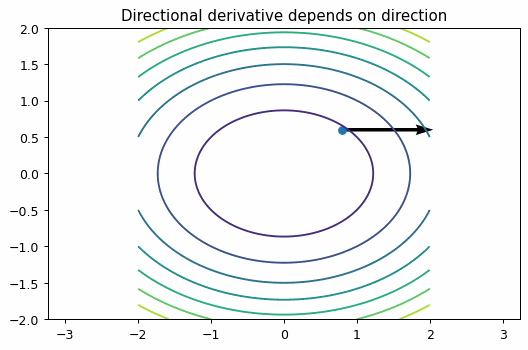

# 勾配と方向微分

Course 01｜微積分

---
layout: center
---

## 今回の問い

「勾配と方向微分」は何を表し、どの条件で使え、結果をどう検算するのか？

---

## 到達目標

- 勾配、方向微分の定義と成立条件を説明できる
- 勾配と方向微分を小規模に計算・実装し検算できる

---

## まず全体像をつかむ

勾配と方向微分の定義、計算手順、成立条件を整理し、微積分の後続Topicへ接続する

---

## このTopicで考える問い

どの方向へ動かすと一番増えるのか。任意方向の変化率はどう求めるか。

---

## 学習目標

- 方向微分を単位ベクトルとの内積として書く
- 勾配が最急上昇方向であると理解する
- 等高線図と結びつける

---

## まず直感

- 方向微分はその方向へ一歩進んだときの増え方。
- 勾配ベクトルは最も増加する方向を指す。
- 等高線図では勾配は等高線に直交する。

数学の定義に入る前に、**どの量を固定し、どの量を動かしているか** を言葉で確認すると理解しやすくなる。

---

## 図解

---

## 図を見るポイント

- 図の横軸・縦軸が何を表しているかを確認する。
- 変化している量と固定している量を区別する。
- 式の各記号が図のどこに対応するかを探す。

このアニメーションでは、概念の「極限・累積・方向・反復」の動きが視覚化されている。

---

## 数学的な定義・中心式

$D_{\mathbf u}f(\mathbf x)=\nabla f(\mathbf x)^\top \mathbf u$

この式は単なる計算規則ではなく、**何をどう近似しているか** を表している。

---

## 小さな例

$f(x,y)=x^2+2y^2$、点 $(1,1)$ では $\nabla f=(2,4)$。

例を読むときは、1. 入力は何か 2. 出力は何か 3. どの量の変化を見ているか、を順に確認する。

---

## よくある誤解

- 方向ベクトルは単位長さに正規化して考える。
- 勾配そのものは方向微分の値ではない。

---

## 機械学習・数値計算との接続

gradient descent は勾配の反対向きへ進む手法。

Course 01の内容は、後の線形代数・最適化・機械学習で何度も再登場する。

---

## 最後に確認したいこと

- 中心式を日本語で説明できるか。
- 図のどの部分が式の各項に対応するか。
- どの場面でこの概念が必要になるか。

---

## 次へ

- [スライド](/slides/calc-gradient-directional-derivative/)
- [演習](/exercises/calc-gradient-directional-derivative)

---

## 前提との接続

このTopicは次の内容を土台にする。式や用語が曖昧なら、先に対応するTopicへ戻る。

- `calc-multivariable-functions-partial-derivatives`

---

## 理解確認

1. 勾配、方向微分の定義と成立条件を説明できる
2. 勾配と方向微分を小規模に計算・実装し検算できる
3. 代表式・計算手順・成立条件を小さな例で検算できるか。

---

## 演習へ

[教科書](../../textbook/calc-gradient-directional-derivative)

[10問の演習](../../exercises/calc-gradient-directional-derivative)

