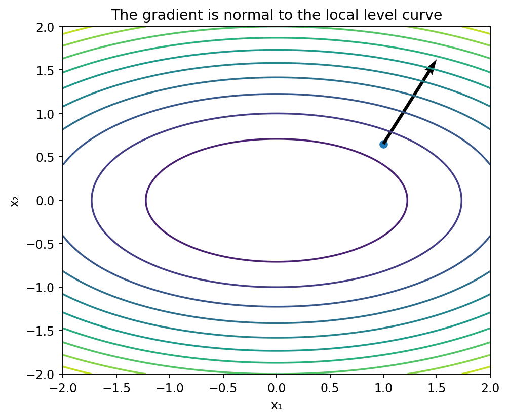

# 勾配と方向微分

Course 01｜微積分｜Topic 08/13

---
layout: center
---

## 今回の問い

## 到達目標

- 定義と代表式を、自分の言葉と記号で説明できる。
- 成立条件を確認し、手計算と結果を検算できる。

## 理解確認

- 定義・条件・計算結果を自分の言葉で説明できるか確認する。

座標軸以外の任意方向へ動く変化率が、なぜ勾配との内積になるのか。

---

## なぜ今これを学ぶのか

偏微分は座標軸方向だけを測った。実際には斜めを含む任意方向へ動くので、全偏微分を一つのベクトルにまとめ、任意方向の変化率を計算する。

---

## 直感

偏微分を一つのベクトルにまとめると、任意方向への一次変化が内積一つで計算できる。そのベクトルが勾配である。

地形で矢印 $\nabla f$ は最も急に上る方向を指す。歩く方向 $\mathbf u$ が勾配と同じなら最大の上り、直交すれば一次的には高さが変わらない。

---

## 図解

図では等高線と点 $\mathbf{x}$ から出る勾配ベクトルを描く。勾配は等高線に直交し、任意方向 $\mathbf u$ への変化率は勾配をその方向へ射影した長さになる。

---

## 記号と代表式

- $\nabla f(\mathbf{x})$：偏微分を並べた勾配ベクトル
- $\mathbf u$：長さ1の方向ベクトル
- $D_{\mathbf u}f$：$\mathbf u$ 方向の方向微分
- $\|\nabla f\|_2$：最急上昇率

$$
D_{\mathbf u}f(\mathbf{x})=\nabla f(\mathbf{x})^{\mathsf T}\mathbf u
$$

---

## 導出 1

全微分可能なら $f(\mathbf{x}+\Delta\mathbf{x})=f(\mathbf{x})+\nabla f(\mathbf{x})^T\Delta\mathbf{x}+o(\|\Delta\mathbf{x}\|)$。

---

## 導出 2

$\Delta\mathbf{x}=h\mathbf u$ を代入して差分商を取ると $[f(\mathbf{x}+h\mathbf u)-f(\mathbf{x})]/h=\nabla f^T\mathbf u+o(|h|)/h$。極限で余りが0になり方向微分公式を得る。

---

## 例題

$f(x,y)=x^2+2y^2$、点 $(1,1)$ では $\nabla f=(2,4)^T$。$\mathbf u=(3/5,4/5)^T$ なら方向微分は $2(3/5)+4(4/5)=22/5$。

---

## 条件を変えるとどうなるか

$\mathbf u$ の長さを1にしないと、$D_{c\mathbf u}=cD_{\mathbf u}$ となり「方向」ではなく移動速度まで混ざる。最急方向の比較に単位ベクトル条件が必要。

---

## よくある誤解

勾配は「偏微分のただの一覧」ではなく、内積を通して全方向の一次変化を同時に符号化したベクトル。この幾何的役割が最適化で重要。

---

## 実装・計算上の注意

gradient descentでは $-\nabla f$ 方向へ進む。学習率がstepの長さを担うため、方向微分で単位ベクトルを使った議論と、実際の更新ベクトルを区別する。

---

## 一段先へ

スカラー出力では局所線形写像を勾配の転置で表せる。ベクトル出力へ一般化するとJacobian行列になる。

---

## 自分で説明できるか

- 方向微分公式を局所線形近似から導けるか
- 勾配が等高線に直交する理由を方向微分0から説明できるか
- 最急上昇方向が勾配方向になる証明でCauchy–Schwarzのどこを使うか

---
layout: center
---

## 教科書と演習

- [教科書](../../textbook/calc-gradient-directional-derivative)
- [10問の演習](../../exercises/calc-gradient-directional-derivative)
