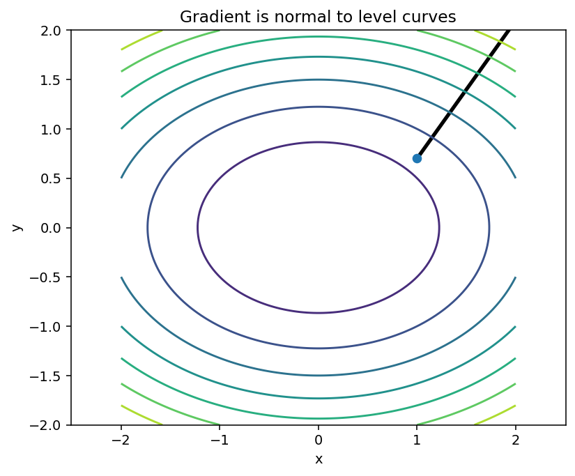

# 勾配と方向微分

Course 01｜微積分｜Topic 08/13

---
layout: center
---

## 今日の中心問い

任意の方向へ少し動いたとき、関数はどれだけ変化するのか。

---

## 到達目標

- 勾配ベクトルを計算できる
- 単位方向ベクトルに沿う方向微分を計算できる
- 勾配が最急上昇方向であることを説明できる
- 勾配と等高線が直交する理由を説明できる

---

## 試験での基本姿勢

1. 何を求める問題か確認
2. 定義・成立条件を確認
3. 計算
4. 判定
5. 検算して結論

---

## 記号

| 記号 | 意味 |
|---|---|
| $\nabla f$ | 偏導関数を並べた勾配ベクトル |
| $\mathbf{u}$ | 長さ1の方向ベクトル |
| $D_{\mathbf{u}}f$ | $\mathbf{u}$ 方向の方向微分 |
| $\|\mathbf{v}\|$ | ベクトル $\mathbf{v}$ のEuclidノルム |

---

## 中心概念 1

1. 勾配
$f:\mathbb R^n\to\mathbb R$ に対して
$$\nabla f(\mathbf{x})=\begin{bmatrix}\partial f/\partial x_1\\\vdots\\\partial f/\partial x_n\end{bmatrix}.$$
入力が $n$ 次元なら勾配も $n$ 次元。

---

## 中心概念 2

### 2. 方向微分
長さ1のベクトル $\mathbf{u}$ に沿う変化率は
$$D_{\mathbf{u}}f(\mathbf{x})=\nabla f(\mathbf{x})^T\mathbf{u}.$$
内積なので、勾配のうちその方向へ投影された成分を取り出している。

---

## 図で確認

---

## 標準手順

- 各偏導関数を計算して勾配を作る
- 評価点があれば代入する
- 与えられた方向ベクトルの長さを確認し、必要なら正規化する
- 勾配との内積を取る
- 最大変化方向なら勾配を正規化する

---

## 典型例

**例1：** $f=x^2+3y^2$ なら $\nabla f=[2x,6y]^T$。$(1,1)$ では $[2,6]^T$。

---

## よくある誤り

- 方向ベクトルを正規化しない
- 勾配そのものと方向微分のスカラー値を混同する
- 最急降下方向を $+\nabla f$ とする
- 勾配0なら必ず最小と断定する

---

## 満点答案のポイント

- shapeを確認：$\nabla f$ は列ベクトル、方向微分はスカラー
- 「方向」だけを聞かれたら正規化したベクトルで答える
- 勾配0は停留点の必要条件にすぎない

---

## 機械学習との接続

gradient descent は $\mathbf{x}_{k+1}=\mathbf{x}_k-\eta\nabla f(\mathbf{x}_k)$ として負の勾配方向へ進む。$\eta$ はstep size（学習率）。

---

## 30秒確認 1

中心式または中心定義を、記号の意味まで含めて口頭で説明できるか。

---

## 30秒確認 2

「この条件がないと結論できない」という成立条件を1つ挙げられるか。

---

## 30秒確認 3

典型的な誤答を1つ挙げ、どこが誤りか説明できるか。

---

## 演習へ

- [教科書](../../textbook/calc-gradient-directional-derivative)
- [10問の演習](../../exercises/calc-gradient-directional-derivative)
