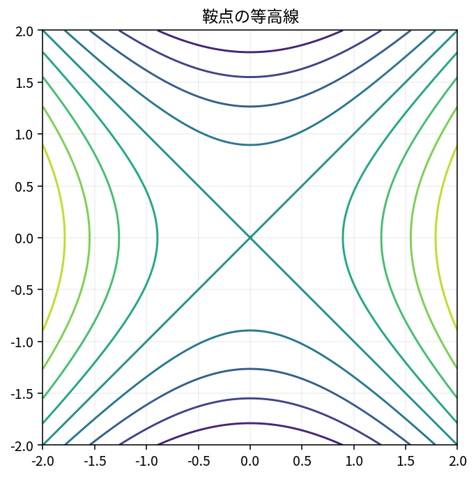

# Hessianと二次近似

Course 01｜微積分｜Topic 10/13

---
layout: center
---

## 今回の問い

多変数関数の「曲がり方」を行列でどう表し、停留点をどう分類するか。

---

## 到達目標

- Hessianを計算できる
- 二次形式 $\mathbf h^TH\mathbf h$ の意味を説明できる
- Hessianの正定値性で停留点を分類できる
- 多変数Taylor二次近似を書ける

---

## 試験での基本姿勢

1. 何を求める問題か確認
2. 定義・成立条件を確認
3. 計算
4. 判定
5. 検算して結論

---

## 記号

| 記号 | 意味 |
|---|---|
| $H_f(\mathbf x)$ | 二階偏導関数を並べたHessian行列 |
| $\mathbf h$ | 基準点からの小さな変位ベクトル |
| $\lambda_i$ | Hessianの固有値 |
| $\mathbf h^TH\mathbf h$ | 方向 $\mathbf h$ に沿う二次の曲率寄与 |

---

## 中心概念 1

1. Hessian
$f:\mathbb R^n\to\mathbb R$ に対して
$$H_f(\mathbf x)=\left[\frac{\partial^2f}{\partial x_i\partial x_j}\right]_{n\times n}.$$
十分滑らかなら混合偏微分が等しく、Hessianは対称行列になる。

---

## 中心概念 2

### 2. 二次Taylor近似
基準点 $\mathbf x$ から小さく $\mathbf h$ 動くと
$$f(\mathbf x+\mathbf h)\approx f(\mathbf x)+\nabla f(\mathbf x)^T\mathbf h+\frac12\mathbf h^TH_f(\mathbf x)\mathbf h.$$
勾配が傾き、Hessianが曲率を担う。

---

## 図で確認

---

## 標準手順

- 一階偏導関数から停留点を求める
- 二階偏導関数を計算してHessianを作る
- 評価点を代入する
- 固有値または2変数なら行列式判定を使う
- ゼロ固有値や $D=0$ なら二階判定だけで断定しない

---

## 典型例

**例1：局所最小。** $f=x^2+2y^2$ では $H=\mathrm{diag}(2,4)$。固有値は2,4で正なので原点は厳密な局所最小。

---

## よくある誤り

- HessianをJacobianと同じ一階微分だと思う
- 固有値に0があるのに最小と断定する
- 鞍点を「極値なし」だけで終え、方向による符号変化を説明しない
- 二次形式の $1/2$ を落とす

---

## 満点答案のポイント

- 停留点→Hessian→符号判定という順序を守る
- 2変数では $D$ と $f_{xx}$ の条件をセットで覚える
- $D=0$ は判定不能であって極値なしではない

---

## 機械学習との接続

HessianはNewton法や曲率解析で使われる。大規模MLでは完全なHessianは高価なため、Hessian-vector productや近似曲率が使われる。

---

## 30秒確認 1

中心式または中心定義を、記号の意味まで含めて口頭で説明できるか。

---

## 30秒確認 2

「この条件がないと結論できない」という成立条件を1つ挙げられるか。

---

## 30秒確認 3

典型的な誤答を1つ挙げ、どこが誤りか説明できるか。

---

## 演習へ

- [教科書](../../textbook/calc-hessian-second-order)
- [10問の演習](../../exercises/calc-hessian-second-order)
## 理解確認

- 到達目標の各項目を、定義・計算手順・成立条件とともに説明できるか確認する。
- 教科書と演習の対応箇所を参照し、式の意味を自分の言葉で説明する。
