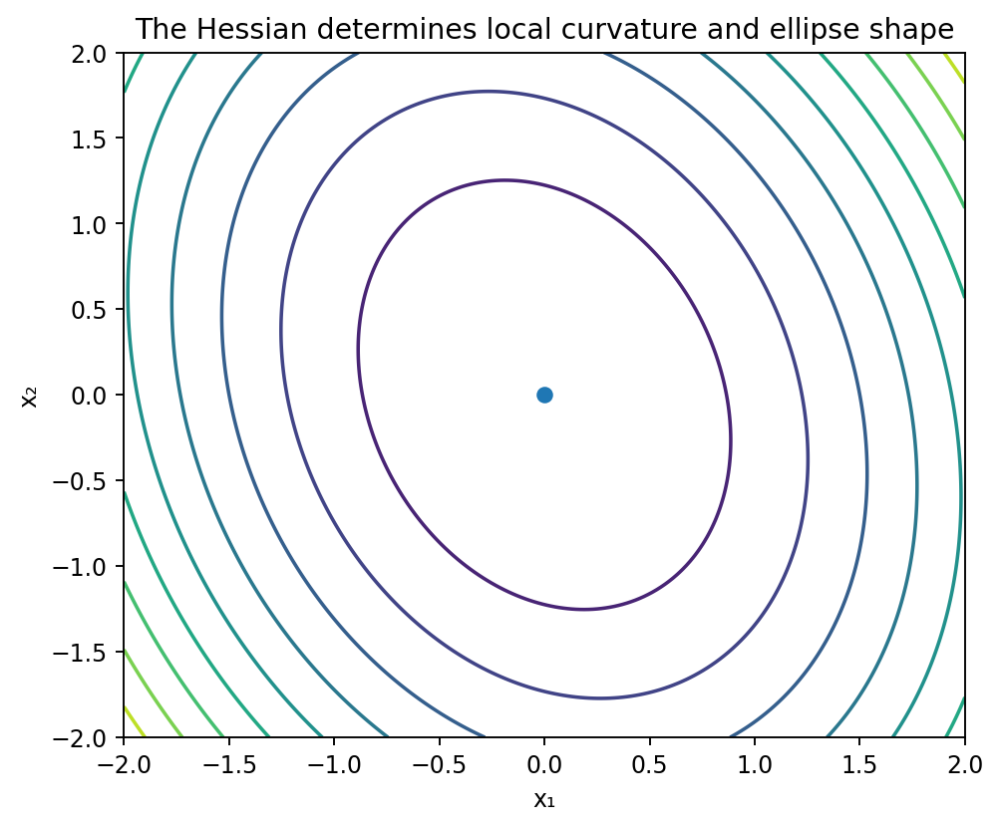

# Hessianと二次近似

Course 01｜微積分｜Topic 10/13

---
layout: center
---

## 今回の問い

## 到達目標

- 定義と代表式を、自分の言葉と記号で説明できる。
- 成立条件を確認し、手計算と結果を検算できる。

## 理解確認

- 定義・条件・計算結果を自分の言葉で説明できるか確認する。

多変数関数の曲率を行列にまとめ、停留点の近くの形を二次形式でどう判定するか。

---

## なぜ今これを学ぶのか

Jacobianは一次の局所変化を表した。停留点では一次項が0になるため、次に効くのは二次の変化。各偏微分をもう一度微分してHessianにまとめる。

---

## 直感

一次近似が傾きを表すのに対し、Hessianは方向ごとの曲がり方を二次形式として表す。

Hessianは「どの方向にどれだけ曲がるか」をまとめた行列。谷底では全方向に上へ曲がり、山頂では全方向に下へ曲がり、鞍点では方向によって符号が変わる。

---

## 図解

図では等高線が楕円になる二次関数と鞍型の等高線を描く。正定値Hessianではどの方向 $\mathbf h$ に対しても $\mathbf h^T\mathbf H\mathbf h>0$ なので中心から離れると値が増える。固有ベクトル方向が楕円の主軸になる。

---

## 記号と代表式

- $\mathbf H_f(\mathbf{x})\in\mathbb R^{n\times n}$：二階偏微分を並べたHessian
- $H_{ij}=\partial^2f/(\partial x_i\partial x_j)$
- $\mathbf h$：評価点からの小さな変位
- $\mathbf h^T\mathbf H\mathbf h$：方向 $\mathbf h$ に沿う二次変化

$$
f(\mathbf{x}+\mathbf h)\approx f(\mathbf{x})+\nabla f(\mathbf{x})^{\mathsf T}\mathbf h+\frac12\mathbf h^{\mathsf T}\mathbf H_f(\mathbf{x})\mathbf h
$$

---

## 導出 1

$\nabla f(\mathbf{x}+t\mathbf h)\approx\nabla f(\mathbf{x})+t\mathbf H_f(\mathbf{x})\mathbf h$。これは勾配というベクトル値関数にJacobianを適用したもので、そのJacobianがHessian。

---

## 導出 2

$g(t)=f(\mathbf{x}+t\mathbf h)$ とすると $g^{\prime}(0)=\nabla f^T\mathbf h$、$g^{\prime\prime}(0)=\mathbf h^T\mathbf H_f\mathbf h$。一変数Taylorを $t=1$ まで書けば代表式を得る。

---

## 例題

$f(x,y)=x^2+4xy+5y^2$。Hessianは $\begin{bmatrix}2&4\\4&10\end{bmatrix}$。主座小行列式は2>0、行列式20-16=4>0なので正定値。原点は厳密局所極小。

---

## 条件を変えるとどうなるか

$f(x,y)=x^4+y^4$ は原点でHessianが0行列だが厳密局所極小。Hessianが半正定値だから極小と断定するのではなく、高次項を見る必要がある。

---

## よくある誤解

Hessianの各成分だけを個別に見るのは危険。混合項があるため、曲率の符号は二次形式全体または固有値で判定する。

---

## 実装・計算上の注意

Newton法ではHessianを逆に解くが、明示逆行列より線形方程式 $\mathbf H\mathbf p=-\nabla f$ をsolveする。大規模問題ではHessian-vector productや近似Hessianを使う。

---

## 一段先へ

Hessianが正定値であることは局所凸性と結び付く。Course 06では強凸性、Newton法、条件数をHessianの固有値から定量化する。

---

## 自分で説明できるか

- 線上関数 $g(t)$ を使って二次Taylor項を導けるか
- $\mathbf h^T\mathbf H\mathbf h$ の符号と等高線の形を結び付けられるか
- Hessianが0でも極小になり得る例を説明できるか

---
layout: center
---

## 教科書と演習

- [教科書](../../textbook/calc-hessian-second-order)
- [10問の演習](../../exercises/calc-hessian-second-order)
