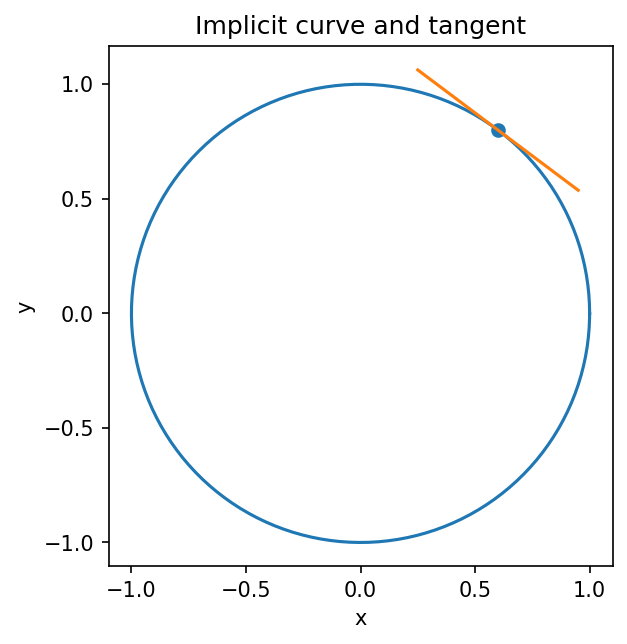

# 陰関数微分と逆関数

Course 01｜微積分

---

## 何を解決するか

yを明示的に解けない式でも、なぜ dy/dx を計算できるのか。

F(x,y)=0 で定まる曲線上では y も x に依存して動く。両辺を x で微分すると、y を含む項には連鎖律で y′ が現れ、それを解けば接線の傾きが得られる。

---

## 図の意味

青い円は $x^2+y^2=1$。黒点の接線傾きは $-x/y$。左右端では $y=0$ となり接線が垂直なので、$y(x)$ の微分係数としては表せない。

---

## 記号

- $y=y(x)$：関係式を保ちながら $x$ とともに変わる量。
- $y'=dy/dx$：接線の傾き。
- $f^{-1}$：逆関数。

---

## 中心式

$$
x^2+y^2=1
\Rightarrow 2x+2yy'=0
\Rightarrow y'=-x/y.
$$

---

## 導出

1. $y$ は $x$ に依存するので $y=y(x)$ と考える。
2. 両辺を $x$ で微分する。
3. $y(x)^2$ には一変数の連鎖律を使い $2yy'$ とする。
4. $y'$ について解く。

---

## 積がある場合

$xy+y^2=6$ なら

$$
y+xy'+2yy'=0.
$$

$x=2,y=2$ では $2+6y'=0$ なので $y'=-1/3$。積の微分と連鎖律だけで計算できる。

---

## 手計算

**問題**：$x^2+xy+y^2=7$ 上の点 $(1,2)$ で $dy/dx$ を求めよ。

**解答**：両辺をxで微分すると $2x+y+xy' +2yy'=0$。$(x+2y)y'=-(2x+y)$。$(1,2)$ では $5y'=-4$ なので $y'=-4/5$。

---

## 条件を変える

$xy+y^2=6$ の点 $(2,2)$ では $F_x=y=2$、$F_y=x+2y=6$。したがって $y\prime=-F_x/F_y=-1/3$。直接 $y$ を解くより簡単。

---

## どこで壊れるか

$F_y=0$ の点で公式を使うと0除算になる。たとえば円の $(1,0)$ では垂直接線なので、$y$ を $x$ の微分可能関数として表すこと自体が破綻している。

---

## 次へ

多変数では $F(\mathbf x,\mathbf y)=0$ に対してJacobianの可逆性が同じ役割を持つ。最適化の制約面でも $\nabla g$ が法線を与えるので、Lagrange/KKTへ自然につながる。

---

[教科書](../../textbook/calc-implicit-inverse-functions)　|　[10問の演習](../../exercises/calc-implicit-inverse-functions)
