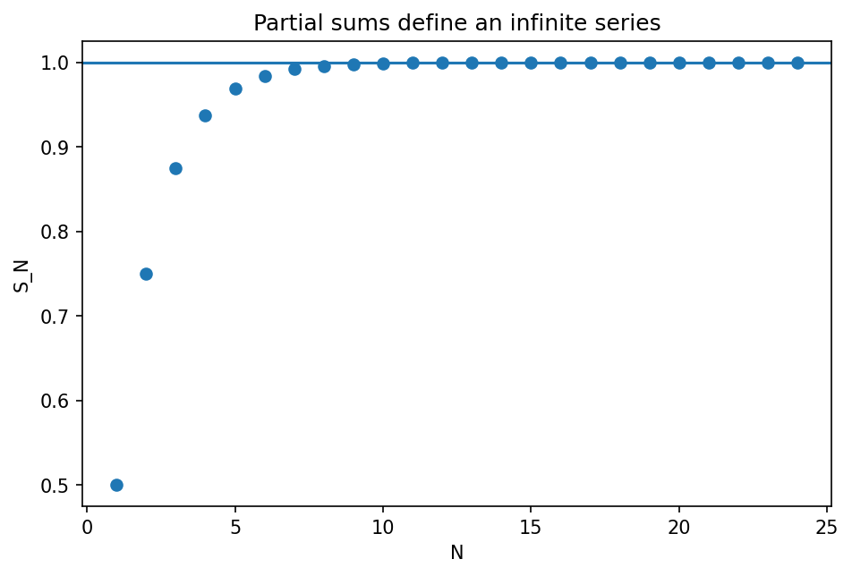

# 無限級数と収束判定

Course 01｜微積分

---

## 何を解決するか

無限個の項を足すとは何を意味し、どの条件で有限値へ収束するのか。

無限級数は「無限に足す操作」を直接定義せず、最初のN項までの部分和 S_N を作り、その数列が収束するかで定義する。

---

## 図の意味

横軸は部分和の打ち切り位置 $N$、縦軸は $S_N=\sum_{n=1}^N a_n$。幾何級数では点列が一定値へ近づき、GIFでは項を1つ追加するたびに部分和が極限へ近づく。無限和そのものを直接描いているのではなく、有限和の列の挙動を描いている点が重要。

---

## 記号

| 記号 | 意味 |
|---|---|
| $a_n$ | 級数の第n項 |
| $S_N$ | N項までの部分和 |
| $S$ | 部分和の極限 |

- $a_n$：級数の第n項。
- $S_N=\sum_{n=1}^N a_n$：N項までの部分和。
- $S$：部分和数列の極限。

---

## 中心式

$$
\sum_{n=1}^{\infty}a_n=S\iff S_N=\sum_{n=1}^{N}a_n\to S
$$

---

## 導出

1. 無限和を有限和の列 $S_N$ に置き換える。
2. $S_N$ が有限値Sへ収束すれば、そのSを無限級数の値と定義する。
3. $a_n\to0$ は必要条件だが十分条件ではない。

---

## 省略しない一段

無限級数 $\sum a_n$ の定義は部分和数列 $S_N$ の極限である。したがって級数の問題は数列の収束問題に還元できる。必要条件 $a_n\to0$ は $a_n=S_n-S_{n-1}$ と収束列の差から従うが、逆は成り立たない。

幾何級数では有限和公式 $S_N=(1-r^{N+1})/(1-r)$ を先に証明し、$|r|<1$ なら $r^{N+1}\to0$ を使う。$|r|\ge1$ ではこの極限が消えず、収束しない。

---

## 手計算

**問題**：$\sum_{n=1}^{\infty}3/4^n$ の部分和を求め、極限から級数の値を求めよ。

**解答**：$S_N=3\sum_{n=1}^N(1/4)^n=3[(1/4)(1-(1/4)^N)/(1-1/4)]=1-4^{-N}$。$N\to\infty$ で1。

---

## 条件を変える

$\sum_{n=1}^\infty 1/[n(n+1)]$ は $1/[n(n+1)]=1/n-1/(n+1)$。部分和は $S_N=1-1/(N+1)$ となり、極限は1。望遠鏡型では部分和を明示するのが最短。

---

## どこで壊れるか

$a_n\to0$ を収束の十分条件と誤解しない。調和級数 $\sum1/n$ は項が0へ行くが、$S_{2^k}$ を区間ごとにまとめると各ブロックが少なくとも1/2増え続けるため発散する。

---

## 次へ

Taylor級数は係数が導関数で決まる無限級数。次Topicでは「級数が収束する」だけでなく「その和が元の関数と一致する」ために剰余項が0へ行くことを確認する。

---

[教科書](../../textbook/calc-infinite-series-convergence)　|　[10問の演習](../../exercises/calc-infinite-series-convergence)

---

## 今回の問い

「無限級数と収束判定」は何を表し、どの条件で使え、結果をどう検算するのか？

---

## 到達目標

- 無限個の項を足すとは何を意味し、どの条件で有限値へ収束するのか。
- 中心式の記号と成立条件を説明できる
- 小さい例と反例で検算できる

---

## 理解確認

1. 無限個の項を足すとは何を意味し、どの条件で有限値へ収束するのか。
2. 中心式の記号と成立条件を説明できる
3. 小さい例と反例で検算できる
