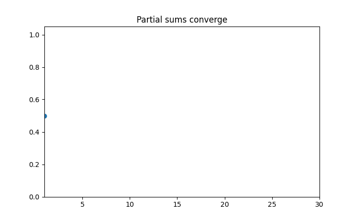

# 無限級数と収束判定

Course 01｜微積分

---

## 今回の問い

無限個の項を足すとは何を意味し、どの条件で有限値へ収束するのか。

---

## 直感

無限級数は「無限に足す操作」を直接定義せず、最初のN項までの部分和 S_N を作り、その数列が収束するかで定義する。

---

## 図解

---

## 動きで確認

---

## 中心式

$$
\sum_{n=1}^{\infty}a_n=S\iff S_N=\sum_{n=1}^{N}a_n\to S
$$

---

## 導出

1. 無限和を有限和の列 $S_N$ に置き換える。
2. $S_N$ が有限値Sへ収束すれば、そのSを無限級数の値と定義する。
3. $a_n\to0$ は必要条件だが十分条件ではない。

---

## 小さい例

幾何級数 Σr^n は |r|<1 なら S_N=(1-r^{N+1})/(1-r)→1/(1-r)。一方 Σ1/n は項が0へ行っても発散。

---

## 条件を外すと

- a_n→0だけで収束と判断しない。
- 絶対収束と条件収束を区別する。

---

## 理解確認

- 式の各記号を定義できるか。
- 導出を1段ずつ再現できるか。
- 反例を1つ作れるか。

---

## 教科書と演習

[教科書](../../textbook/calc-infinite-series-convergence)

[10問の演習](../../exercises/calc-infinite-series-convergence)
