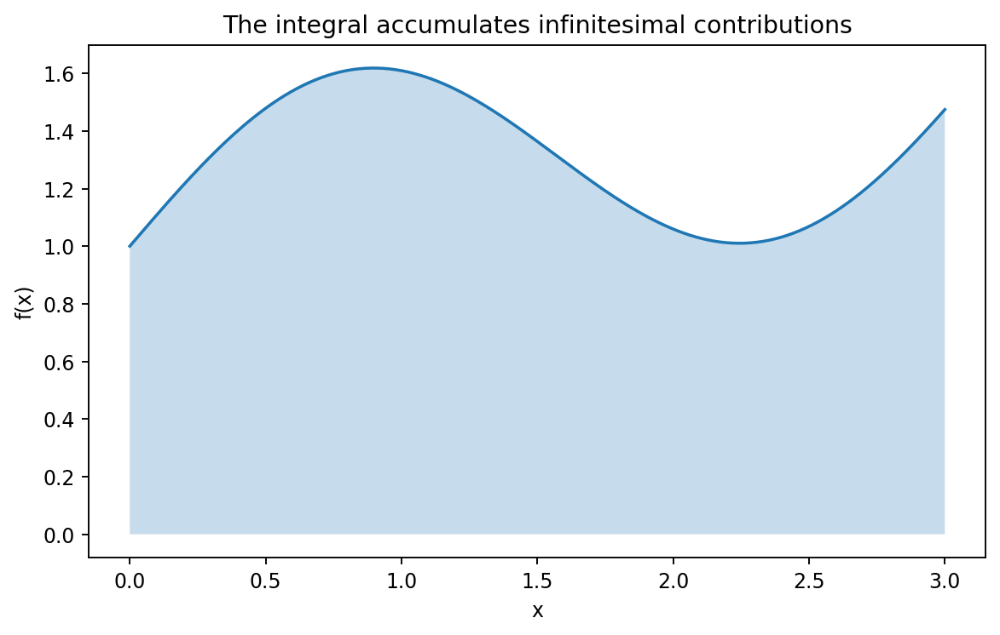

# 積分と微積分学の基本定理

Course 01｜微積分｜Topic 05/13

---
layout: center
---

## 今回の問い

## 到達目標

- 定義と代表式を、自分の言葉と記号で説明できる。
- 成立条件を確認し、手計算と結果を検算できる。

## 理解確認

- 定義・条件・計算結果を自分の言葉で説明できるか確認する。

微小量の総和としての積分と、微分の逆操作が同じものになるのはなぜか。

---

## なぜ今これを学ぶのか

微分は局所的な変化率を取り出す操作だった。逆に、各地点の小さな寄与を足し上げて累積量を求める操作が積分である。両者が逆になることを基本定理で結ぶ。

---

## 直感

積分は微小な寄与の総和であり、累積量を表す関数を微分すると元の密度が戻る。これが微分と積分を結ぶ基本定理である。

速度 $v(t)$ を短い時間幅 $\Delta t$ ごとに「ほぼ一定」と見れば、各区間の移動距離は $v(t_i)\Delta t$。全区間を足し、幅を0へ縮めた極限が総移動量になる。

---

## 図解

図では曲線 $y=f(x)$ の下を細い長方形に分割する。各長方形の符号付き面積 $f(x_i^*)\Delta x$ を足し、幅を細くすると曲線下の符号付き面積へ近づく。別の図では上端 $x$ を動かすと累積面積 $A(x)=\int_a^x f(t)dt$ が増え、その瞬間の増加率が高さ $f(x)$ になる。

---

## 記号と代表式

- $a,b$：積分区間の端点
- $\Delta x$：分割した小区間の幅
- $x_i^*$：第 $i$ 区間内の標本点
- $F$：$F^{\prime}=f$ を満たす原始関数
- $A(x)=\int_a^x f(t)dt$：上端までの累積量

$$
\int_a^b f(x)\,dx=F(b)-F(a),\quad F^{\prime}=f
$$

---

## 導出 1

$A(x+h)-A(x)=\int_x^{x+h}f(t)dt$。$h$ が小さければ連続性により区間内の $f(t)$ は $f(x)$ に近く、積分はおよそ $f(x)h$。

---

## 導出 2

$[A(x+h)-A(x)]/h=(1/h)\int_x^{x+h}f(t)dt$ は短い区間での $f$ の平均値。$h\to0$ で連続性により平均値は $f(x)$ へ近づくので $A^{\prime}(x)=f(x)$。

---

## 例題

$\int_0^2 3x^2dx$。原始関数は $F(x)=x^3$。基本定理より $F(2)-F(0)=8$。Riemann和で見ても正の高さを足し上げた面積が8へ収束する。

---

## 条件を変えるとどうなるか

「積分＝常に正の面積」は誤り。$f(x)=x$ を $[-1,1]$ で積分すると0だが、実際の幾何学的面積は1。絶対面積なら $\int|f|$ を考える。

---

## よくある誤解

「積分は微分の逆」とだけ覚えると、Riemann和としての意味が消える。基本定理は別々に定義した「局所変化率」と「累積総和」が結び付く定理である。

---

## 実装・計算上の注意

数値積分では原始関数が閉形式で得られなくても、有限個の関数値からRiemann和を改良して近似できる。Course 05で台形則や高次求積法を扱う。

---

## 一段先へ

累積量の上端を変数にした $A(x)$ は、確率分布のCDFや物理量の累積にも現れる。さらに多変数では面積・体積上の積分へ一般化されるが、まず一変数の「局所密度を足す」理解を固定する。

---

## 自分で説明できるか

- 基本定理第1部を $A(x+h)-A(x)$ から説明できるか
- 符号付き面積と幾何学的面積の違いを例で説明できるか
- Riemann和の $\Delta x$ を小さくする意味を極限の言葉で説明できるか

---
layout: center
---

## 教科書と演習

- [教科書](../../textbook/calc-integrals-fundamental-theorem)
- [10問の演習](../../exercises/calc-integrals-fundamental-theorem)
