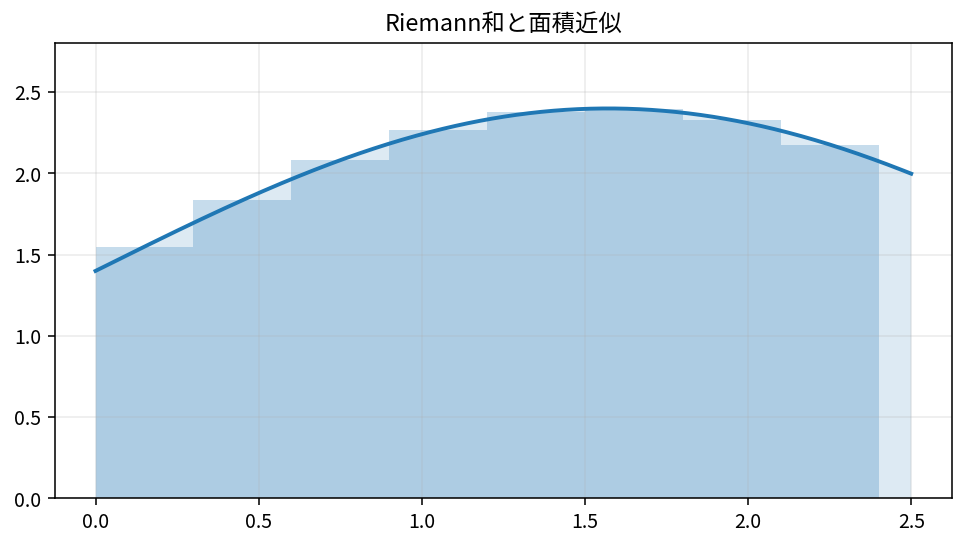

# 積分と微積分学の基本定理

Course 01｜微積分｜Topic 05/13

---
layout: center
---

## 今回の問い

小さな量の足し合わせと、微分の逆操作がなぜ同じものになるのか。

---

## 到達目標

- 定積分をRiemann和の極限として説明できる
- 符号付き面積と定積分を区別できる
- 微積分学の基本定理を使って定積分を計算できる
- 上端が変数の積分を微分できる

---

## 試験での基本姿勢

1. 何を求める問題か確認
2. 定義・成立条件を確認
3. 計算
4. 判定
5. 検算して結論

---

## 記号

| 記号 | 意味 |
|---|---|
| $\int_a^b f(x)\,dx$ | $[a,b]$ 上での $f$ の定積分 |
| $\Delta x$ | 区間を分割した1区間の幅 |
| $x_i^*$ | 第 $i$ 区間内の代表点 |
| $F$ | $F^{\prime}=f$ を満たす原始関数 |
| $dx$ | 積分する変数が $x$ であることを示す記号 |

---

## 中心概念 1

1. 積分は細かい和の極限
$[a,b]$ を $n$ 個に分け、幅を $\Delta x=(b-a)/n$ とする。各小区間の代表点を $x_i^*$ とすると
$$\int_a^b f(x)\,dx=\lim_{n\to\infty}\sum_{i=1}^{n}f(x_i^*)\Delta x.$$
高さ×幅を無限に細かく足している。

---

## 中心概念 2

### 2. 符号付き面積
$f(x)>0$ の部分は正、$f(x)<0$ の部分は負として加算される。したがって定積分と「幾何学的な面積」は常に同じではない。面積を求めるなら必要に応じて $|f(x)|$ を積分するか、符号が変わる点で区間を分ける。

---

## 図で確認

---

## 標準手順

- 何を積分しているか、変数と区間を書く
- 面積か符号付き量かを確認する
- 原始関数 $F$ を求める
- $F(b)-F(a)$ の順で代入する
- 変数上端の微分ならFTC＋連鎖律を使う
- 単位は「被積分関数の単位×横軸の単位」になる

---

## 典型例

**例1：FTCで計算。** $\int_0^2 3x^2\,dx=[x^3]_0^2=8$。

---

## よくある誤り

- 定積分に積分定数 $+C$ を付ける
- $F(a)-F(b)$ と順序を逆にする
- 負の部分を面積としてそのまま足してしまう
- 変数上端で連鎖律の因子を落とす

---

## 満点答案のポイント

- Riemann和の意味を文章で説明できるようにする
- 定積分と不定積分を区別する
- FTCは「微分と積分が逆操作」という言葉だけでなく式を2本書けるようにする

---

## 機械学習との接続

期待値、確率密度の正規化、連続時間の総量など、データ解析では積分が「蓄積・平均」の計算として現れる。

---

## 30秒確認 1

中心式または中心定義を、記号の意味まで含めて口頭で説明できるか。

---

## 30秒確認 2

「この条件がないと結論できない」という成立条件を1つ挙げられるか。

---

## 30秒確認 3

典型的な誤答を1つ挙げ、どこが誤りか説明できるか。

---

## 演習へ

- [教科書](../../textbook/calc-integrals-fundamental-theorem)
- [10問の演習](../../exercises/calc-integrals-fundamental-theorem)
## 理解確認

- 到達目標の各項目を、定義・計算手順・成立条件とともに説明できるか確認する。
- 教科書と演習の対応箇所を参照し、式の意味を自分の言葉で説明する。
