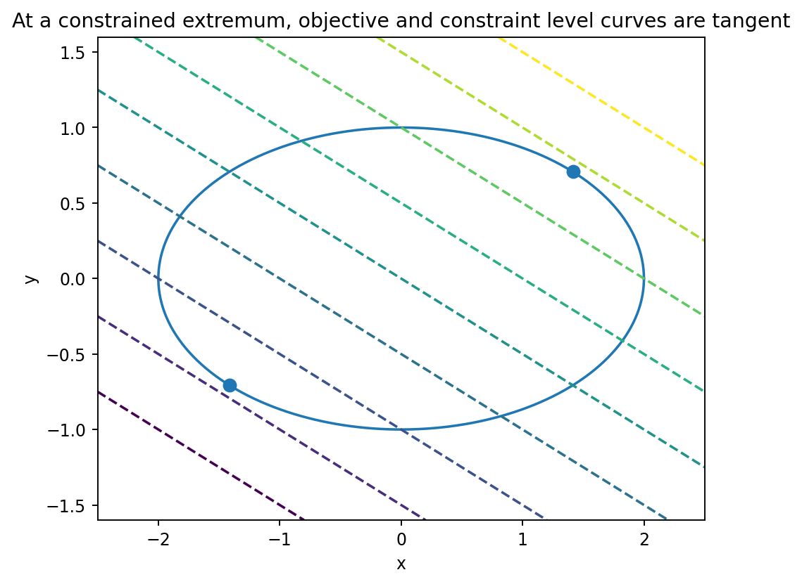

# Lagrange乗数法

Course 01｜微積分｜Topic 13/13

---
layout: center
---

## 今回の問い

## 到達目標

- 定義と代表式を、自分の言葉と記号で説明できる。
- 成立条件を確認し、手計算と結果を検算できる。

## 理解確認

- 定義・条件・計算結果を自分の言葉で説明できるか確認する。

制約面の上だけで動ける最適化では、なぜ目的関数と制約の勾配が平行になるのか。

---

## なぜ今これを学ぶのか

制約なしでは全方向へ動けたため勾配0が必要だった。制約付きでは動ける方向が制約面の接方向に限られるので、勾配そのものが0でなくても極値になれる。

---

## 直感

制約面に沿って動ける方向すべてで目的関数が変化しない極値では、目的関数の勾配は制約面の法線方向にしか残れない。

等高線が制約曲線へ接する点では、制約に沿って少し動いても目的関数が一次的に変わらない。両曲線の法線、つまり二つの勾配が同じ方向を向く。

---

## 図解

図では目的関数の等高線と制約曲線 $g(x,y)=c$ を描く。最適点では両者が接し、それぞれに垂直な $\nabla f$ と $\nabla g$ が平行になる。交差している点なら制約曲線に沿ってさらに高い／低い等高線へ移動できる。

---

## 記号と代表式

- $f:\mathbb R^n\to\mathbb R$：目的関数
- $g:\mathbb R^n\to\mathbb R$：制約を表す関数
- $g(\mathbf x)=c$：許される点の集合
- $\lambda$：Lagrange乗数。二つの法線ベクトルの倍率

$$
\nabla f(\mathbf{x}^*)=\lambda\nabla g(\mathbf{x}^*),\quad g(\mathbf{x}^*)=c
$$

---

## 導出 1

制約 $g(\mathbf x)=c$ を満たし続ける接ベクトル $\mathbf v$ は一次的に $\nabla g(\mathbf x^*)^T\mathbf v=0$ を満たす。つまり接空間は $\nabla g$ に直交する。

---

## 導出 2

制約に沿う任意の $\mathbf v$ に対し $\nabla f(\mathbf x^*)^T\mathbf v=0$。したがって $\nabla f$ も同じ接空間の全ベクトルに直交する。

---

## 例題

$f(x,y)=xy$ を $x^2+y^2=1$ 上で最大化。$\nabla f=(y,x)$、$\nabla g=(2x,2y)$。$y=2\lambda x$, $x=2\lambda y$ と制約を解き、$x=\pm y=\pm1/\sqrt2$。値を比較して最大 $1/2$、最小 $-1/2$。

---

## 条件を変えるとどうなるか

$g(x,y)=x^2+y^2=0$ の唯一の点は原点だが、原点で $\nabla g=0$。正則性が壊れているため通常のLagrange条件から有用な情報が得られない。

---

## よくある誤解

$\lambda$ を「答えの意味不明な補助変数」とせず、目的関数の法線が制約法線の何倍かを表す量と理解する。後の最適化では制約を緩めたときの感度としても解釈される。

---

## 実装・計算上の注意

数値制約最適化では方程式を手で解くだけでなくKKT系を反復的に解く。制約のスケールが極端に違うと数値条件が悪化するため正規化も重要。

---

## 一段先へ

不等式制約へ進むと、全制約が常に効くわけではなく、active constraintと相補性条件が必要になる。Course 06のKKT条件はLagrange乗数法の体系的な一般化。

---

## 自分で説明できるか

- 接ベクトルが $\nabla g$ に直交する理由を微分から導けるか
- 二つの勾配が平行になる論理を「接空間の直交補」で説明できるか
- $\nabla g=0$ だと通常の導出のどこが壊れるか

---
layout: center
---

## 教科書と演習

- [教科書](../../textbook/calc-lagrange-multipliers)
- [10問の演習](../../exercises/calc-lagrange-multipliers)
