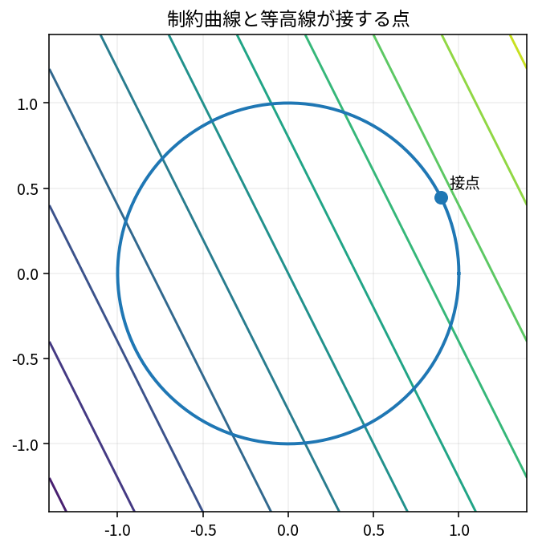
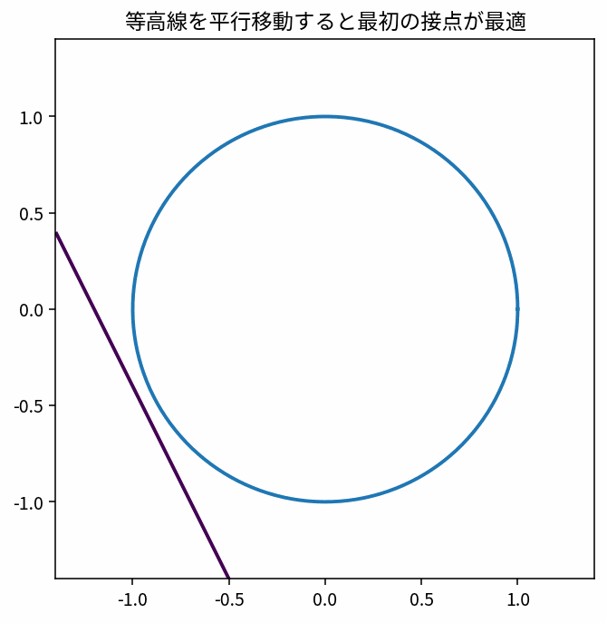

# Lagrange乗数法

Course 01｜微積分

---
layout: center
---

## 今回の問い

「Lagrange乗数法」は何を表し、どの条件で使え、結果をどう検算するのか？

---

## 到達目標

- Lagrange乗数法の定義と成立条件を説明できる
- Lagrange乗数法を小規模に計算・実装し検算できる

---

## まず全体像をつかむ

Lagrange乗数法の定義、計算手順、成立条件を整理し、微積分の後続Topicへ接続する

---

## このTopicで考える問い

制約つきで最適化するとき、なぜ勾配が平行になるのか。

---

## 学習目標

- 制約付き最適化の幾何学を説明する
- Lagrange関数を立てる
- 勾配平行条件の意味を理解する

---

## まず直感

- 制約つき最適化では自由に好きな方向へ動けない。
- 最適点では目的関数の勾配が制約の法線方向と揃う。
- 等高線の接触として見ると理解しやすい。

数学の定義に入る前に、**どの量を固定し、どの量を動かしているか** を言葉で確認すると理解しやすくなる。

---

## 図解

---

## 図を見るポイント

- 図の横軸・縦軸が何を表しているかを確認する。
- 変化している量と固定している量を区別する。
- 式の各記号が図のどこに対応するかを探す。

このアニメーションでは、概念の「極限・累積・方向・反復」の動きが視覚化されている。

---

## 数学的な定義・中心式

$\nabla f(\mathbf x)=\lambda\nabla g(\mathbf x),\quad g(\mathbf x)=c$

この式は単なる計算規則ではなく、**何をどう近似しているか** を表している。

---

## 小さな例

単位円上で $f(x,y)=x+0.5y$ を最大化する。

例を読むときは、1. 入力は何か 2. 出力は何か 3. どの量の変化を見ているか、を順に確認する。

---

## よくある誤解

- 制約式も必ず連立に含める。
- 勾配が等しいのではなく平行。

---

## 機械学習・数値計算との接続

KKT条件や制約付き学習問題の入口になる。

Course 01の内容は、後の線形代数・最適化・機械学習で何度も再登場する。

---

## 最後に確認したいこと

- 中心式を日本語で説明できるか。
- 図のどの部分が式の各項に対応するか。
- どの場面でこの概念が必要になるか。

---

## 次へ

- [スライド](/slides/calc-lagrange-multipliers/)
- [演習](/exercises/calc-lagrange-multipliers)

---

## 前提との接続

このTopicは次の内容を土台にする。式や用語が曖昧なら、先に対応するTopicへ戻る。

- `calc-gradient-directional-derivative`
- `calc-unconstrained-optimization`

---

## 理解確認

1. Lagrange乗数法の定義と成立条件を説明できる
2. Lagrange乗数法を小規模に計算・実装し検算できる
3. 代表式・計算手順・成立条件を小さな例で検算できるか。

---

## 演習へ

[教科書](../../textbook/calc-lagrange-multipliers)

[10問の演習](../../exercises/calc-lagrange-multipliers)

