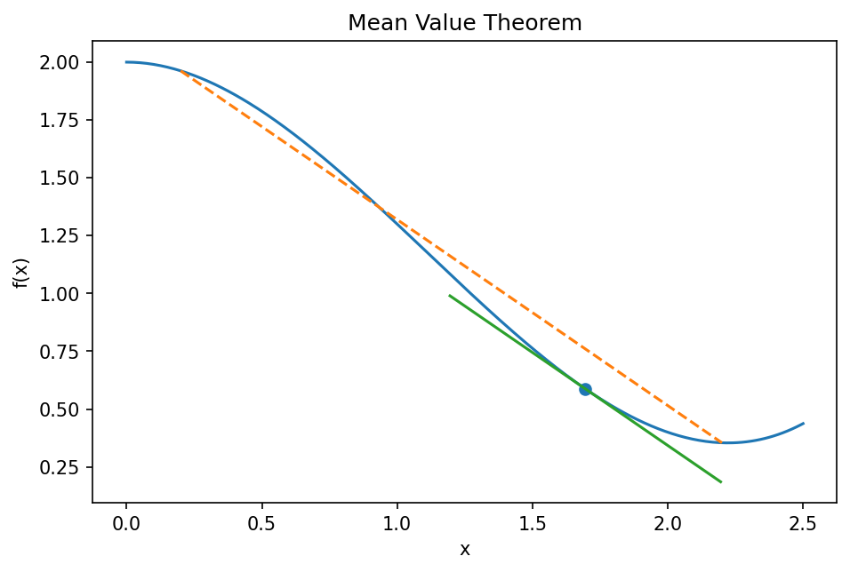

# 平均値の定理

Course 01｜微積分

---

## 何を解決するか

区間全体の平均変化率と、ある一点の瞬間変化率が一致するのはなぜか。

区間の両端を結ぶ割線と平行な接線が途中に存在する、という局所微分と大域変化を結ぶ定理。単調性、誤差評価、収束証明の基礎になる。

---

## 図の意味

曲線上の端点 $(a,f(a))$ と $(b,f(b))$ を結ぶ破線が割線。その傾きが区間全体の平均変化率。図中の点 $c$ で描いた接線が割線と平行になっており、接線傾き $f\prime(c)$ が平均変化率と一致することを示す。GIFでは接線を動かし、平行になる位置が存在することを確認できる。

---

## 記号

| 記号 | 意味 |
|---|---|
| $a<b$ | 区間端点 |
| $c∈(a,b)$ | 定理が保証する内部点 |
| $f′(c)$ | cでの瞬間変化率 |

- $a<b$：区間端点。
- $c\in(a,b)$：定理が存在を保証する内部点。
- $f'(c)$：cでの瞬間変化率。

---

## 中心式

$$
f\prime(c)=\frac{f(b)-f(a)}{b-a}
$$

---

## 導出

1. 割線の傾きを m と置く。
2. $g(x)=f(x)-mx$ を作ると g(a)=g(b)。
3. Rolleの定理により g′(c)=0、したがって f′(c)=m。

---

## 省略しない一段

証明では割線を水平にするため補助関数を作る。$m=[f(b)-f(a)]/(b-a)$ とし $g(x)=f(x)-mx$ と置くと $g(b)-g(a)=f(b)-f(a)-m(b-a)=0$。よって $g(a)=g(b)$。

$f$ が $[a,b]$ で連続、$(a,b)$ で微分可能なら $g$ も同様なのでRolleの定理を使え、ある $c$ で $g\prime(c)=0$。$g\prime=f\prime-m$ だから $f\prime(c)=m$。仮定が証明のどこで使われるかを対応づける。

---

## 手計算

**問題**：$f(x)=\sqrt{x}$ を $[1,4]$ に適用し、平均値の定理が保証する $c$ を求めよ。

**解答**：平均変化率は $(2-1)/(4-1)=1/3$。$f'(x)=1/(2\sqrt x)$ なので $1/(2\sqrt c)=1/3$、$\sqrt c=3/2$、$c=9/4\in(1,4)$。

---

## 条件を変える

$f(x)=x^3$、$[-1,2]$ では平均変化率は $(8-(-1))/3=3$。$f\prime(x)=3x^2$ なので $3c^2=3$、区間内に $c=1,-1$ があるが開区間 $(-1,2)$ では $c=1$ が該当する。

---

## どこで壊れるか

連続性を外すと成立しない。たとえば $f(x)=0$ for $x<0$, $f(x)=1$ for $x\ge0$ を $[-1,1]$ で見ると平均変化率は1/2だが、微分できる点で導関数は0しか取らない。

---

## 次へ

MVTから「導関数が0なら定数」「導関数の符号で単調性」「導関数上界から誤差上界」が導ける。Taylor剰余や数値計算法の誤差評価の背後にも同じ考えがある。

---

[教科書](../../textbook/calc-mean-value-theorem)　|　[10問の演習](../../exercises/calc-mean-value-theorem)

---

## 今回の問い

「平均値の定理」は何を表し、どの条件で使え、結果をどう検算するのか？

---

## 到達目標

- 区間全体の平均変化率と、ある一点の瞬間変化率が一致するのはなぜか。
- 中心式の記号と成立条件を説明できる
- 小さい例と反例で検算できる

---

## 理解確認

1. 区間全体の平均変化率と、ある一点の瞬間変化率が一致するのはなぜか。
2. 中心式の記号と成立条件を説明できる
3. 小さい例と反例で検算できる
