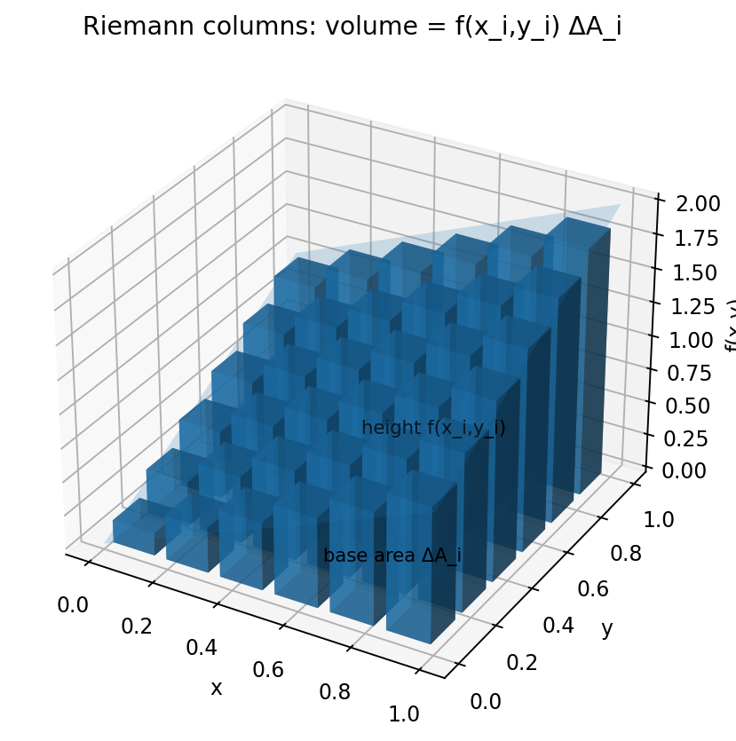

# 重積分

Course 01｜微積分

---

## 何を解決するか

1変数の「面積の足し上げ」は、2変数・3変数でどのように拡張されるか。

領域を小さな長方形や直方体へ分割し、各セルでの関数値×セル面積（体積）を足す。極限を取ると重積分になる。

---

## 図の意味

図の底面の格子1枚が小領域 $D_i$、その面積が $\Delta A_i$。各セル上で関数 $f(x_i,y_i)$ を高さとみなすと、小さな柱の体積が $f(x_i,y_i)\Delta A_i$。柱を細かくして総和を取った極限が $\iint_D f\,dA$ であり、単なる2次元格子ではなく「底面×高さ」の3次元量として読む。

---

## 記号

| 記号 | 意味 |
|---|---|
| $D$ | 積分領域 |
| $dA$ | 微小面積要素 |
| $f(x,y)$ | 各点での密度・高さ |

- $D\subset\mathbb R^2$：積分領域。
- $dA$：面積要素。Cartesian座標では $dx\,dy$。
- $f:D\to\mathbb R$：積分する関数。

---

## 中心式

$$
\iint_D f(x,y)\,dA
$$

---

## 導出

1. Dを小セルへ分割する。
2. 各セルで代表点を選び $f(x_i,y_i)\Delta A_i$ を足す。
3. 最大セル径を0へ近づけた極限が二重積分。

---

## 省略しない一段

まず長方形 $D=[a,b]\times[c,d]$ を小矩形へ分割し、代表点 $(x_i^*,y_j^*)$ でRiemann和 $\sum_{i,j}f(x_i^*,y_j^*)\Delta x_i\Delta y_j$ を作る。分割の最大幅を0へした極限が二重積分。

連続関数ならFubiniの定理により反復積分へ変換できる。$\int_c^d[\int_a^b f(x,y)dx]dy$ は、固定した $y$ でx方向に薄い断面を積分し、その断面量をy方向へ足す操作である。領域が長方形でないときは境界を関数で記述し直す必要がある。

---

## 手計算

**問題**：領域 $D=\{(x,y):0\le x\le1,0\le y\le1-x\}$ で $f(x,y)=x+2y$ を積分せよ。

**解答**：$\int_0^1\int_0^{1-x}(x+2y)dy dx=\int_0^1[x(1-x)+(1-x)^2]dx=\int_0^1(1-x)dx=1/2$。

---

## 条件を変える

三角形 $D=\{(x,y):0\le x\le1,0\le y\le x\}$ で $f=1$ なら $\iint_D1\,dA=\int_0^1\int_0^x1\,dy\,dx=\int_0^1x\,dx=1/2$。これは三角形の面積と一致する。

---

## どこで壊れるか

積分順序を変えると境界も書き換える必要がある。上の三角形をdy dxからdx dyへ変えるなら $0\le y\le1$, $y\le x\le1$。境界をそのまま交換すると別領域を積分してしまう。

---

## 次へ

確率密度の二重積分は領域確率、期待値は密度を重みとした重積分になる。次の変数変換では面積要素 $dA$ 自体が座標変換でどう伸縮するかをJacobian determinantで追う。

---

[教科書](../../textbook/calc-multiple-integrals)　|　[10問の演習](../../exercises/calc-multiple-integrals)
