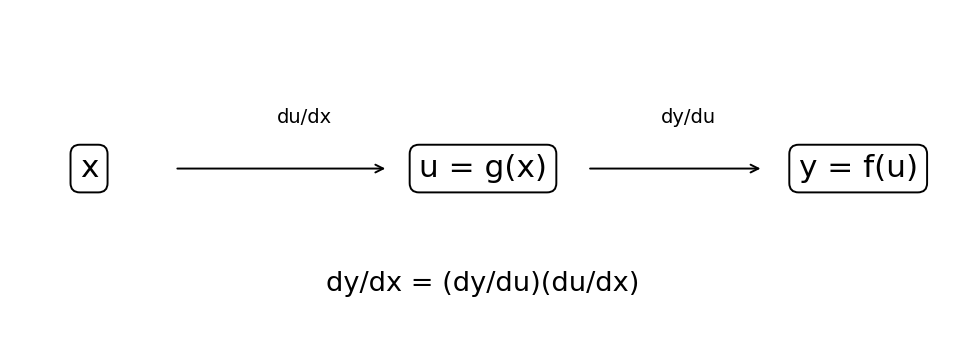

# 多変数の連鎖律

Course 01｜微積分｜Topic 11/13

---
layout: center
---

## 今日の中心問い

複数の中間変数を通る変化を、漏れなく合成するにはどうするか。

---

## 到達目標

- 経路に沿うスカラー関数の連鎖律を書ける
- Jacobian積として多変数連鎖律を書ける
- 行列shapeで式の向きを検算できる
- 計算グラフ上の複数経路の寄与を足し合わせられる

---

## 試験での基本姿勢

1. 何を求める問題か確認
2. 定義・成立条件を確認
3. 計算
4. 判定
5. 検算して結論

---

## 記号

| 記号 | 意味 |
|---|---|
| $x(t),y(t)$ | $t$ に依存する中間変数 |
| $z=f(x,y)$ | 中間変数から作る出力 |
| $J_f$ | 関数 $f$ のJacobian |
| $J_{f\circ g}$ | 合成関数 $f(g(\cdot))$ のJacobian |

---

## 中心概念 1

1. スカラー経路
$z=f(x,y)$、$x=x(t),y=y(t)$ なら
$$\frac{dz}{dt}=\frac{\partial f}{\partial x}\frac{dx}{dt}+\frac{\partial f}{\partial y}\frac{dy}{dt}.$$
$t$ の変化が $x$ 経路と $y$ 経路の両方を通って $z$ に影響するため、寄与を足す。

---

## 中心概念 2

### 2. Jacobianによる連鎖律
$g:\mathbb R^n\to\mathbb R^p$、$f:\mathbb R^p\to\mathbb R^m$ のとき
$$J_{f\circ g}(\mathbf x)=J_f(g(\mathbf x))J_g(\mathbf x).$$
shapeは $(m\times p)(p\times n)=m\times n$。**順序を逆にしない**。

---

## 図で確認

---

## 標準手順

- 依存関係を図か式で明示する
- 各関数の入力・出力次元を書く
- 局所Jacobianを求める
- 外側Jacobian×内側Jacobianの順に掛ける
- 複数経路なら寄与を足す
- 最終shapeが入力→出力の写像に一致するか確認する

---

## 典型例

**例1：経路。** $z=x^2+y^2$, $x=t$, $y=t^2$。$dz/dt=2x\cdot1+2y\cdot2t=2t+4t^3$。

---

## よくある誤り

- Jacobian積の順序を逆にする
- 複数経路の寄与を1つしか数えない
- 中間点 $g(\mathbf x)$ で外側Jacobianを評価しない
- shape確認をせず転置ミスをする

---

## 満点答案のポイント

- 依存関係を矢印で紙に書くのは有効だが、答案では式も必ず書く
- 行列の内側次元が一致するかを毎回確認する
- 「経路では掛ける、合流では足す」を言葉でも説明できるようにする

---

## 機械学習との接続

backpropagationそのもの。深いニューラルネットでは局所Jacobianの積を効率よく計算し、損失から各パラメータへの勾配を伝播する。

---

## 30秒確認 1

中心式または中心定義を、記号の意味まで含めて口頭で説明できるか。

---

## 30秒確認 2

「この条件がないと結論できない」という成立条件を1つ挙げられるか。

---

## 30秒確認 3

典型的な誤答を1つ挙げ、どこが誤りか説明できるか。

---

## 演習へ

- [教科書](../../textbook/calc-multivariable-chain-rule)
- [10問の演習](../../exercises/calc-multivariable-chain-rule)
