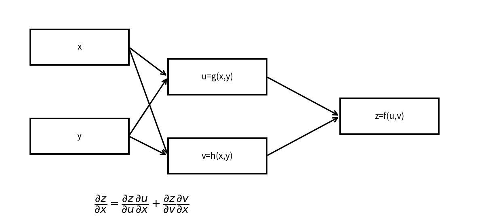

# 多変数の連鎖律

Course 01｜微積分

---
layout: center
---

## 今回の問い

「多変数の連鎖律」は何を表し、どの条件で使え、結果をどう検算するのか？

---

## 到達目標

- 多変数の連鎖律の定義と成立条件を説明できる
- 多変数の連鎖律を小規模に計算・実装し検算できる

---

## まず全体像をつかむ

多変数の連鎖律の定義、計算手順、成立条件を整理し、微積分の後続Topicへ接続する

---

## このTopicで考える問い

複数の中間変数を通る依存関係では、微分をどう組み立てるか。

---

## 学習目標

- 計算グラフで依存関係を追う
- 偏微分の和として連鎖律を書く
- Jacobian積として整理する

---

## まず直感

- 多変数の連鎖律は経路ごとの寄与を足し合わせる規則。
- 行列で書くと計算が見通しやすい。
- 逆伝播への橋渡しになる。

数学の定義に入る前に、**どの量を固定し、どの量を動かしているか** を言葉で確認すると理解しやすくなる。

---

## 図解

---

## 図を見るポイント

- 図の横軸・縦軸が何を表しているかを確認する。
- 変化している量と固定している量を区別する。
- 式の各記号が図のどこに対応するかを探す。

---

## 数学的な定義・中心式

$\dfrac{\partial z}{\partial x}=\dfrac{\partial z}{\partial u}\dfrac{\partial u}{\partial x}+\dfrac{\partial z}{\partial v}\dfrac{\partial v}{\partial x}$

この式は単なる計算規則ではなく、**何をどう近似しているか** を表している。

---

## 小さな例

$z=f(u,v),\;u=g(x,y),\;v=h(x,y)$ の依存関係を図で追う。

例を読むときは、1. 入力は何か 2. 出力は何か 3. どの量の変化を見ているか、を順に確認する。

---

## よくある誤解

- 経路の足し忘れに注意。
- スカラー式と行列表記の対応を曖昧にしない。

---

## 機械学習・数値計算との接続

ニューラルネットの逆伝播は計算グラフ上の多変数連鎖律。

Course 01の内容は、後の線形代数・最適化・機械学習で何度も再登場する。

---

## 最後に確認したいこと

- 中心式を日本語で説明できるか。
- 図のどの部分が式の各項に対応するか。
- どの場面でこの概念が必要になるか。

---

## 次へ

- [スライド](/slides/calc-multivariable-chain-rule/)
- [演習](/exercises/calc-multivariable-chain-rule)

---

## 前提との接続

このTopicは次の内容を土台にする。式や用語が曖昧なら、先に対応するTopicへ戻る。

- `calc-total-derivative-jacobian`
- `calc-differentiation-rules-chain-rule`

---

## 理解確認

1. 多変数の連鎖律の定義と成立条件を説明できる
2. 多変数の連鎖律を小規模に計算・実装し検算できる
3. 代表式・計算手順・成立条件を小さな例で検算できるか。

---

## 演習へ

[教科書](../../textbook/calc-multivariable-chain-rule)

[10問の演習](../../exercises/calc-multivariable-chain-rule)

