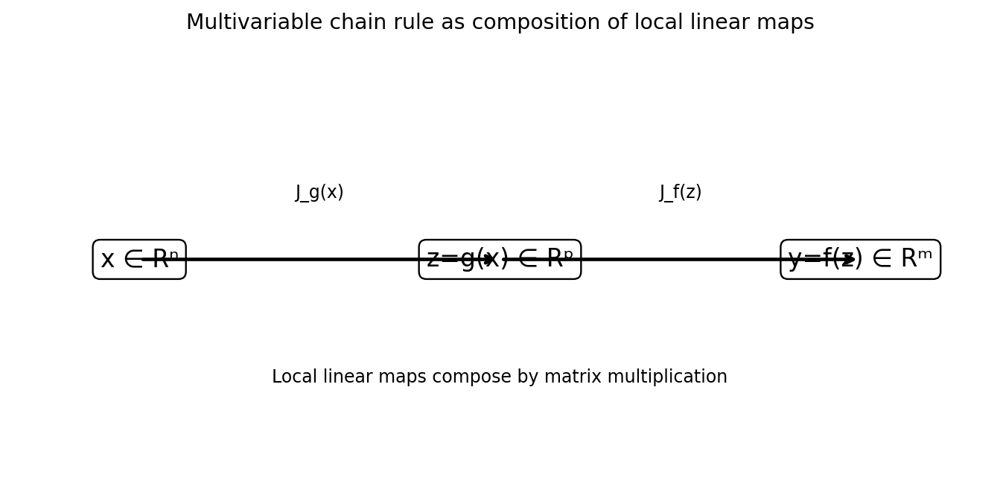

# 多変数の連鎖律

Course 01｜微積分｜Topic 11/13

---
layout: center
---

## 今回の問い

## 到達目標

- 定義と代表式を、自分の言葉と記号で説明できる。
- 成立条件を確認し、手計算と結果を検算できる。

## 理解確認

- 定義・条件・計算結果を自分の言葉で説明できるか確認する。

多段の多変数写像で変化を伝えると、なぜJacobianの行列積になるのか。

---

## なぜ今これを学ぶのか

各関数は局所的にはJacobianという線形写像で近似できる。二つの関数を合成したとき、その局所線形近似も「二つの線形写像の合成」になるはずであり、行列積が自然に現れる。

---

## 直感

局所的な線形写像を順に合成すると行列積になる。多変数の連鎖律はこの事実そのものである。

一変数では倍率×倍率だった。多変数では入力変化の方向も混ざるため、倍率が行列に置き換わり、順序を保った行列積になる。

---

## 図解

図では $\mathbf x\in\mathbb R^n\to\mathbf z=g(\mathbf x)\in\mathbb R^p\to\mathbf y=f(\mathbf z)\in\mathbb R^m$ の3層を描く。小変位 $d\mathbf x$ がまず $\mathbf J_gd\mathbf x$ へ、次に $\mathbf J_f(\mathbf J_gd\mathbf x)$ へ写るため全体行列は $\mathbf J_f\mathbf J_g$。

---

## 記号と代表式

- $g:\mathbb R^n\to\mathbb R^p$
- $f:\mathbb R^p\to\mathbb R^m$
- $\mathbf J_g\in\mathbb R^{p\times n}$
- $\mathbf J_f\in\mathbb R^{m\times p}$
- $\mathbf J_{f\circ g}\in\mathbb R^{m\times n}$

$$
\mathbf J_{f\circ g}(\mathbf{x})=\mathbf J_f(g(\mathbf{x}))\mathbf J_g(\mathbf{x})
$$

---

## 導出 1

$g(\mathbf x+\mathbf h)=g(\mathbf x)+\mathbf J_g\mathbf h+o(\|\mathbf h\|)$。中間変数の変化は $\Delta\mathbf z\approx\mathbf J_g\mathbf h$。

---

## 導出 2

$f(\mathbf z+\Delta\mathbf z)=f(\mathbf z)+\mathbf J_f\Delta\mathbf z+o(\|\Delta\mathbf z\|)$。$\Delta\mathbf z\approx\mathbf J_g\mathbf h$ を代入すると一次項は $\mathbf J_f\mathbf J_g\mathbf h$。

---

## 例題

$g(x,y)=(x+y,xy)^T$、$f(u,v)=u^2+v$。$\mathbf J_g=\begin{bmatrix}1&1\\y&x\end{bmatrix}$、$\mathbf J_f=[2u,1]$。積は $[2(x+y)+y,\ 2(x+y)+x]$ で、直接 $f(g)= (x+y)^2+xy$ を偏微分した結果と一致。

---

## 条件を変えるとどうなるか

行列積は可換でないので $\mathbf J_f\mathbf J_g=\mathbf J_g\mathbf J_f$ としてはいけない。shapeが偶然一致しても、写像の適用順序が逆になる。

---

## よくある誤解

「偏微分を全部掛ける」ではなく、中間変数ごとの経路を足し合わせる構造。行列表記はその多数の経路和を一度に表している。

---

## 実装・計算上の注意

reverse-mode ADは、スカラーlossに対してvector-Jacobian productを出力側から逆向きに計算し、巨大なJacobian全体を保存しない。これがdeep neural networkのbackpropagationを効率化する。

---

## 一段先へ

計算graphがDAGなら、各nodeの局所Jacobianをトポロジカル順に合成できる。Course 09でこの構造を誤差逆伝播として詳しく扱う。

---

## 自分で説明できるか

- shapeだけからJacobian積の順序を決められるか
- 直接微分とJacobian積が一致する2変数例を計算できるか
- reverse-modeで転置が現れる理由を内積・連鎖律から説明できるか

---
layout: center
---

## 教科書と演習

- [教科書](../../textbook/calc-multivariable-chain-rule)
- [10問の演習](../../exercises/calc-multivariable-chain-rule)
