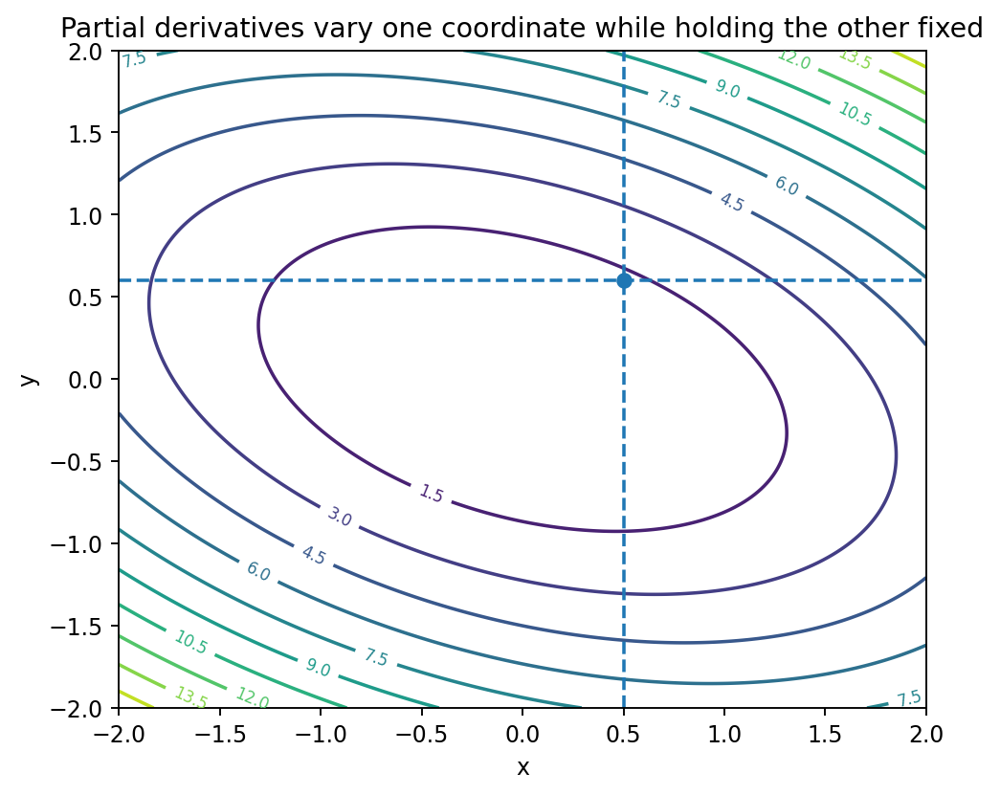

# 多変数関数と偏微分

Course 01｜微積分｜Topic 07/13

---
layout: center
---

## 今回の問い

## 到達目標

- 定義と代表式を、自分の言葉と記号で説明できる。
- 成立条件を確認し、手計算と結果を検算できる。

## 理解確認

- 定義・条件・計算結果を自分の言葉で説明できるか確認する。

複数の入力を持つ関数で、一つの入力だけを動かす変化率をどう定義するか。

---

## なぜ今これを学ぶのか

一変数では入力方向が一つしかなかった。多変数ではどの方向へ動くかで変化率が変わるため、まず座標軸ごとの変化率を偏微分として定義する。

---

## 直感

入力が複数あるとき、一つの座標だけを動かし他を固定して測る変化率が偏微分である。

$f(x,y)$ を地形の高さと見ると、$y$ を固定して東西へ歩く傾きが $\partial f/\partial x$、$x$ を固定して南北へ歩く傾きが $\partial f/\partial y$。

---

## 図解

図では曲面 $z=f(x,y)$ を $y=y_0$ の縦平面で切った断面曲線と、$x=x_0$ で切った断面曲線を描く。それぞれの接線の傾きが二つの偏微分に対応する。

---

## 記号と代表式

- $\mathbf{x}=(x_1,\ldots,x_n)^T$：入力ベクトル
- $x_i$：第 $i$ 座標
- $\mathbf e_i$：第 $i$ 成分だけ1の標準基底ベクトル
- $\partial f/\partial x_i$：他の座標を固定して $x_i$ だけ変えた変化率

$$
\frac{\partial f}{\partial x_i}(\mathbf{x})=\lim_{h\to0}\frac{f(\mathbf{x}+h\mathbf e_i)-f(\mathbf{x})}{h}
$$

---

## 導出 1

$\mathbf{x}$ から $h\mathbf e_i$ だけ動けば、変化するのは $x_i$ だけ。したがって $g(h)=f(\mathbf{x}+h\mathbf e_i)$ という一変数関数を作れる。

---

## 導出 2

$g^{\prime}(0)=\lim_{h\to0}[g(h)-g(0)]/h$ を書き戻すと、ちょうど $\partial f/\partial x_i$ の定義になる。

---

## 例題

$f(x,y)=x^2y+3y^2$。$y$ を定数として $x$ で微分すると $f_x=2xy$。$x$ を定数として $y$ で微分すると $f_y=x^2+6y$。$(1,2)$ では $(f_x,f_y)=(4,13)$。

---

## 条件を変えるとどうなるか

上の $xy/(x^2+y^2)$ の例は「全偏微分が存在すれば連続・微分可能」という主張への反例。座標軸だけの情報では全方向を覆わない。

---

## よくある誤解

偏微分時に他変数を0にするのではなく「定数として固定する」。$x^2y$ を $x$ で偏微分したとき $y$ は残り、$2xy$ となる。

---

## 実装・計算上の注意

NumPy配列で多変数関数を扱うとき、軸の意味と数学的な変数を混同しない。自動微分ではどの入力成分に対する偏微分かをshapeで確認する。

---

## 一段先へ

全ての偏微分を並べると勾配ができる。ただし勾配を局所線形近似として使うには全微分可能性が必要。次Topicで方向微分と勾配の関係を導く。

---

## 自分で説明できるか

- 偏微分を $g(h)$ という一変数関数に還元して定義できるか
- 全偏微分が存在しても連続でない反例のどこが効いているか説明できるか
- $f(x,y,z)=xye^z$ の3偏微分を計算できるか

---
layout: center
---

## 教科書と演習

- [教科書](../../textbook/calc-multivariable-functions-partial-derivatives)
- [10問の演習](../../exercises/calc-multivariable-functions-partial-derivatives)
