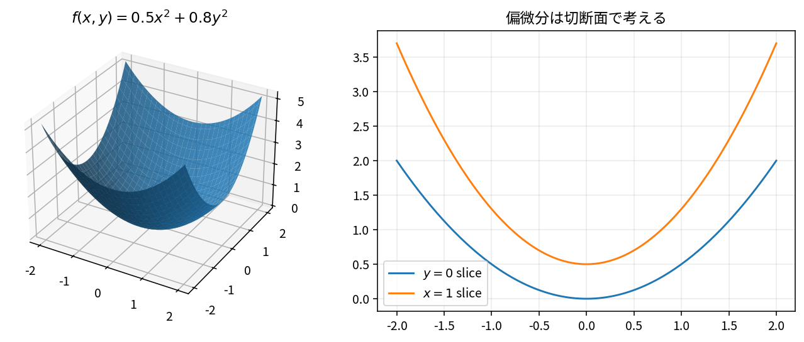

# 多変数関数と偏微分

Course 01｜微積分

---
layout: center
---

## 今回の問い

「多変数関数と偏微分」は何を表し、どの条件で使え、結果をどう検算するのか？

---

## 到達目標

- 多変数関数、偏微分の定義と成立条件を説明できる
- 多変数関数と偏微分を小規模に計算・実装し検算できる

---

## まず全体像をつかむ

多変数関数と偏微分の定義、計算手順、成立条件を整理し、微積分の後続Topicへ接続する

---

## このTopicで考える問い

2変数以上の関数では、変化率をどう方向ごとに分けて考えるか。

---

## 学習目標

- 多変数関数を入力空間と出力空間で捉える
- 偏微分を一方向だけ動かす変化率として説明する
- 切断面との対応を理解する

---

## まず直感

- 多変数関数は多次元の入力から出力を返す。
- 偏微分では他の変数を固定して1方向だけ見る。
- 3Dの曲面と2Dの切断面を往復して理解する。

数学の定義に入る前に、**どの量を固定し、どの量を動かしているか** を言葉で確認すると理解しやすくなる。

---

## 図解

---

## 図を見るポイント

- 図の横軸・縦軸が何を表しているかを確認する。
- 変化している量と固定している量を区別する。
- 式の各記号が図のどこに対応するかを探す。

---

## 数学的な定義・中心式

$\dfrac{\partial f}{\partial x}(a,b)=\lim_{h\to0}\dfrac{f(a+h,b)-f(a,b)}{h}$

この式は単なる計算規則ではなく、**何をどう近似しているか** を表している。

---

## 小さな例

$f(x,y)=x^2+xy$ なら $\partial f/\partial x=2x+y$, $\partial f/\partial y=x$。

例を読むときは、1. 入力は何か 2. 出力は何か 3. どの量の変化を見ているか、を順に確認する。

---

## よくある誤解

- 偏微分は全体の変化ではない。
- 何を固定するかを曖昧にしない。

---

## 機械学習・数値計算との接続

特徴量が多いモデルでは、各入力成分の感度を偏微分が表す。

Course 01の内容は、後の線形代数・最適化・機械学習で何度も再登場する。

---

## 最後に確認したいこと

- 中心式を日本語で説明できるか。
- 図のどの部分が式の各項に対応するか。
- どの場面でこの概念が必要になるか。

---

## 次へ

- [スライド](/slides/calc-multivariable-functions-partial-derivatives/)
- [演習](/exercises/calc-multivariable-functions-partial-derivatives)

---

## 前提との接続

このTopicは次の内容を土台にする。式や用語が曖昧なら、先に対応するTopicへ戻る。

- `calc-differentiation-rules-chain-rule`
- `prep-symbols-types-shapes`

---

## 理解確認

1. 多変数関数、偏微分の定義と成立条件を説明できる
2. 多変数関数と偏微分を小規模に計算・実装し検算できる
3. 代表式・計算手順・成立条件を小さな例で検算できるか。

---

## 演習へ

[教科書](../../textbook/calc-multivariable-functions-partial-derivatives)

[10問の演習](../../exercises/calc-multivariable-functions-partial-derivatives)

