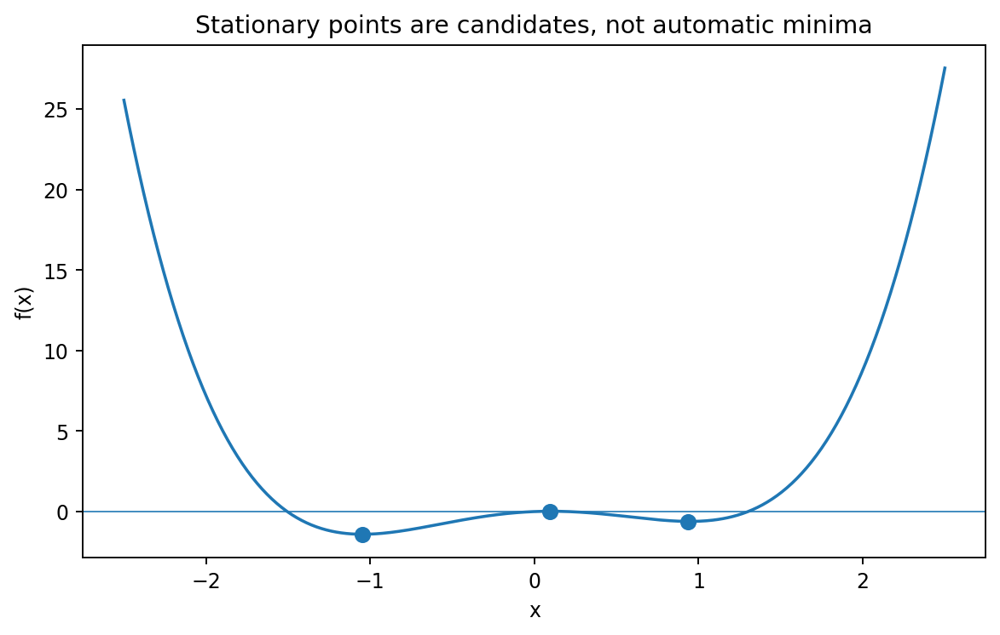

# 一変数の最適化

Course 01｜微積分｜Topic 04/13

---
layout: center
---

## 今回の問い

## 到達目標

- 定義と代表式を、自分の言葉と記号で説明できる。
- 成立条件を確認し、手計算と結果を検算できる。

## 理解確認

- 定義・条件・計算結果を自分の言葉で説明できるか確認する。

傾き0はなぜ極値の候補を与え、なぜそれだけでは最大・最小を保証しないのか。

---

## なぜ今これを学ぶのか

導関数で局所的な増減を測れるようになった。次は「どこで最も大きい／小さいか」を導関数から探す。重要なのは、$f^{\prime}=0$ は候補を絞る条件であって結論そのものではない点。

---

## 直感

内部の滑らかな極値では、左右どちらへ少し動いても一方向に改善できないため接線の傾きが0になる。ただし0であることだけでは極値を保証しない。

滑らかな曲線の内部で谷底や山頂にいるなら、右へ少し進んでも左へ少し進んでも一方向に改善し続けることはできない。そのため接線は水平になる。ただし水平でも $x^3$ のように通過する点がある。

---

## 図解

図では極小点・極大点・水平な変曲点を並べる。3点はいずれも接線が水平だが、周囲の傾きの符号変化が「負→正」なら極小、「正→負」なら極大、符号が変わらなければ極値ではない。

---

## 記号と代表式

- $f$：最適化する一変数関数
- $x^*$：極値の候補点
- $f^{\prime}(x)$：傾き
- $f^{\prime\prime}(x)$：曲率を表す二階導関数

$$
f^{\prime}(x^*)=0
$$

---

## 導出 1

$x^*$ が局所極小なら小さい $h>0$ で $f(x^*+h)-f(x^*)\ge0$。したがって右差分商は $[f(x^*+h)-f(x^*)]/h\ge0$。

---

## 導出 2

$h<0$ では分子は依然 $\ge0$ だが分母が負なので差分商は $\le0$。微分可能なら左右極限は同じ値なので、その値は同時に $\ge0$ かつ $\le0$、よって0。

---

## 例題

$f(x)=x^3-3x$。$f^{\prime}=3x^2-3=0$ から $x=\pm1$。$f^{\prime\prime}=6x$ なので $x=-1$ は極大、$x=1$ は極小。候補を出した後に分類する二段階が必要。

---

## 条件を変えるとどうなるか

$f(x)=|x|$ は $x=0$ で局所最小だが微分不可能なので $f^{\prime}(0)=0$ という必要条件の対象外。仮定を外すと「極値なら傾き0」は使えない。

---

## よくある誤解

$f^{\prime}=0$ を解いた時点で答えとするのは誤り。候補点、微分不能点、端点を集め、局所か大域かに応じて比較・分類する必要がある。

---

## 実装・計算上の注意

数値最適化では解析的に方程式 $f^{\prime}=0$ を解けない場合が多い。勾配法などは候補へ反復的に近づくが、初期値や局所極値に依存する。ここではまず解析的な必要条件を理解してから数値法へ進む。

---

## 一段先へ

多変数では「左右」の代わりに無数の方向がある。全方向の一次変化を0にする条件が $\nabla f=0$ で、Hessianが一変数の二階導関数に対応する。

---

## 自分で説明できるか

- $f^{\prime}(x^*)=0$ が必要条件になる証明を左右差分商で再現できるか
- $x^4$ と $x^3$ を二階導関数判定だけで区別できない理由は何か
- 閉区間 $[a,b]$ で端点を無視すると失敗する例を作れるか

---
layout: center
---

## 教科書と演習

- [教科書](../../textbook/calc-one-variable-optimization)
- [10問の演習](../../exercises/calc-one-variable-optimization)
