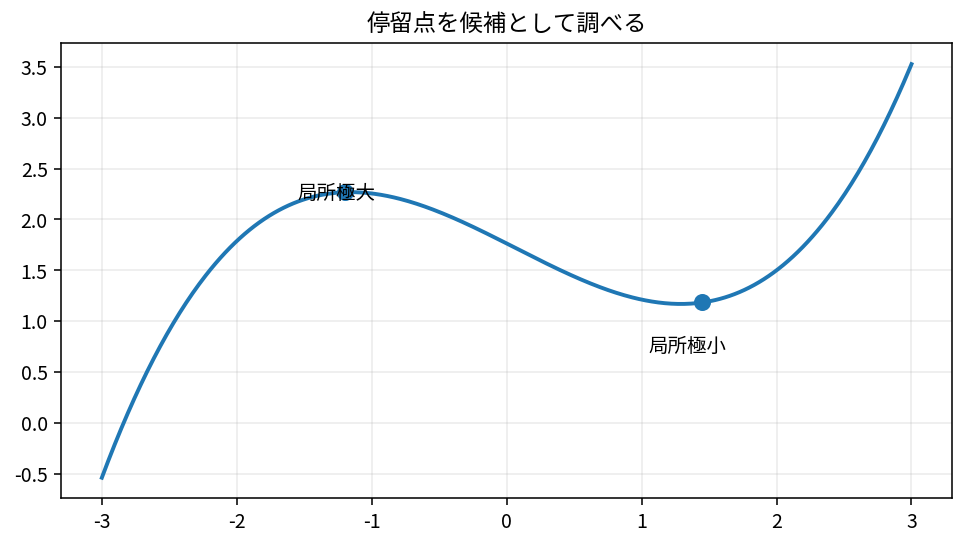

# 一変数の最適化

Course 01｜微積分

---
layout: center
---

## 今回の問い

「一変数の最適化」は何を表し、どの条件で使え、結果をどう検算するのか？

---

## 到達目標

- 一変数の最適化の定義と成立条件を説明できる
- 一変数の最適化を小規模に計算・実装し検算できる

---

## まず全体像をつかむ

一変数の最適化の定義、計算手順、成立条件を整理し、微積分の後続Topicへ接続する

---

## このTopicで考える問い

関数の山や谷は、導関数を使ってどう見つけるか。

---

## 学習目標

- 停留点を候補として見つける
- 1次導関数・2次導関数による判定を説明する
- 端点の確認も含めて最適値を求める

---

## まず直感

- 最適化ではまず増減が止まる点を探す。
- ただし停留点が常に極値とは限らない。
- 閉区間なら端点も候補。

数学の定義に入る前に、**どの量を固定し、どの量を動かしているか** を言葉で確認すると理解しやすくなる。

---

## 図解

---

## 図を見るポイント

- 図の横軸・縦軸が何を表しているかを確認する。
- 変化している量と固定している量を区別する。
- 式の各記号が図のどこに対応するかを探す。

---

## 数学的な定義・中心式

候補点は $f'(x)=0$ または微分不能点。判定には $f''(x)$ を使う。

この式は単なる計算規則ではなく、**何をどう近似しているか** を表している。

---

## 小さな例

$f(x)=x^3-3x$ は $x=\pm1$ が停留点。$x=-1$ は極大、$x=1$ は極小。

例を読むときは、1. 入力は何か 2. 出力は何か 3. どの量の変化を見ているか、を順に確認する。

---

## よくある誤解

- 停留点と最適点を同一視しない。
- 開区間と閉区間で端点の扱いが違う。

---

## 機械学習・数値計算との接続

損失関数最小化の最も単純な原型。

Course 01の内容は、後の線形代数・最適化・機械学習で何度も再登場する。

---

## 最後に確認したいこと

- 中心式を日本語で説明できるか。
- 図のどの部分が式の各項に対応するか。
- どの場面でこの概念が必要になるか。

---

## 次へ

- [スライド](/slides/calc-one-variable-optimization/)
- [演習](/exercises/calc-one-variable-optimization)

---

## 前提との接続

このTopicは次の内容を土台にする。式や用語が曖昧なら、先に対応するTopicへ戻る。

- `calc-differentiation-rules-chain-rule`

---

## 理解確認

1. 一変数の最適化の定義と成立条件を説明できる
2. 一変数の最適化を小規模に計算・実装し検算できる
3. 代表式・計算手順・成立条件を小さな例で検算できるか。

---

## 演習へ

[教科書](../../textbook/calc-one-variable-optimization)

[10問の演習](../../exercises/calc-one-variable-optimization)

