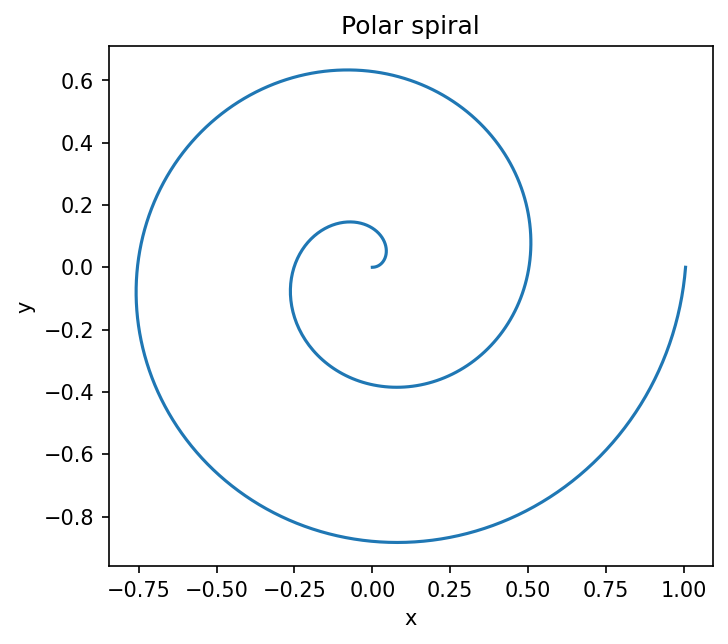

# 媒介変数表示と極座標

Course 01｜微積分

---

## 何を解決するか

xを独立変数にできない曲線を、媒介変数や極座標でどう扱うか。

曲線を時間tに沿って動く点 (x(t),y(t)) として表せば、縦線を含む曲線も自然に表現できる。極座標は距離rと角度θで点を表す。

---

## 図の意味

図の螺旋はパラメータ $t$ を増やすと点 $(x(t),y(t))$ が連続的に移動して描かれる。各点で速度ベクトル $(x\prime(t),y\prime(t))$ が接線方向を与え、横成分が0でなければ傾きは $y\prime/x\prime$。極座標なら同じ点を半径 $r$ と角度 $\theta$ で表す。

---

## 記号

| 記号 | 意味 |
|---|---|
| $t$ | 媒介変数 |
| $x(t),y(t)$ | 平面座標 |
| $r(θ)$ | 極座標での半径 |

- $t$：媒介変数。
- $x(t),y(t)$：曲線座標。
- $r,\theta$：極座標の半径と角度。

---

## 中心式

$$
\frac{dy}{dx}=\frac{dy/dt}{dx/dt}\quad(dx/dt\ne0)
$$

---

## 導出

1. x,yの両方をtの関数とみなす。
2. 連鎖律で dy/dt=(dy/dx)(dx/dt)。
3. dx/dt≠0なら dy/dx について解く。

---

## 省略しない一段

媒介表示では「xを入力してyを返す」という関数グラフの制約を外し、$t\mapsto(x(t),y(t))$ という平面への写像として曲線を扱う。連鎖律 $dy/dt=(dy/dx)(dx/dt)$ から、$dx/dt\ne0$ の点で $dy/dx=(dy/dt)/(dx/dt)$。

極座標は $x=r\cos\theta$, $y=r\sin\theta$。$r$ が $\theta$ の関数なら、この2式を $\theta$ で微分して接線を求められる。円や螺旋のようにCartesian式より自然な曲線が多い。

---

## 手計算

**問題**：$x=t^2$, $y=t^3$ の $t=2$ における接線の傾きと接線方程式を求めよ。

**解答**：$dx/dt=2t=4$, $dy/dt=3t^2=12$ なので $dy/dx=3$。点は(4,8)だから $y-8=3(x-4)$。

---

## 条件を変える

$x=t^2-1$, $y=t^3-t$ の $t=1$ では $dx/dt=2$, $dy/dt=2$ なので傾き1。点は $(0,0)$。同じ点を別のtが通る場合は枝ごとに接線が異なることもある。

---

## どこで壊れるか

$dx/dt=0$ の点で比を取ってはいけない。$dy/dt\ne0$ なら垂直接線の可能性がある。両方0なら高階項を調べる必要があり、単純な0/0では結論できない。

---

## 次へ

線積分では曲線を媒介表示して $d\mathbf r=\mathbf r\prime(t)dt$ とする。物理の軌道、最適化のパス、複素積分などでも同じ表現を使う。

---

[教科書](../../textbook/calc-parametric-polar-curves)　|　[10問の演習](../../exercises/calc-parametric-polar-curves)
