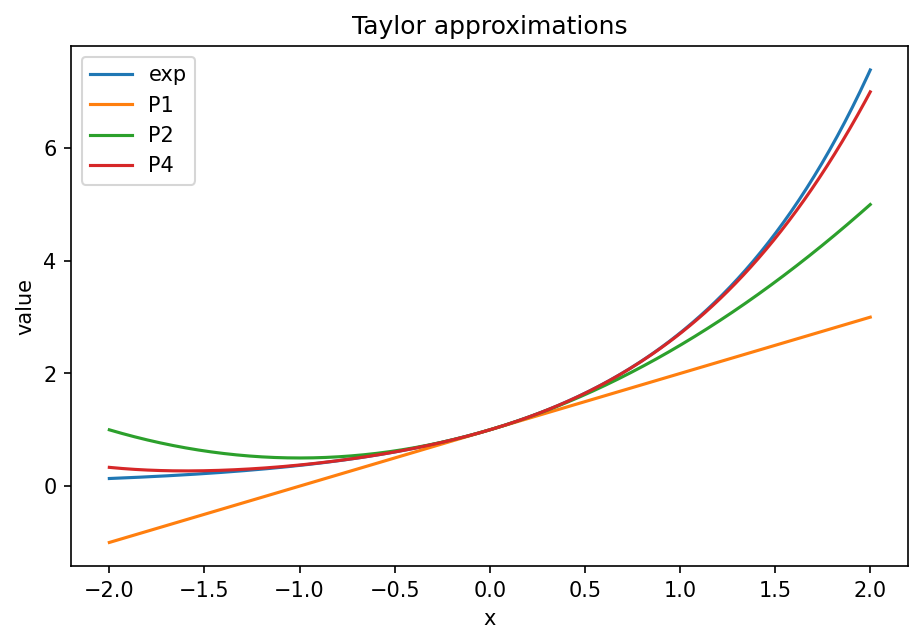

# Taylor展開と局所近似

Course 01｜微積分

---

## 今回の問い

Taylor多項式はなぜこの係数になり、有限次数近似の誤差をどう読むか。

---

## 直感

中心aで0階からn階までの導関数を一致させる唯一のn次以下多項式がTaylor多項式。局所情報を圧縮したmodelであり、元関数そのものとは限らない。

---

## 図解

---

## 中心式

$$
P_n(x)=\sum_{k=0}^n\frac{f^{(k)}(a)}{k!}(x-a)^k
$$

---

## 導出

1. $P_n=\sum c_k(x-a)^k$ と置く。
2. k回微分してx=aを代入すると $P_n^{(k)}(a)=k!c_k$。
3. 導関数一致条件から $c_k=f^{(k)}(a)/k!$。
4. 誤差は別量 $R_n=f-P_n$ として扱い、Taylor級数との同一視を避ける。

---

## 小さい例

e^xを0で2次近似すると1+x+x²/2。x=0.1では1.105で真値約1.10517に近いが、x=5では局所近似として不十分。

---

## 条件を外すと

- 有限Taylor polynomialと無限Taylor seriesを混同しない。
- ≈と=を区別する。

---

## 理解確認

- 式の各記号を定義できるか。
- 導出を1段ずつ再現できるか。
- 反例を1つ作れるか。

---

## 教科書と演習

[教科書](../../textbook/calc-taylor-approximation)

[10問の演習](../../exercises/calc-taylor-approximation)
