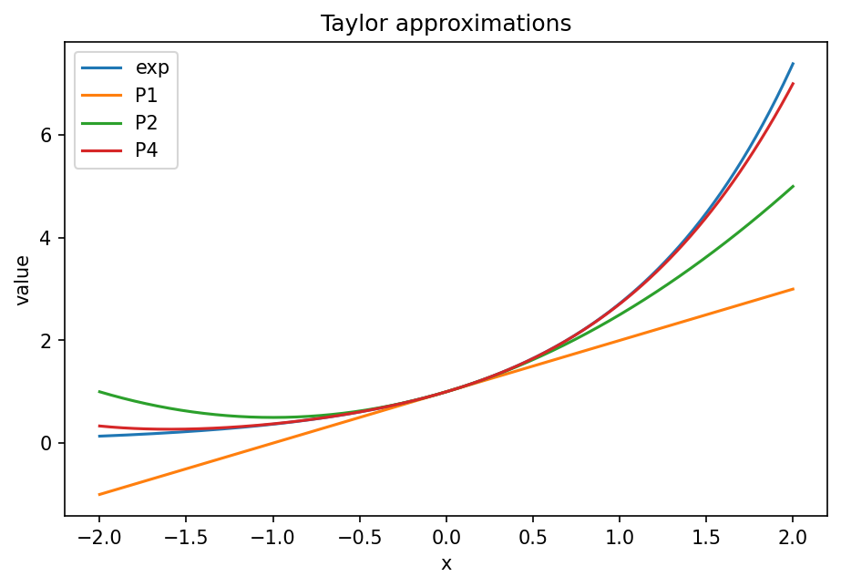

# Taylor級数・剰余・収束半径

Course 01｜微積分

---

## 何を解決するか

有限次数のTaylor近似を無限級数へ伸ばすと、いつ元の関数そのものになるのか。

Taylor多項式を高次数へしただけでは自動的に関数へ一致しない。差 R_n(x) が0へ行くことを別に確認する必要がある。

---

## 図の意味

図には $e^x$ と複数次数のTaylor多項式を重ねる。展開点 $a=0$ 付近ではどの多項式もよく一致するが、離れるほど低次数近似の誤差が大きい。次数を上げると一致する範囲が広がる様子が、剰余 $R_n(x)$ が小さくなることに対応する。

---

## 記号

| 記号 | 意味 |
|---|---|
| $P_n(x)$ | n次Taylor多項式 |
| $R_n(x)=f(x)-P_n(x)$ | 剰余 |
| $ξ$ | aとxの間の点 |

- $P_n(x)$：a周りn次Taylor多項式。
- $R_n(x)=f(x)-P_n(x)$：剰余。
- $\xi$：aとxの間に存在する点。

---

## 中心式

$$
R_n(x)=\frac{f^{(n+1)}(\xi)}{(n+1)!}(x-a)^{n+1}
$$

---

## 導出

1. n次まで導関数を一致させた差 $R_n$ を考える。
2. Rolleの定理を繰り返す補助関数から Lagrange 剰余形を得る。
3. 右辺が n→∞ で0へ行く範囲でTaylor級数がfへ一致する。

---

## 省略しない一段

Taylor多項式 $P_n$ は $a$ で0次からn次までの導関数を一致させる唯一の多項式だが、それだけでは $n\to\infty$ で $f$ に収束するとは限らない。必要なのは $R_n(x)=f(x)-P_n(x)\to0$。

Lagrange剰余 $R_n=f^{(n+1)}(\xi)(x-a)^{n+1}/(n+1)!$ は、微分可能性の仮定の下で誤差を「高階導関数の大きさ」と「距離の高べき」に分解する。$e^x$ では高階導関数も $e^x$ なので固定区間で上界を取り、階乗がべきより速く増えることから誤差0を示せる。

---

## 手計算

**問題**：$e^x$ を0周り2次Taylor多項式で $x=0.5$ に近似し、Lagrange剰余で誤差上界を求めよ。

**解答**：$P_2(0.5)=1+0.5+0.5^2/2=1.625$。$R_2=e^{\xi}0.5^3/3!$, $0<\xi<0.5$ なので $|R_2|\le e^{0.5}/48\approx0.03435$。

---

## 条件を変える

$\sin x$ の0周り3次Taylor多項式は $x-x^3/6$。$|x|\le1$ なら次の非零項の大きさ $|x|^5/120\le1/120$ が誤差の目安になる。

---

## どこで壊れるか

滑らかでもTaylor級数が元関数に一致しない例がある。$f(x)=e^{-1/x^2}$ ($x\ne0$), $f(0)=0$ は0で全導関数が0なのでTaylor級数は0だが、$x\ne0$ では $f(x)>0$。

---

## 次へ

数値計算ではTaylor展開からEuler法や有限差分の局所誤差を導く。最適化では二次近似、確率では特性関数や漸近展開に同じ考えが現れる。

---

[教科書](../../textbook/calc-taylor-series-remainder)　|　[10問の演習](../../exercises/calc-taylor-series-remainder)

---

## 今回の問い

「Taylor級数・剰余・収束半径」は何を表し、どの条件で使え、結果をどう検算するのか？

---

## 到達目標

- 有限次数のTaylor近似を無限級数へ伸ばすと、いつ元の関数そのものになるのか。
- 中心式の記号と成立条件を説明できる
- 小さい例と反例で検算できる

---

## 理解確認

1. 有限次数のTaylor近似を無限級数へ伸ばすと、いつ元の関数そのものになるのか。
2. 中心式の記号と成立条件を説明できる
3. 小さい例と反例で検算できる
