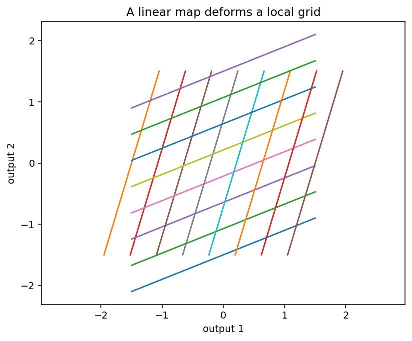

# 全微分とJacobian

Course 01｜微積分｜Topic 09/13

---
layout: center
---

## 今日の中心問い

多変数関数を、ある点の近くで最もよい線形写像として近似するにはどうするか。

---

## 到達目標

- 全微分を一次近似として説明できる
- Jacobianのshapeを入力次元・出力次元から決められる
- ベクトル値関数のJacobianを計算できる
- 線形近似を使って小さな入力変化から出力変化を近似できる

---

## 試験での基本姿勢

1. 何を求める問題か確認
2. 定義・成立条件を確認
3. 計算
4. 判定
5. 検算して結論

---

## 記号

| 記号 | 意味 |
|---|---|
| $\mathbf{x}\in\mathbb R^n$ | 入力ベクトル |
| $\mathbf{f}:\mathbb R^n\to\mathbb R^m$ | $m$ 次元出力を返す関数 |
| $J_{\mathbf f}(\mathbf x)$ | $m\times n$ のJacobian行列 |
| $d\mathbf x$ | 十分小さい入力変化 |
| $d\mathbf f$ | 一次近似された出力変化 |

---

## 中心概念 1

1. 全微分
スカラー値関数 $f(x,y)$ では、小さい変化 $(dx,dy)$ に対して
$$df\approx f_x\,dx+f_y\,dy.$$
これは接平面による一次近似。

---

## 中心概念 2

### 2. Jacobian
$\mathbf f:\mathbb R^n\to\mathbb R^m$ のJacobianを
$$J_{\mathbf f}(\mathbf x)=\left[\frac{\partial f_i}{\partial x_j}\right]_{m\times n}$$
と定義する。**行は出力成分、列は入力成分**。したがって入力変化 $d\mathbf x\in\mathbb R^n$ に対し
$$d\mathbf f\approx J_{\mathbf f}(\mathbf x)d\mathbf x\in\mathbb R^m.$$

---

## 図で確認

---

## 標準手順

- 関数の入力次元 $n$ と出力次元 $m$ を書く
- Jacobianが $m\times n$ になることを先に決める
- 各出力 $f_i$ を各入力 $x_j$ で偏微分する
- 評価点を代入する
- 小変化を近似するなら $Jd\mathbf x$ を計算する
- 行列積のshapeが $m\times n$ と $n\times1$ で整合するか確認する

---

## 典型例

**例1：** $\mathbf f(x,y)=[x^2+y,\ xy]^T$ なら
$$J=\begin{bmatrix}2x&1\\y&x\end{bmatrix}.$$
$(1,2)$ では $J=\begin{bmatrix}2&1\\2&1\end{bmatrix}$。

---

## よくある誤り

- Jacobianの行列を転置してしまう
- 出力と入力の順序を混同する
- $Jd\mathbf x$ ではなく $d\mathbf xJ$ と掛ける
- 全微分の等号を有限変化にも厳密に使う

---

## 満点答案のポイント

- 最初に $\mathbb R^n\to\mathbb R^m$ とshapeを書く
- 行＝出力、列＝入力を固定する
- 一次近似なので大きな変化では誤差が増えると説明する

---

## 機械学習との接続

ニューラルネットの各層はベクトル値関数。各層のJacobianを連鎖律で掛けることがbackpropagationの線形代数的な見方である。

---

## 30秒確認 1

中心式または中心定義を、記号の意味まで含めて口頭で説明できるか。

---

## 30秒確認 2

「この条件がないと結論できない」という成立条件を1つ挙げられるか。

---

## 30秒確認 3

典型的な誤答を1つ挙げ、どこが誤りか説明できるか。

---

## 演習へ

- [教科書](../../textbook/calc-total-derivative-jacobian)
- [10問の演習](../../exercises/calc-total-derivative-jacobian)
