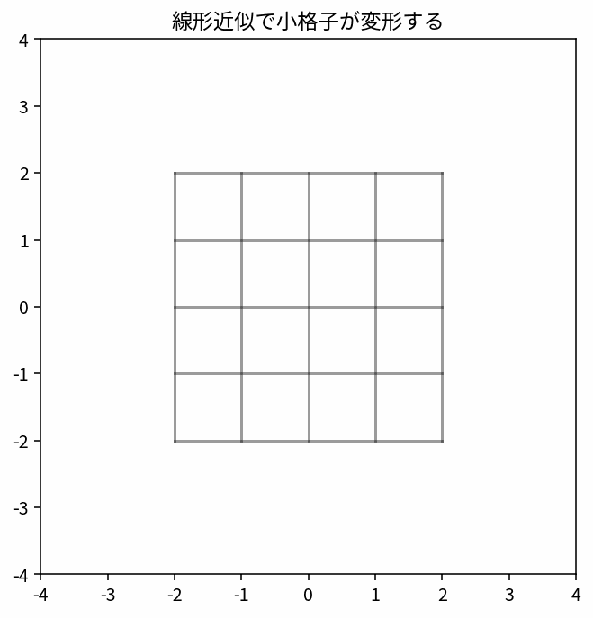

# 全微分とJacobian

Course 01｜微積分

---
layout: center
---

## 今回の問い

「全微分とJacobian」は何を表し、どの条件で使え、結果をどう検算するのか？

---

## 到達目標

- 全微分、Jacobianの定義と成立条件を説明できる
- 全微分とJacobianを小規模に計算・実装し検算できる

---

## まず全体像をつかむ

全微分とJacobianの定義、計算手順、成立条件を整理し、微積分の後続Topicへ接続する

---

## このTopicで考える問い

多変数関数をある点の近くで線形に近似すると、何が見えるか。

---

## 学習目標

- 全微分を線形写像として解釈する
- Jacobianが局所線形近似の係数行列であると理解する
- 小変位がどう伝わるかを説明する

---

## まず直感

- 全微分は十分小さい変化に対する一次近似。
- Jacobianはベクトル値関数の微分係数を並べた行列。
- 小さな格子の変形として見ると直感的。

数学の定義に入る前に、**どの量を固定し、どの量を動かしているか** を言葉で確認すると理解しやすくなる。

---

## 図解

---

## 図を見るポイント

- 図の横軸・縦軸が何を表しているかを確認する。
- 変化している量と固定している量を区別する。
- 式の各記号が図のどこに対応するかを探す。

このアニメーションでは、概念の「極限・累積・方向・反復」の動きが視覚化されている。

---

## 数学的な定義・中心式

$f(\mathbf x+\Delta \mathbf x)\approx f(\mathbf x)+J_f(\mathbf x)\Delta \mathbf x$

この式は単なる計算規則ではなく、**何をどう近似しているか** を表している。

---

## 小さな例

$f(x,y)=(x+y,xy)$ の Jacobian は $\begin{bmatrix}1&1\\y&x\end{bmatrix}$。

例を読むときは、1. 入力は何か 2. 出力は何か 3. どの量の変化を見ているか、を順に確認する。

---

## よくある誤解

- Jacobianは厳密な変換ではなく局所近似。
- 行と列の意味を混同しない。

---

## 機械学習・数値計算との接続

逆伝播、誤差伝播、線形化モデルで中心的。

Course 01の内容は、後の線形代数・最適化・機械学習で何度も再登場する。

---

## 最後に確認したいこと

- 中心式を日本語で説明できるか。
- 図のどの部分が式の各項に対応するか。
- どの場面でこの概念が必要になるか。

---

## 次へ

- [スライド](/slides/calc-total-derivative-jacobian/)
- [演習](/exercises/calc-total-derivative-jacobian)

---

## 前提との接続

このTopicは次の内容を土台にする。式や用語が曖昧なら、先に対応するTopicへ戻る。

- `calc-gradient-directional-derivative`
- `prep-numpy-arrays-shapes`

---

## 理解確認

1. 全微分、Jacobianの定義と成立条件を説明できる
2. 全微分とJacobianを小規模に計算・実装し検算できる
3. 代表式・計算手順・成立条件を小さな例で検算できるか。

---

## 演習へ

[教科書](../../textbook/calc-total-derivative-jacobian)

[10問の演習](../../exercises/calc-total-derivative-jacobian)

