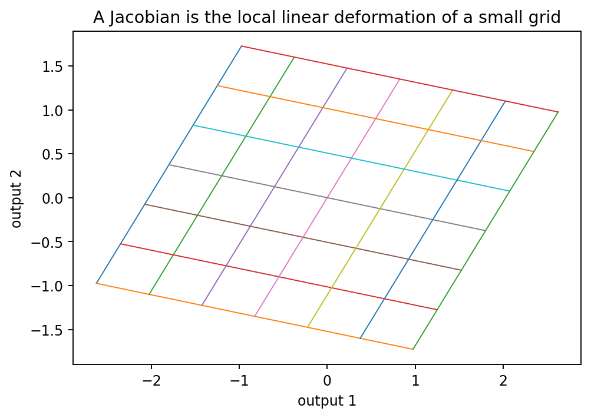

# 全微分とJacobian

Course 01｜微積分｜Topic 09/13

---
layout: center
---

## 今回の問い

## 到達目標

- 定義と代表式を、自分の言葉と記号で説明できる。
- 成立条件を確認し、手計算と結果を検算できる。

## 理解確認

- 定義・条件・計算結果を自分の言葉で説明できるか確認する。

多入力・多出力の非線形関数を、一点の近くで一つの行列として近似できるのはなぜか。

---

## なぜ今これを学ぶのか

スカラー出力では勾配の内積が局所変化を表した。出力もベクトルになると、各出力の勾配を並べた行列が局所線形写像になる。

---

## 直感

多変数関数も十分小さな範囲では線形写像として見られる。その局所線形写像を表す行列がJacobianである。

地図の非線形な座標変換も、十分小さな領域だけ拡大すると平行四辺形へ写す線形変換に見える。Jacobianはその瞬間の拡大・回転・せん断をまとめる。

---

## 図解

図では入力側の小さな正方形格子が、非線形写像で曲がった格子へ移る。その一点をさらに拡大するとほぼ平行四辺形になり、その二本の辺がJacobianの各列、すなわち標準基底を局所的に写した方向になる。

---

## 記号と代表式

- $f:\mathbb R^n\to\mathbb R^m$：ベクトル値関数
- $\Delta\mathbf{x}\in\mathbb R^n$：小さな入力変位
- $\mathbf J_f\in\mathbb R^{m\times n}$：Jacobian
- $(\mathbf J_f)_{ij}=\partial f_i/\partial x_j$：第 $i$ 出力の第 $j$ 入力に対する偏微分

$$
f(\mathbf{x}+\Delta\mathbf{x})\approx f(\mathbf{x})+\mathbf J_f(\mathbf{x})\Delta\mathbf{x}
$$

---

## 導出 1

$\mathbf h=h\mathbf e_j$ とすると、全微分の線形部分は $h\mathbf A\mathbf e_j$。一方、各出力の変化率は偏微分列 $(\partial f_i/\partial x_j)_i$。よって $\mathbf A$ の第 $j$ 列はその偏微分列でなければならない。

---

## 導出 2

各入力座標 $j=1,\ldots,n$ について上の列を並べると $\mathbf A=[\partial f_i/\partial x_j]_{m\times n}=\mathbf J_f$。

---

## 例題

$f(x,y)=(x^2y,\ x+y^2)^T$。Jacobianは $\begin{bmatrix}2xy&x^2\\1&2y\end{bmatrix}$。$(1,2)$ では $\begin{bmatrix}4&1\\1&4\end{bmatrix}$。$\Delta\mathbf x=(0.01,-0.02)^T$ なら出力変化を行列積で一次近似できる。

---

## 条件を変えるとどうなるか

全偏微分が存在しても全微分可能とは限らないので、「Jacobianを書けた＝必ず良い局所線形近似」とは言えない。前Topicの原点反例がそのまま使える。

---

## よくある誤解

Jacobianを「偏微分を表にしたもの」とだけ覚えるとshapeや行列積の意味が曖昧になる。Jacobianは入力の微小ベクトルを出力の微小ベクトルへ写す線形写像。

---

## 実装・計算上の注意

自動微分ライブラリではJacobian全体を明示生成すると巨大になる場合がある。実務ではJacobian-vector productやvector-Jacobian productを計算し、必要な方向だけ伝播させる。

---

## 一段先へ

局所線形写像を二つ連続して適用すれば行列積になる。この考えが多変数連鎖律であり、deep learningのbackpropagationへ直結する。

---

## 自分で説明できるか

- $m\times n$ になる理由を入力・出力次元から説明できるか
- Jacobianの各列を標準基底方向の方向微分として説明できるか
- 「全微分可能」の残差条件が何を保証するか

---
layout: center
---

## 教科書と演習

- [教科書](../../textbook/calc-total-derivative-jacobian)
- [10問の演習](../../exercises/calc-total-derivative-jacobian)
