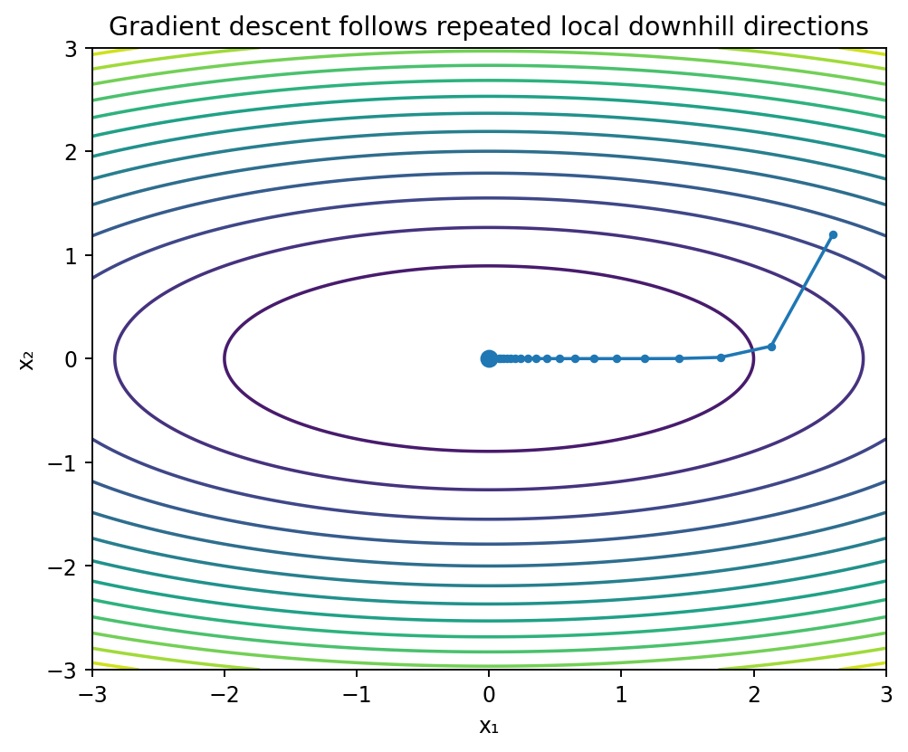

# 多変数の制約なし最適化

Course 01｜微積分｜Topic 12/13

---
layout: center
---

## 今回の問い

## 到達目標

- 定義と代表式を、自分の言葉と記号で説明できる。
- 成立条件を確認し、手計算と結果を検算できる。

## 理解確認

- 定義・条件・計算結果を自分の言葉で説明できるか確認する。

多変数の局所最適点で勾配が0になる理由と、Hessianで候補をどう分類するか。

---

## なぜ今これを学ぶのか

方向微分とHessianを学んだので、一変数の最適化を多変数へ一般化できる。局所最適では全ての方向で一階の改善が消える必要がある。

---

## 直感

全ての方向への一次変化を同時に0にする条件が勾配0であり、Hessianでその停留点が谷・山・鞍点のどれかを判定する。

勾配が非零なら、その反対方向へ十分小さく進むと一次近似で関数値を下げられる。したがって内部の滑らかな局所最小では勾配は0でなければならない。

---

## 図解

図では等高線上の点から負の勾配方向へ矢印を描く。非停留点では矢印方向へ進むと低い等高線へ移れる。停留点では勾配矢印が0になり、Hessianが谷・山・鞍の形を決める。

---

## 記号と代表式

- $f:\mathbb R^n\to\mathbb R$：目的関数
- $\mathbf{x}^*$：局所最適候補
- $\nabla f$：一階微分情報
- $\mathbf H_f$：二階曲率情報

$$
\nabla f(\mathbf{x}^*)=\mathbf0
$$

---

## 導出 1

$\nabla f(\mathbf x)\ne0$ とし $\mathbf u=-\nabla f/\|\nabla f\|$。方向微分は $D_{\mathbf u}f=-\|\nabla f\|<0$。よって十分小さい正のstepで値を下げられる。

---

## 導出 2

局所最小なら周囲にこれ以上小さい点があってはならない。したがって上の下降方向が存在しない必要があり、$\nabla f=0$。

---

## 例題

$f(x,y)=(x-1)^2+2(y+1)^2$。勾配 $(2(x-1),4(y+1))^T=0$ から $(1,-1)$。Hessian $\operatorname{diag}(2,4)$ は正定値なので一意な大域最小でもある。

---

## 条件を変えるとどうなるか

$f(x,y)=|x|+y^2$ は原点で最小だが $x$ 方向に微分不能。勾配0条件を使うには微分可能性が必要。

---

## よくある誤解

「gradient descentが止まった＝大域最適」は誤り。勾配が小さいのは停留条件に近いことしか示さず、局所極小・鞍点・plateauを区別するには追加情報が要る。

---

## 実装・計算上の注意

勾配降下更新 $\mathbf x_{k+1}=\mathbf x_k-\eta\nabla f$ は一次Taylorで $f(\mathbf x-\eta\nabla f)\approx f(\mathbf x)-\eta\|\nabla f\|^2$ と下がることから動機付けられる。ただしstepが大きいと高次項が無視できない。

---

## 一段先へ

Course 06では凸性を追加すると局所最小＝大域最小となり、勾配法の収束率まで定量化できる。ここではまず一般の非凸関数での必要条件を理解する。

---

## 自分で説明できるか

- 非零勾配から下降方向を構成して必要条件を証明できるか
- 勾配0なのに鞍点となる例をHessianで説明できるか
- 勾配法の負符号を一次Taylor近似から説明できるか

---
layout: center
---

## 教科書と演習

- [教科書](../../textbook/calc-unconstrained-optimization)
- [10問の演習](../../exercises/calc-unconstrained-optimization)
