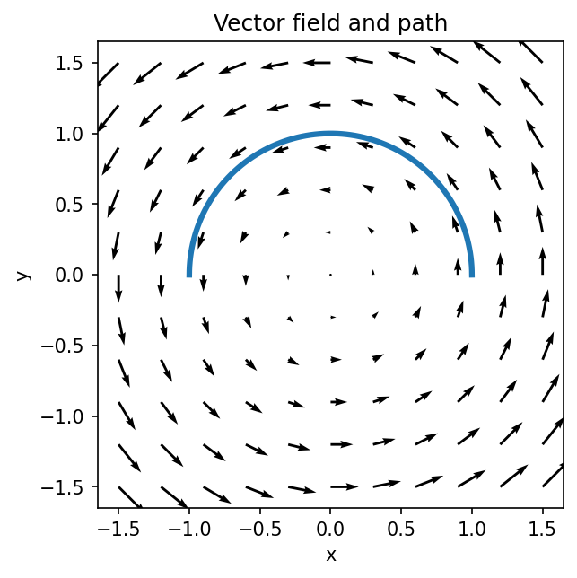

# ベクトル場と線積分

Course 01｜微積分

---

## 今回の問い

空間の各点にベクトルがあるとき、曲線に沿った仕事をどう足し上げるか。

---

## 直感

力場Fの中を曲線Cに沿って動くと、微小変位drに平行な力成分だけが仕事をする。内積 F·dr を経路全体で積分する。

---

## 図解

---

## 中心式

$$
\int_C \mathbf{F}\cdot d\mathbf{r}=\int_a^b \mathbf{F}(\mathbf{r}(t))\cdot\mathbf{r}\prime(t)\,dt
$$

---

## 導出

1. 曲線を短い線分へ分割する。
2. 各線分で仕事を $F\cdot\Delta r$ と近似する。
3. 分割幅を0へしたRiemann和の極限が線積分。

---

## 小さい例

F=(x,y), r(t)=(t,t), 0≤t≤1 なら F·r′=2t、積分値は1。

---

## 条件を外すと

- ベクトルの大きさだけを積分しない。
- 経路方向を反転すると符号が変わる。

---

## 理解確認

- 式の各記号を定義できるか。
- 導出を1段ずつ再現できるか。
- 反例を1つ作れるか。

---

## 教科書と演習

[教科書](../../textbook/calc-vector-fields-line-integrals)

[10問の演習](../../exercises/calc-vector-fields-line-integrals)
