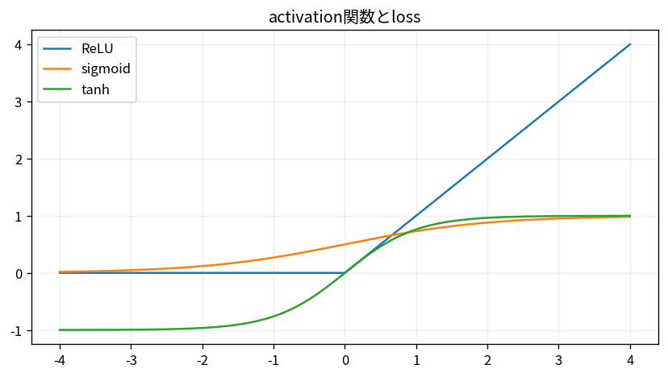

# activation関数とloss

Course 09｜深層学習｜Topic 03/20

---
layout: center
---

## 今回の問い

## 到達目標

- 定義と代表式を、自分の言葉と記号で説明できる。
- 成立条件を確認し、手計算と結果を検算できる。

## 理解確認

- 定義・条件・計算結果を自分の言葉で説明できるか確認する。

activation関数とlossの代表式は、どの定義・仮定から、なぜその形になるのか。

---

## なぜ今これを学ぶのか

前Topic `dl-backprop-computation-graphs` で得た概念を使い、ここでは activation関数とloss へ進む。

---

## 直感

activation関数は線形層へ非線形性を入れ、lossは予測と目標のずれを学習信号へ変換する。

---

## 図解

ReLU, sigmoid, tanhの曲線と勾配が小さくなる領域を比較する。 曲線の傾きが逆伝播される局所gradientになる。sigmoid/tanhの飽和域では傾きが小さく、ReLUでは正側で一定なのでgradient伝播の性質が異なる。

---

## 記号と代表式

- $\operatorname{ReLU}(x)=\max(0,x)$
- $z$：logit
- $p$：probability
- $L$：training objective

$$
\operatorname{ReLU}(x)=\max(0,x)
$$

---

## 導出 1

x>0でderivative1、x<0で0。x=0はsubgradient/convention。positive regionでsaturationしない。

---

## 導出 2

Bernoulli likelihood $p^y(1-p)^{1-y}$ のnegative logが $-y\log p-(1-y)\log(1-p)$。

---

## 例題

z=0,y=1ならp=0.5, gradient p-y=-0.5でzを上げる方向。

---

## 条件を変えるとどうなるか

classificationでMSEが常に間違いではないが、Bernoulli/categorical likelihoodとの対応やgradient特性がcross entropyと異なる。

---

## よくある誤解

activation関数とlossでは、式へ数値を代入するだけでは不十分である。classificationでMSEが常に間違いではないが、Bernoulli/categorical likelihoodとの対応やgradient特性がcross entropyと異なる。 という失敗例が示すように、式を使える条件と結論の範囲を区別する必要がある。

---

## 実装・計算上の注意

BCEWithLogits/CrossEntropyLossを使いlog(0)回避。reduction(mean/sum)でgradient scaleが変わる。

---

## 一段先へ

deep layersでsignal/gradient scaleを保つためinitializationとnormalizationへ。

---

## 自分で説明できるか

- 「ReLU derivative」を式を見ずに説明できるか
- 「logit gradient」までの論理を一段ずつ再現できるか
- activation関数とlossの条件を1つ外した反例を説明できるか

---
layout: center
---

## 教科書と演習

- [教科書](../../textbook/dl-activation-loss-functions)
- [10問の演習](../../exercises/dl-activation-loss-functions)
