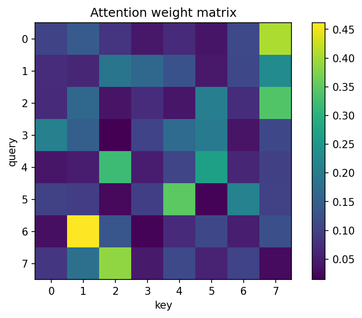

# attention機構

Course 09｜深層学習

---

## 今回の問い

scaled dot-product attentionの1/√d_kはなぜ必要で、Q/K/Vは何を計算しているか。

---

## 直感

queryとkeyの内積で「どのvalueをどれだけ参照するか」のscoreを作る。dimensionが増えると未scale内積の分散が大きくなりsoftmaxが飽和しやすいため1/√d_kでscaleする。

---

## 図解

---

## 中心式

$$
\mathrm{Attn}(Q,K,V)=\mathrm{softmax}\left(\frac{QK^T}{\sqrt{d_k}}\right)V
$$

---

## 導出

1. 各q_iとk_jの内積でscore matrix S=QK^Tを作る。
2. 成分が独立・分散1程度ならdot productの分散はd_k程度なので√d_kで割りvarianceをO(1)にする。
3. 各query rowでsoftmaxし、keyごとの非負weight和1を作る。
4. そのweightでVのrowを加重平均する。

---

## 小さい例

1 query・2 keyでscaled scoreが[0, ln3]ならsoftmax weightは[1/4,3/4]。outputは0.25v1+0.75v2。

---

## 条件を外すと

- softmaxのaxisを取り違えない。
- QK^TをVそのものと混同しない。

---

## 理解確認

- 式の各記号を定義できるか。
- 導出を1段ずつ再現できるか。
- 反例を1つ作れるか。

---

## 教科書と演習

[教科書](../../textbook/dl-attention-mechanism)

[10問の演習](../../exercises/dl-attention-mechanism)
