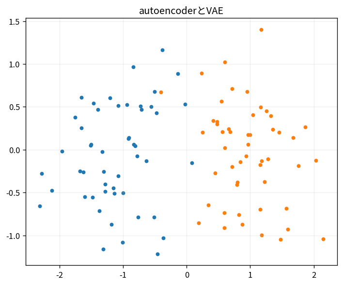

# autoencoderとVAE

Course 09｜深層学習｜Topic 11/20

---
layout: center
---

## 今回の問い

## 到達目標

- 定義と代表式を、自分の言葉と記号で説明できる。
- 成立条件を確認し、手計算と結果を検算できる。

## 理解確認

- 定義・条件・計算結果を自分の言葉で説明できるか確認する。

autoencoderとVAEの代表式は、どの定義・仮定から、なぜその形になるのか。

---

## なぜ今これを学ぶのか

前Topic `dl-normalization-residuals` で得た概念を使い、ここでは autoencoderとVAE へ進む。

---

## 直感

潜在変数modelは観測を低次元latentへ圧縮し、latentから再構成する。VAEではlatentを確率分布として扱う。

---

## 図解

2次元latent空間に点を配置し、再構成との対応を描く。 観測xを低次元潜在zへencodeし、zからxをdecodeする。VAEではzを1点でなく分布として扱い、再構成とpriorへの近さを同時に最適化する。

---

## 記号と代表式

- $q_\phi(z|x)$：encoder approximate posterior
- $p_\theta(x|z)$：decoder likelihood
- $p(z)$：prior
- ELBO

$$
\mathcal{L}=\mathbb{E}_{q_\phi(\mathbf{z}\mid\mathbf{x})}[\log p_\theta(\mathbf{x}\mid\mathbf{z})]-D_{KL}(q_\phi\|p)
$$

---

## 導出 1

$\log p(x)=ELBO + D_{KL}(q(z|x)||p(z|x))$。KL≥0なのでELBO≤log evidence。

---

## 導出 2

$E_q[\log p_\theta(x|z)]-D_{KL}(q_\phi(z|x)||p(z))$。

---

## 例題

1D latent normal encoderのμ,σからsampleしdecoder reconstruction。KLがposteriorをprior近くへ。

---

## 条件を変えるとどうなるか

deterministic autoencoderのreconstruction lossだけではvalid generative prior samplingを保証しない。

---

## よくある誤解

autoencoderとVAEでは、式へ数値を代入するだけでは不十分である。deterministic autoencoderのreconstruction lossだけではvalid generative prior samplingを保証しない。 という失敗例が示すように、式を使える条件と結論の範囲を区別する必要がある。

---

## 実装・計算上の注意

KL analytic formula、posterior collapse、decoder likelihood(Bernoulli/Gaussian)に合わせたloss。

---

## 一段先へ

implicit generatorとdiscriminator gameでdistribution matchingするGANへ。

---

## 自分で説明できるか

- 「evidence identity」を式を見ずに説明できるか
- 「reparameterization」までの論理を一段ずつ再現できるか
- autoencoderとVAEの条件を1つ外した反例を説明できるか

---
layout: center
---

## 教科書と演習

- [教科書](../../textbook/dl-autoencoders-vae)
- [10問の演習](../../exercises/dl-autoencoders-vae)
