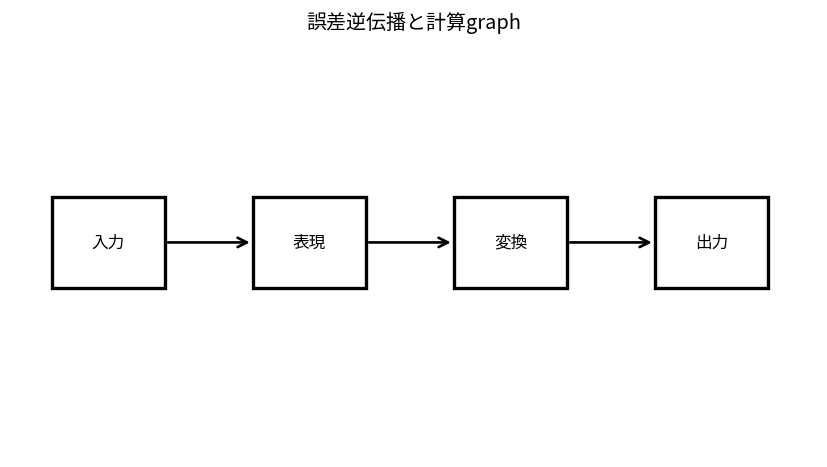

# 誤差逆伝播と計算graph

Course 09｜深層学習｜Topic 02/20

---
layout: center
---

## 今回の問い

## 到達目標

- 定義と代表式を、自分の言葉と記号で説明できる。
- 成立条件を確認し、手計算と結果を検算できる。

## 理解確認

- 定義・条件・計算結果を自分の言葉で説明できるか確認する。

誤差逆伝播と計算graphの代表式は、どの定義・仮定から、なぜその形になるのか。

---

## なぜ今これを学ぶのか

前Topic `dl-perceptron-mlp` で得た概念を使い、ここでは 誤差逆伝播と計算graph へ進む。

---

## 直感

backpropは計算graphを前向きに値計算し、逆向きに連鎖律で勾配を伝える。

---

## 図解

forward矢印とreverse gradient矢印を順にハイライトする。 forward矢印が値の計算、逆向き矢印が局所微分をchain ruleで掛け合わせるgradient計算である。同じ中間量を再利用することで全parameterの微分を効率よく得る。

---

## 記号と代表式

- $y=f(x)$：node operation
- $J_f$：Jacobian
- $\bar y=\partial L/\partial y$：upstream gradient
- $\bar x=J_f^T\bar y$

$$
\frac{\partial\mathcal{L}}{\partial\mathbf{x}}=\mathbf{J}_f(\mathbf{x})^{\mathsf T}\frac{\partial\mathcal{L}}{\partial f}
$$

---

## 導出 1

$dy=J_f dx$。scalar lossのchangeは $dL=\bar y^Tdy=\bar y^TJ_fdx=(J_f^T\bar y)^Tdx$。

---

## 導出 2

よってdownstream gradientは $\bar x=J_f^T\bar y$。full Jacobianを形成せずVJPを計算できる。

---

## 例題

$z=xy$, $L=z^2$。forward z=xy。reverse dL/dz=2z、dL/dx=2z·y=2xy²、dL/dy=2z·x=2x²y。

---

## 条件を変えるとどうなるか

backpropはgradient descentそのものではない。backpropはgradient計算、optimizerはそのgradientを使ってparameter update。

---

## よくある誤解

誤差逆伝播と計算graphでは、式へ数値を代入するだけでは不十分である。backpropはgradient descentそのものではない。backpropはgradient計算、optimizerはそのgradientを使ってparameter update。 という失敗例が示すように、式を使える条件と結論の範囲を区別する必要がある。

---

## 実装・計算上の注意

in-place ops、detach、mixed precision、checkpointingでgraph semanticsが変わる。finite-difference gradient checkをsmall modelで。

---

## 一段先へ

gradientが流れる形はactivation/loss選択に左右される。次Topicでderivativeとprobabilistic lossを整理する。

---

## 自分で説明できるか

- 「local linearization」を式を見ずに説明できるか
- 「graph reuse」までの論理を一段ずつ再現できるか
- 誤差逆伝播と計算graphの条件を1つ外した反例を説明できるか

---
layout: center
---

## 教科書と演習

- [教科書](../../textbook/dl-backprop-computation-graphs)
- [10問の演習](../../exercises/dl-backprop-computation-graphs)
