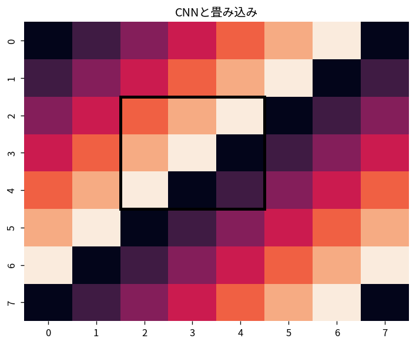
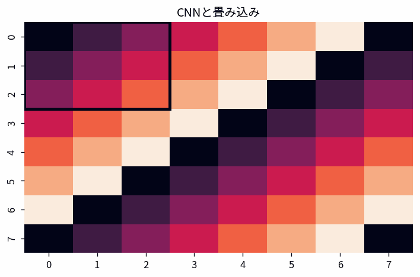

# CNNと畳み込み

Course 09｜深層学習

---
layout: center
---

## 今回の問い

CNNと畳み込みで、何を入力し、代表式がどの量を出力し、どの成立条件を外すと結果が壊れるのか。

---

## 到達目標

- CNNと畳み込みの定義と代表式を言葉で説明できる
- 図と式の対応を説明できる
- 小さな例で成立条件と失敗条件を検算できる

---

## 直感

CNNは局所kernelを共有して画像上を走査し、位置ごとの同じパターンを検出する。

**前提:** mat-convolution-linear-systems, dl-perceptron-mlp

---

## 図解

---

## 図を見るポイント

- 軸・node・矢印・領域が何を表すか確認する
- 代表式の各項と図の要素を対応づける
- 条件を変えたとき、どこが変化するか予測する

---

## 代表式

$$
y_{i,j,k}=\sum_{a,b,c}w_{a,b,c,k}x_{i+a,j+b,c}
$$

左辺の出力 → 右辺の操作 → 入力の型の順で読む。

---

## 式をどう読むか

- **対象:** CNN、畳み込み
- shape・次元・定義域を先に確定する
- 計算後に符号・大きさ・残差・確率などを図と照合する

---

## 小さな例

小さな画像上を3×3 kernelが移動してfeature mapを作る。

最小の非自明な設定で、手計算と実装を照合する。

---

## 動き／思考実験で確認

- 各frameで、何が固定され何が更新されるかを追う。

---

## 成立条件

- stride/paddingで出力shapeが変わる。
- 畳み込み実装は数学的convolutionと向きが異なる場合がある。
- CNNと畳み込みの定義と計算手順を区別し、数値例だけで一般性を判断しない。

---

## よくある誤解

- CNNと畳み込みの定義と計算手順を同一視する
- 成立条件を確認せず公式を適用する
- 数学上の次元と配列のshapeを混同する

---

## 数値・実装で検算

1. 小さい入力を作る
2. 定義式から期待値を手で求める
3. NumPy等の実装結果と比較する
4. shape・残差・許容誤差・seedを記録する

---

## 後続分野への接続

CNNと畳み込みは、後続の数値計算・データ解析・機械学習で前提となる。

このTopicの量が、後続で入力・目的関数・制約・診断のどれとして使われるか確認する。

---

## 理解確認

- CNNと畳み込みを図→式→小例の順で説明できるか
- 条件を1つ外した反例を作れるか

[教科書](../../textbook/dl-cnn-convolution)

[10問の演習](../../exercises/dl-cnn-convolution)
