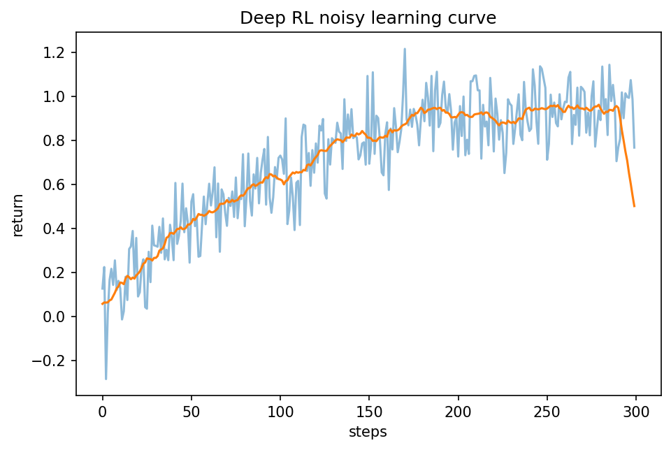

# Deep Reinforcement Learning

Course 09｜深層学習

---

## 何を解決するか

表形式のQやpolicyをニューラルnetworkへ置き換えると、何が可能になり、何が不安定になるか。

高次元stateでは表を持てないためfunction approximationを使う。DQNはQ-learningにreplay bufferとtarget networkを加え、PPO等のactor-criticではpolicyとvalueを同時学習する。

---

## 図の意味

横軸がenvironment step、縦軸がepisode return。raw returnは大きく揺れ、移動平均が徐々に上がる。supervised learningのようにiid fixed dataset上のlossが単調に下がるとは限らず、policyが変わると収集data分布も変わることを示す。

---

## 記号

| 記号 | 意味 |
|---|---|
| $Q_θ(s,a)$ | networkで近似したQ |
| $θ^-$ | target network parameter |
| $D$ | replay buffer |

- $Q_\theta(s,a)$：online network。
- $Q_{\theta^-}$：target network。
- $D$：replay bufferのtransition分布。

---

## 中心式

$$
\mathcal L(\theta)=E_{(s,a,r,s\prime)\sim D}\left[(r+\gamma\max_{a\prime}Q_{\theta^-}(s\prime,a\prime)-Q_\theta(s,a))^2\right]
$$

---

## 導出

1. tabular Q updateをsquared TD error最小化として書き換える。
2. 相関した逐次sampleをreplay bufferでshuffleする。
3. target networkを遅く更新してmoving targetを緩和する。

---

## 省略しない一段

DQNではtabular Q-learningのTD targetをnetworkへ拡張し、squared TD errorをmini-batchで最小化する。しかし同じnetworkでtargetとpredictionを同時に更新するとtarget自体が急に動く。そこで遅く更新するtarget network $\theta^-$ を使う。

連続したtransitionは強く相関するのでreplay bufferからrandom mini-batchを取り、近似的に相関を弱める。これらはBellman式を変えるのではなく、function approximationでのoptimization stabilityを改善する工夫。

---

## 手計算

**問題**：DQN sampleで $r=0.5$, $\gamma=0.9$, target networkの次state maxQ=5, current $Q=3$。TD target、error、squared lossを求めよ。

**解答**：target=$0.5+0.9\times5=5.0$。TD error=5.0-3=2.0、squared loss=4.0（1/2係数を使う実装なら2.0）。

---

## 条件を変える

sample $(s,a,r,s')$ で $r=1$, $\gamma=0.99$, target networkのmaxQ=3ならtarget=3.97。online Qが2.5ならTD error=1.47、squared lossは約2.161。

---

## どこで壊れるか

replayとtarget networkを入れれば必ず収束するわけではない。off-policy + bootstrapping + nonlinear function approximationの不安定性は残り、reward scaleやexplorationにも敏感。

---

## 次へ

actor–critic、PPO、model-based RLへ進む。Course10のRLHFではstateがprompt+prefix、actionがtoken、policyがLMという巨大なRL問題として理解できる。

---

[教科書](../../textbook/dl-deep-reinforcement-learning)　|　[10問の演習](../../exercises/dl-deep-reinforcement-learning)
