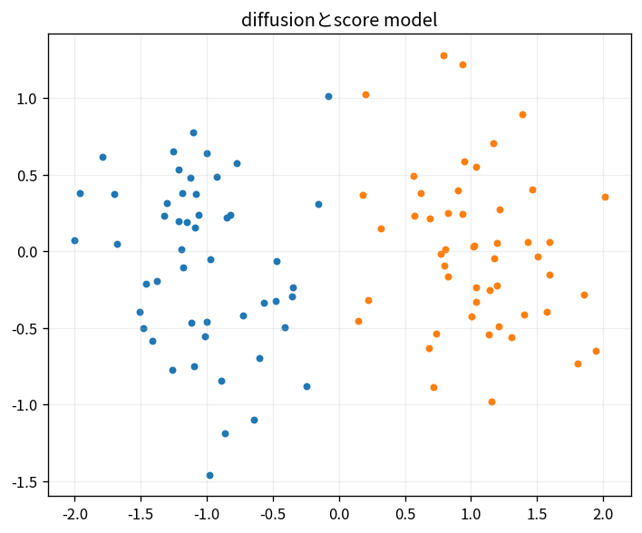

# diffusionとscore model

Course 09｜深層学習｜Topic 13/20

---
layout: center
---

## 今回の問い

## 到達目標

- 定義と代表式を、自分の言葉と記号で説明できる。
- 成立条件を確認し、手計算と結果を検算できる。

## 理解確認

- 定義・条件・計算結果を自分の言葉で説明できるか確認する。

diffusionとscore modelの代表式は、どの定義・仮定から、なぜその形になるのか。

---

## なぜ今これを学ぶのか

前Topic `dl-gans-adversarial-training` で得た概念を使い、ここでは diffusionとscore model へ進む。

---

## 直感

diffusionはデータへ段階的にnoiseを加えるforward過程と、noiseを除いて戻すreverse過程を学習する。

---

## 図解

画像状の点群がnoise化し、逆に構造へ戻る過程を描く。 前向き過程で徐々にnoiseを加え、逆過程では各noise levelから少しずつdenoiseする。多数の小さな逆遷移を学習することで複雑な分布を生成する。

---

## 記号と代表式

- $x_0$：data
- $x_t=\sqrt{\bar\alpha_t}x_0+\sqrt{1-\bar\alpha_t}\epsilon$
- $\epsilon\sim N(0,I)$
- $\epsilon_\theta(x_t,t)$：noise predictor

$$
\mathbf{x}_t=\sqrt{\bar{\alpha}_t}\mathbf{x}_0+\sqrt{1-\bar{\alpha}_t}\boldsymbol{\varepsilon}
$$

---

## 導出 1

Gaussian Markov stepsを合成すると任意tのx_tをx0と1個のstandard noiseのlinear combinationとしてsampleできる。

---

## 導出 2

生成したεが既知なのでnetworkへx_t,tを与えε prediction MSEを学習できる。

---

## 例題

t smallではx_tほぼdata、t largeではnoise dominant。networkはnoise levelに応じdenoise。

---

## 条件を変えるとどうなるか

forward formulaだけでgenerationできない。learned reverse dynamicsが必要。

---

## よくある誤解

diffusionとscore modelでは、式へ数値を代入するだけでは不十分である。forward formulaだけでgenerationできない。learned reverse dynamicsが必要。 という失敗例が示すように、式を使える条件と結論の範囲を区別する必要がある。

---

## 実装・計算上の注意

schedule, prediction target(ε/v/x0), sampler steps、guidance scaleを記録。

---

## 一段先へ

label無しdataからrepresentationを学ぶcontrastive/self-supervised objectivesへ。

---

## 自分で説明できるか

- 「closed-form noising」を式を見ずに説明できるか
- 「reverse」までの論理を一段ずつ再現できるか
- diffusionとscore modelの条件を1つ外した反例を説明できるか

---
layout: center
---

## 教科書と演習

- [教科書](../../textbook/dl-diffusion-score-models)
- [10問の演習](../../exercises/dl-diffusion-score-models)
