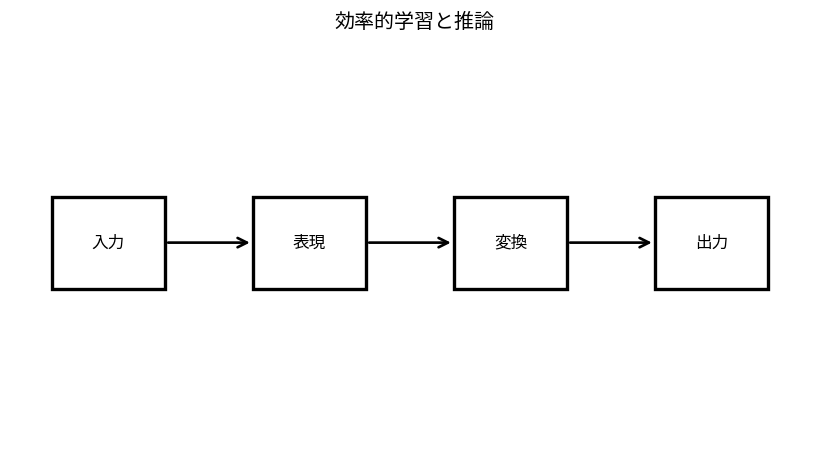

# 効率的学習と推論

Course 09｜深層学習｜Topic 19/20

---
layout: center
---

## 今回の問い

## 到達目標

- 定義と代表式を、自分の言葉と記号で説明できる。
- 成立条件を確認し、手計算と結果を検算できる。

## 理解確認

- 定義・条件・計算結果を自分の言葉で説明できるか確認する。

効率的学習と推論の代表式は、どの定義・仮定から、なぜその形になるのか。

---

## なぜ今これを学ぶのか

前Topic `dl-scaling-distributed-training` で得た概念を使い、ここでは 効率的学習と推論 へ進む。

---

## 直感

効率化は精度を保ちながらparameter数、bit幅、active expert、計算量を減らす。

---

## 図解

dense modelとlow-rank/quantized/MoEの計算ブロックを比較する。 大きな重み行列全体を更新せず、低rank補正など少数parameterだけを学習する経路を描く。計算・memory削減と表現力の交換がある。

---

## 記号と代表式

- $W\in\mathbb R^{d_{out}\times d_{in}}$
- $\Delta W=BA$ with rank r
- $r\ll d$
- quantization bit-width

$$
\mathbf{W}^{\prime}=\mathbf{W}+\mathbf{B}\mathbf{A}
$$

---

## 導出 1

full update d_out d_inに対しLoRAはr(d_out+d_in)。r smallで大幅削減。

---

## 導出 2

$Wx+BAx$。B,Aをmerge可能な場合inference extra costを消せる。

---

## 例題

4096×4096 full matrix16.8M params、r=8 LoRAは約65k trainable params。

---

## 条件を変えるとどうなるか

compression率だけで評価するとquality degradation/latency kernel supportを見落とす。

---

## よくある誤解

効率的学習と推論では、式へ数値を代入するだけでは不十分である。compression率だけで評価するとquality degradation/latency kernel supportを見落とす。 という失敗例が示すように、式を使える条件と結論の範囲を区別する必要がある。

---

## 実装・計算上の注意

actual hardware throughput, memory peak, end-to-end latencyをbenchmark。

---

## 一段先へ

最後にrobustness/safetyを「accuracy以外のfailure modes」として評価する。

---

## 自分で説明できるか

- 「parameter count」を式を見ずに説明できるか
- 「quantization」までの論理を一段ずつ再現できるか
- 効率的学習と推論の条件を1つ外した反例を説明できるか

---
layout: center
---

## 教科書と演習

- [教科書](../../textbook/dl-efficient-training-inference)
- [10問の演習](../../exercises/dl-efficient-training-inference)
