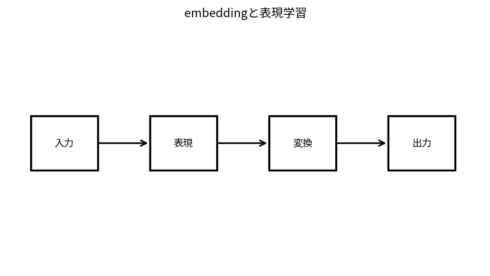

# embeddingと表現学習

Course 09｜深層学習｜Topic 15/20

---
layout: center
---

## 今回の問い

## 到達目標

- 定義と代表式を、自分の言葉と記号で説明できる。
- 成立条件を確認し、手計算と結果を検算できる。

## 理解確認

- 定義・条件・計算結果を自分の言葉で説明できるか確認する。

embeddingと表現学習の代表式は、どの定義・仮定から、なぜその形になるのか。

---

## なぜ今これを学ぶのか

前Topic `dl-self-supervised-contrastive` で得た概念を使い、ここでは embeddingと表現学習 へ進む。

---

## 直感

embeddingは離散IDを連続ベクトルへ写し、類似性や関係を幾何として扱えるようにする。

---

## 図解

token点群を2次元へ描き、近い概念が近く配置される模式図を見る。 離散IDが連続ベクトルへ写され、近いベクトル同士が似た文脈や意味を持つよう学習される。距離・内積が後続modelの計算単位になる。

---

## 記号と代表式

- $E\in\mathbb R^{V\times d}$：embedding table
- $1_i$：one-hot token
- $e_i=E^T1_i$

$$
\mathbf{e}_i=\mathbf{E}^{\mathsf T}\mathbf{1}_i
$$

---

## 導出 1

$E^T1_i$ はEのi-th rowを選ぶ。lookupはmatrix multiplyのsparse special case。

---

## 導出 2

dot/cosineでembedding geometryを評価するが、meaningはobjective/context依存。

---

## 例題

vocab50k,d=768ならtable 38.4M parameters。one-hot 50k dimensionをexplicit生成不要。

---

## 条件を変えるとどうなるか

cosine近い=causal/semantic equivalentを保証しない。dataset biasを反映。

---

## よくある誤解

embeddingと表現学習では、式へ数値を代入するだけでは不十分である。cosine近い=causal/semantic equivalentを保証しない。dataset biasを反映。 という失敗例が示すように、式を使える条件と結論の範囲を区別する必要がある。

---

## 実装・計算上の注意

padding index、OOV、normalization、vocab resize。

---

## 一段先へ

node IDs/featuresをgraph neighborhood aggregationで更新するGNNへ。

---

## 自分で説明できるか

- 「one-hot multiplication」を式を見ずに説明できるか
- 「shared embedding」までの論理を一段ずつ再現できるか
- embeddingと表現学習の条件を1つ外した反例を説明できるか

---
layout: center
---

## 教科書と演習

- [教科書](../../textbook/dl-embeddings-representation-learning)
- [10問の演習](../../exercises/dl-embeddings-representation-learning)
