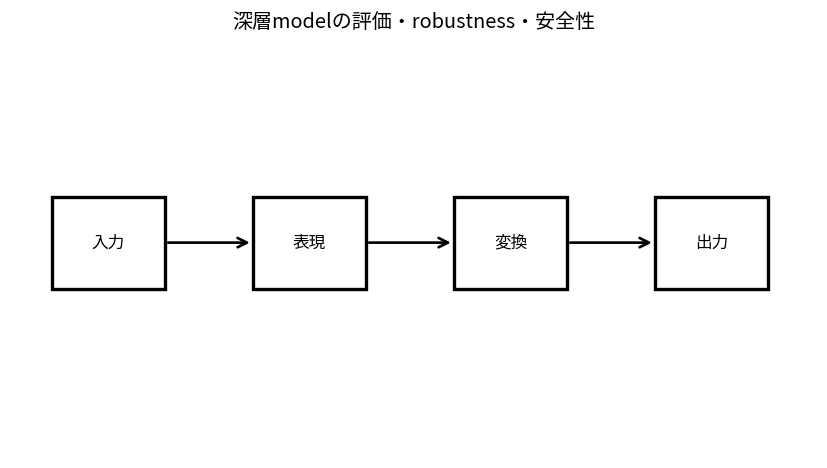

# 深層modelの評価・robustness・安全性

Course 09｜深層学習｜Topic 20/20

---
layout: center
---

## 今回の問い

## 到達目標

- 定義と代表式を、自分の言葉と記号で説明できる。
- 成立条件を確認し、手計算と結果を検算できる。

## 理解確認

- 定義・条件・計算結果を自分の言葉で説明できるか確認する。

深層modelの評価・robustness・安全性の代表式は、どの定義・仮定から、なぜその形になるのか。

---

## なぜ今これを学ぶのか

前Topic `dl-efficient-training-inference` で得た概念を使い、ここでは 深層modelの評価・robustness・安全性 へ進む。

---

## 直感

robustnessと安全性では平均性能だけでなく、摂動・分布変化・悪意ある入力での最悪挙動を調べる。

---

## 図解

通常入力と摂動入力のloss分布を比較する。 入力からmodel出力、評価・監視までの経路上でfailure modeを置く。robustness・misuse・distribution shiftなど異なるリスクを同一指標へ潰さない。

---

## 記号と代表式

- $\delta$：input perturbation
- $\|\delta\|\le\varepsilon$
- $L(f(x+\delta),y)$：adversarial loss
- robustness/safety metrics

$$
\max_{\|\boldsymbol{\delta}\|\le\varepsilon}\mathcal{L}(f(\mathbf{x}+\boldsymbol{\delta}),y)
$$

---

## 導出 1

fixed modelでallowed δ内lossを最大化しworst-case exampleを探す。

---

## 導出 2

robust trainingならparameterをそのworst-case lossを小さくする方向へ。evaluationではattack strength不足をfalse robustnessと区別。

---

## 例題

FGSM/PGDでsmall norm perturbationにaccuracyが落ちるか比較。

---

## 条件を変えるとどうなるか

1種類のattackに耐えた=安全/robust全般ではない。threat model外failureは未評価。

---

## よくある誤解

深層modelの評価・robustness・安全性では、式へ数値を代入するだけでは不十分である。1種類のattackに耐えた=安全/robust全般ではない。threat model外failureは未評価。 という失敗例が示すように、式を使える条件と結論の範囲を区別する必要がある。

---

## 実装・計算上の注意

clean vs robust accuracy、attack parameters、random restarts、subgroup metrics、model versionを記録。

---

## 一段先へ

Course10ではfoundation model規模でpretraining, adaptation, retrieval, agents, alignment/evaluationへ発展する。

---

## 自分で説明できるか

- 「inner maximization」を式を見ずに説明できるか
- 「safety broadening」までの論理を一段ずつ再現できるか
- 深層modelの評価・robustness・安全性の条件を1つ外した反例を説明できるか

---
layout: center
---

## 教科書と演習

- [教科書](../../textbook/dl-evaluation-robustness-safety)
- [10問の演習](../../exercises/dl-evaluation-robustness-safety)
