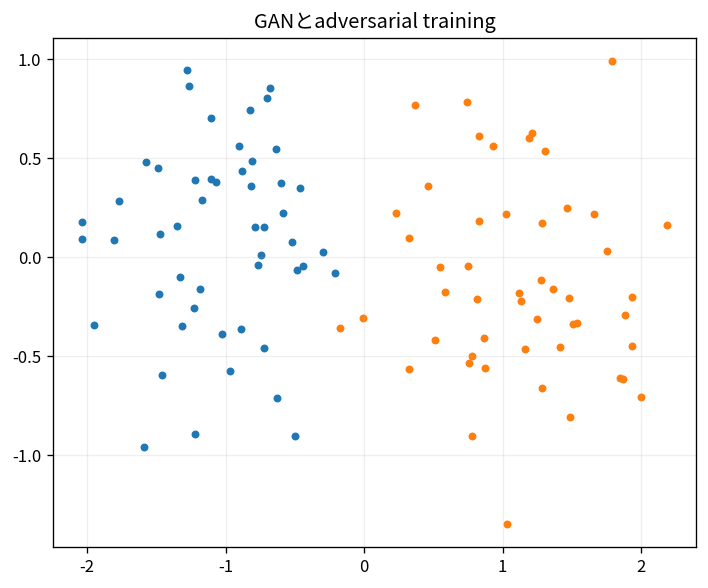

# GANとadversarial training

Course 09｜深層学習｜Topic 12/20

---
layout: center
---

## 今回の問い

## 到達目標

- 定義と代表式を、自分の言葉と記号で説明できる。
- 成立条件を確認し、手計算と結果を検算できる。

## 理解確認

- 定義・条件・計算結果を自分の言葉で説明できるか確認する。

GANとadversarial trainingの代表式は、どの定義・仮定から、なぜその形になるのか。

---

## なぜ今これを学ぶのか

前Topic `dl-autoencoders-vae` で得た概念を使い、ここでは GANとadversarial training へ進む。

---

## 直感

生成modelはデータ分布そのものを近似し、新しい標本を作る。adversarial学習ではgeneratorとdiscriminatorが競う。

---

## 図解

実データ分布と生成分布が反復で近づく様子を見る。 generatorが潜在変数から標本を作り、discriminatorが実データとの識別を試みる。両者の目的が対抗するminimax構造として学習が進む。

---

## 記号と代表式

- $G(z)$：generator
- $D(x)$：real probability discriminator
- $p_{data},p_z$

$$
\min_G\max_D\;\mathbb{E}_{x\sim p_{data}}\log D(x)+\mathbb{E}_{z}\log(1-D(G(z)))
$$

---

## 導出 1

各xで $p_data\log D+p_g\log(1-D)$ をDについて最大化すると $D^*=p_data/(p_data+p_g)$。

---

## 導出 2

D*をvalueへ代入するとconstant + 2·JS divergence。global optimum p_g=p_data。

---

## 例題

1D mixture targetをgenerator mappingでapproximate。Dはdensity ratio signalを提供。

---

## 条件を変えるとどうなるか

minimax理論optimumが存在してもtraining dynamicsがそこへ安定収束する保証はない。mode collapse。

---

## よくある誤解

GANとadversarial trainingでは、式へ数値を代入するだけでは不十分である。minimax理論optimumが存在してもtraining dynamicsがそこへ安定収束する保証はない。mode collapse。 という失敗例が示すように、式を使える条件と結論の範囲を区別する必要がある。

---

## 実装・計算上の注意

separate optimizer steps, spectral norm/gradient penalty等。FID等evaluation sample size。

---

## 一段先へ

likelihood-free adversarialとは別に、noise addition/reversalでlikelihood-related generative modelingをするdiffusionへ。

---

## 自分で説明できるか

- 「D fixedでpointwise maximize」を式を見ずに説明できるか
- 「practical generator loss」までの論理を一段ずつ再現できるか
- GANとadversarial trainingの条件を1つ外した反例を説明できるか

---
layout: center
---

## 教科書と演習

- [教科書](../../textbook/dl-gans-adversarial-training)
- [10問の演習](../../exercises/dl-gans-adversarial-training)
