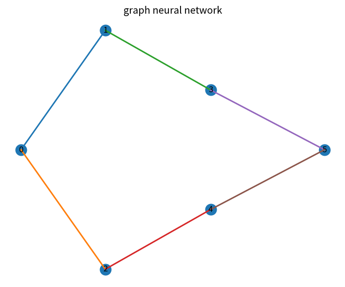

# graph neural network

Course 09｜深層学習｜Topic 16/20

---
layout: center
---

## 今回の問い

## 到達目標

- 定義と代表式を、自分の言葉と記号で説明できる。
- 成立条件を確認し、手計算と結果を検算できる。

## 理解確認

- 定義・条件・計算結果を自分の言葉で説明できるか確認する。

graph neural networkの代表式は、どの定義・仮定から、なぜその形になるのか。

---

## なぜ今これを学ぶのか

前Topic `dl-embeddings-representation-learning` で得た概念を使い、ここでは graph neural network へ進む。

---

## 直感

GNNは各nodeが近傍nodeの表現を集約して更新し、graph構造を表現へ取り込む。

---

## 図解

graph上で1-hop,2-hopと情報が広がる様子を見る。 各nodeが隣接nodeからmessageを受け取り、集約して自分の表現を更新する。graphの頂点順を変えても同じ結果になる集約が必要である。

---

## 記号と代表式

- $h_v^{(l)}$：node v representation
- $\mathcal N(v)$：neighbors
- $AGG$：permutation-invariant aggregation

$$
\mathbf{h}_v^{(l+1)}=\phi(\mathbf{W}\operatorname{AGG}\{\mathbf{h}_u^{(l)}:u\in\mathcal{N}(v)\})
$$

---

## 導出 1

neighborsは順序のない集合なのでaggregationはpermutation invariantであるべき。

---

## 導出 2

$m_v=AGG\{h_u:u\in N(v)\}$、$h_v^{l+1}=\phi(W[h_v,m_v])$ 等。

---

## 例題

mean aggregationでnode featureをneighbors平均とcombine。

---

## 条件を変えるとどうなるか

deep message passingでoversmoothingしnodesが似すぎる。heterophily graphでneighbor averaging不適切。

---

## よくある誤解

graph neural networkでは、式へ数値を代入するだけでは不十分である。deep message passingでoversmoothingしnodesが似すぎる。heterophily graphでneighbor averaging不適切。 という失敗例が示すように、式を使える条件と結論の範囲を区別する必要がある。

---

## 実装・計算上の注意

sparse adjacency, batching disjoint graphs, self-loop/normalization convention。

---

## 一段先へ

異なるmodalitiesをcommon representationへalignするmultimodal learningへ。

---

## 自分で説明できるか

- 「set input」を式を見ずに説明できるか
- 「receptive field」までの論理を一段ずつ再現できるか
- graph neural networkの条件を1つ外した反例を説明できるか

---
layout: center
---

## 教科書と演習

- [教科書](../../textbook/dl-graph-neural-networks)
- [10問の演習](../../exercises/dl-graph-neural-networks)
