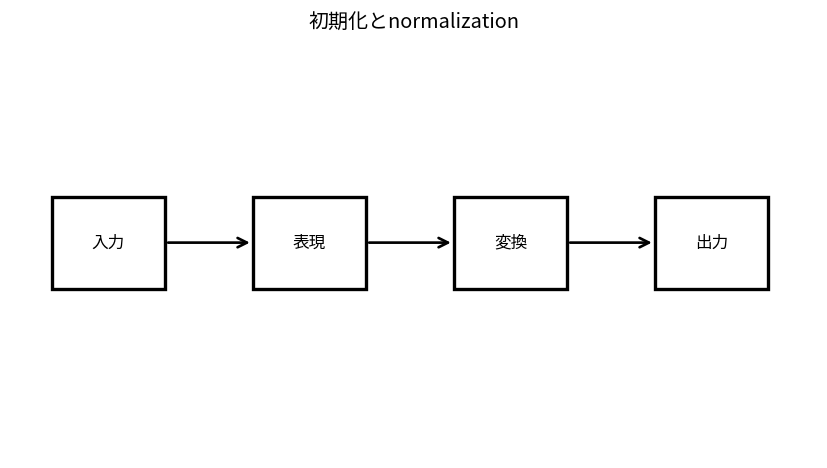

# 初期化とnormalization

Course 09｜深層学習｜Topic 04/20

---
layout: center
---

## 今回の問い

## 到達目標

- 定義と代表式を、自分の言葉と記号で説明できる。
- 成立条件を確認し、手計算と結果を検算できる。

## 理解確認

- 定義・条件・計算結果を自分の言葉で説明できるか確認する。

初期化とnormalizationの代表式は、どの定義・仮定から、なぜその形になるのか。

---

## なぜ今これを学ぶのか

前Topic `dl-activation-loss-functions` で得た概念を使い、ここでは 初期化とnormalization へ進む。

---

## 直感

normalizationは中間表現のスケールを整え、residual connectionは恒等経路を残して深いnetworkの学習を助ける。

---

## 図解

層を通る前後のactivation分布を比較する。 層へ入るactivation分布と正規化後の分布を比較する。尺度を制御することでoptimization landscapeとgradient scaleを扱いやすくする。

---

## 記号と代表式

- $Var(W_{ij})$：initial weight variance
- $\mu_B,\sigma_B^2$：mini-batch statistics
- $\gamma,\beta$：learned affine params

$$
\operatorname{BN}(x)=\gamma\frac{x-\mu_B}{\sqrt{\sigma_B^2+\varepsilon}}+\beta
$$

---

## 導出 1

$z_i=\sum_jW_{ij}x_j$。independent zero-mean近似でVar(z_i)=fan_in·Var(W)·Var(x)。これをVar(x)程度に保つためVar(W)∝1/fan_in。

---

## 導出 2

ReLUはnegative halfを0にするためHe initializationはroughly 2/fan_in、linear/tanhはXavier系。

---

## 例題

1000 inputsでweight variance1ならpreactivation variance約1000倍。1/fan_in scaleで抑える。

---

## 条件を変えるとどうなるか

BatchNormのtraining batch statisticsとinference running statisticsを混同するとprediction shift。small batchではestimate noise。

---

## よくある誤解

初期化とnormalizationでは、式へ数値を代入するだけでは不十分である。BatchNormのtraining batch statisticsとinference running statisticsを混同するとprediction shift。small batchではestimate noise。 という失敗例が示すように、式を使える条件と結論の範囲を区別する必要がある。

---

## 実装・計算上の注意

frameworkのfan_in/fan_out mode、eps、momentum convention確認。train/eval mode test。

---

## 一段先へ

良いgradientを得てもupdate rule/regularizationがtraining dynamicsを決める。

---

## 自分で説明できるか

- 「variance propagation」を式を見ずに説明できるか
- 「BatchNorm」までの論理を一段ずつ再現できるか
- 初期化とnormalizationの条件を1つ外した反例を説明できるか

---
layout: center
---

## 教科書と演習

- [教科書](../../textbook/dl-initialization-normalization)
- [10問の演習](../../exercises/dl-initialization-normalization)
